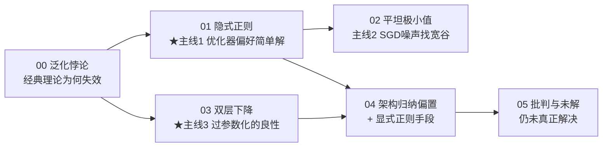

# 讲透泛化

> **深度网络为何能泛化？以及怎么实现的？**
>
> 这是深度学习理论里**最核心、最未解**的难题。经典统计学习理论预言"参数越多越过拟合"，可深度网络参数动辄百亿、远超样本数，却泛化得很好——这个**悖论**正是本教程的全部出发点。
>
> 本教程承接「[讲透激活函数](../讲透激活函数/）」，但主题独立：激活函数回答"网络**能否训练**"，泛化理论回答"训练好了**为何对新数据有效**"。

---

## 这份教程为谁而写

- 被"参数这么多为什么不过拟合"困扰的人。
- 想搞懂 weight decay / dropout / 数据增强 / early stop / 小 batch **为什么有用**、机制是什么的人。
- 想理解"双层下降""平坦极小值""隐式正则"这些术语的人。
- 想知道深度学习理论**还解释不了什么**的人。

## 教学宪法（每章遵守）

每个概念三层呈现：**直觉（比喻）→ 数学（公式与边界）→ 代码（bash 跑通的实证）**。诚实标注哪些是"已证明"、哪些是"经验现象"、哪些"仍未解决"。

## 核心悖论（一句话）

$$
\underbrace{\text{泛化误差}}_{\text{要解释的}} \;\le\; \text{训练误差} + \underbrace{O\!\left(\sqrt{\text{容量}/n}\right)}_{\text{经典理论: 容量越大惩罚越大}}
\;\;\xrightarrow{\text{深度网络: 容量}\gg n}\;\; \text{该严重过拟合, 却泛化很好?}
$$

## 目录与学习路径



| 章节 | 文档 | 回答的问题 | 实验 |
|------|------|-----------|------|
| 00 | [00-泛化悖论.md](00-泛化悖论.md) | 经典理论为何预言失败？悖论从何而来？ | `00_overfitting_capacity.py` |
| 01 | [01-隐式正则.md](01-隐式正则.md) | 为何不加正则网络也能泛化？ | `02_implicit_regularization.py` `04_spectral_bias.py` |
| 02 | [02-平坦极小值.md](02-平坦极小值.md) | 小 batch 为何泛化更好？ | （文献+理论，无可控小实验）|
| 03 | [03-双层下降.md](03-双层下降.md) | 参数远超样本数为何反而不崩？ | `01_double_descent.py` |
| 04 | [04-架构归纳偏置与显式正则.md](04-架构归纳偏置与显式正则.md) | 工程上怎么实现泛化？ | `03_regularization_zoo.py` |
| 05 | [05-批判与未解.md](05-批判与未解.md) | 我们其实还没真正理解它 | — |
| — | [exercises.md](exercises.md) | 输出倒逼输入 | — |

## 环境与运行

```
torch 2.10 (CPU)  |  numpy 1.26  |  python 3.12   (实验01-03纯numpy即可, 04用torch)
```

一键跑通所有实验：

```bash
cd 讲透泛化/experiments
for f in 0*.py; do echo "===== $f ====="; python3 "$f"; done
```

## 五条理论主线一览

| 主线 | 一句话 | 状态 | 对应章/实验 |
|------|--------|------|-----------|
| 1. 隐式正则 | 优化器（SGD）偏好简单/平滑解 | 已被大量实验支持 | 01 / 实验02,04 |
| 2. 平坦极小值 | SGD 噪声找到的宽谷泛化好 | 经验上成立，理论部分 | 02 |
| 3. 双层下降 | 过参数区测试误差反降 | 经验现象（对设定敏感） | 03 / 实验01 |
| 4. 架构归纳偏置 | CNN/Transformer 编码了任务结构 | 工程共识 | 04 |
| 5. 显式正则 | weight decay/dropout/增强人为约束 | 成熟工具 | 04 / 实验03 |

## 实证速览（全部 bash 跑通）

| 实验 | 关键数字 | 说明 |
|------|---------|------|
| 00 容量扫描 | d=3→0.028, d=13→**393** | 经典"参数多=过拟合"验证 |
| 01 双层下降 | 峰值910 → 过参数**5.3**（降171倍）| 过参数区反降 |
| 02 隐式正则 | 闭式6.28 → GD **0.029**（降219倍）| 优化器自带正则 |
| 03 显式正则 | λ=0的17.8 → λ=1e-6 **0.038**（降470倍）| 岭=权重衰减救场 |
| 04 频率偏置 | 低频功率1026→6（降170倍），高频滞后 | 先学平滑大势 |

---

📌 **下一步**：从 [00-泛化悖论.md](00-泛化悖论.md) 开始，先搞清"问题"是什么；或直接跳到 [01-隐式正则.md](01-隐式正则.md) 看最核心的解释。如果你只关心工程手段，直奔 [04](04-架构归纳偏置与显式正则.md)。

---

## 🔗 理论锚点（§12-15 横向打通）

> 本系列讲"为什么深度网络能泛化"；名校理论课把"容量/惩罚/复杂度"**公理化**：
> 枢纽：[`§12-15 整合`](../§12-15%20理论·形式化·安全·可信AI%20整合.md) §21

| 课程 | 产物 | 公理化的内容 |
|---|---|---|
| §12.1 Princeton COS 511/512（Hazan）| [`theory.py`](../top-cs-projects/princeton-cs-projects/topic9-ml-theory/theory.py) | PAC/Hoeffding 界、VC 维（区间假设 shattering）、Rademacher 复杂度——本系列所有"容量/惩罚"的数学根基 |
| §15.2 Princeton COS 595（Hardt）| [`fairness.py`](../top-cs-projects/princeton-cs-projects/topic12-fairness/fairness.py) | 公平性-准确性不可能性定理（Chouldechova/Kleinberg）——泛化-公平 tradeoff |

---

---

## 🎭 欺骗动力学视角：过拟合 = 自我欺骗

> 承接 [`欺骗动力学-社会进步的隐秘引擎.md`](../欺骗动力学-社会进步的隐秘引擎.md) §5。

### 三问

1. **讲透泛化 防的是什么欺骗？** → 训练表现冒充真实泛化能力。
2. **被什么攻破？** → 分布偏移 / Goodhart / 双层下降的盲区。
3. **沉淀进哪条主链？** → 验证主链——统计学习理论给泛化以可证明的保证。

### 一句话

> 过拟合的本质是模型在训练集上「骗」了我们；泛化理论是反这种自欺的数学。

## 🔗 与其他宇宙的连接

- **[`讲透统计学习理论/`](../讲透统计学习理论/)**：泛化之谜（双层下降/隐式正则）的理论工具全在 SLT（Rademacher/PAC-Bayes）
