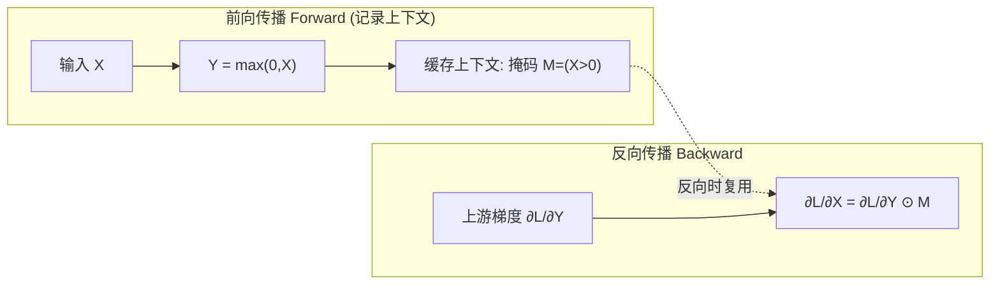

# 01 · ReLU 自动微分与反向传播

> 对应原对话 **Q1：ReLU 怎么做自动微分与反向传播？**
>
> 本章是全系列的**核心**。把 ReLU 这一个最简单的激活函数彻底拆透：前向怎么算、反向怎么传、框架底层为什么用「掩码」、为什么说它是「梯度门控」。

---

## 一、直觉层：ReLU 是一道「门」

### 1.1 ReLU 长什么样

ReLU（Rectified Linear Unit，修正线性单元）的定义只有一行：

$$
\text{ReLU}(x) = \max(0, x)
$$

画出来就是：$x<0$ 时是一条贴着 x 轴的水平线（恒为 0），$x>0$ 时是一条 45° 斜线（$y=x$），在原点有个尖角。

### 1.2 三个直觉比喻

- **门控开关**：$x>0$ 时门打开，信号原样通过；$x\le0$ 时门关闭，信号被挡住（变 0）。
- **负数清零器**：把所有负输入「砍」成 0，正输入原样保留。
- **生物神经元的粗糙模拟**：真实神经元要么「发放」（激活），要么「静默」（不激活），ReLU 的「非 0 即正」恰好对应这种「全或无」特性。

### 1.3 为什么反向传播要看「导数」

反向传播的本质是**链式法则**：要知道损失 $L$ 对输入 $x$ 的梯度 $\frac{\partial L}{\partial x}$，需要拿上游传来的梯度 $\frac{\partial L}{\partial y}$ 乘以**这一层的局部导数** $\frac{\partial y}{\partial x}$：

$$
\frac{\partial L}{\partial x} = \frac{\partial L}{\partial y} \cdot \frac{\partial y}{\partial x}
$$

所以搞清楚 ReLU 的导数 $\frac{\partial y}{\partial x}$，就搞清楚了它在反向传播里的行为。

---

## 二、数学层：分段求导与次梯度

### 2.1 ReLU 的导数（分段函数）

对 $f(x)=\max(0,x)$ 分段求导：

$$
f'(x) = \begin{cases} 1, & x > 0 \\ 0, & x < 0 \end{cases}
$$

- $x>0$ 区域，$f(x)=x$，导数是 1（无损通行）。
- $x<0$ 区域，$f(x)=0$（常数），导数是 0（梯度截断）。

### 2.2 $x=0$ 怎么办？——次梯度（Subgradient）

严格的微积分告诉你：ReLU 在 $x=0$ 处**不可导**（左导数 0、右导数 1，不相等，是个尖角）。

工程上怎么处理？引入**次梯度**概念：在不可导点，取左导数和右导数之间**任意一个值**都可以，即 $f'(0) \in [0, 1]$。

**主流框架的约定**：PyTorch / ONNX Runtime 都取 $f'(0)=0$。

> 为什么取 0 也无所谓？因为浮点数恰好等于 0 的概率几乎是 0（极小为 $10^{-38}$ 量级的数都不会精确命中 0）。这个约定只在理论上重要，实践中几乎不触发。

### 2.3 把导数写成「掩码」——关键工程洞察

把上面的分段导数重新表达：定义一个**布尔掩码**（mask）

$$
M = \mathbb{1}[x > 0] = \begin{cases} 1, & x>0 \\ 0, & x\le0 \end{cases}
$$

那么 ReLU 的导数（除 $x=0$ 约定外）就是

$$
f'(x) = M
$$

这是个极其深刻的简化：**ReLU 的导数就是一个 0/1 掩码**。

### 2.4 反向传播公式：梯度门控

把掩码代入链式法则。设上游梯度为 $g = \frac{\partial L}{\partial y}$，则

$$
\boxed{\;\frac{\partial L}{\partial x} = g \cdot f'(x) = g \odot M\;}
$$

其中 $\odot$ 是**逐元素乘**（Hadamard 积）。

- $x_i > 0$：$(\frac{\partial L}{\partial x})_i = g_i$（上游梯度原样通过）。
- $x_i \le 0$：$(\frac{\partial L}{\partial x})_i = 0$（上游梯度被截断）。

> 🎯 **这就是「梯度门控」**：ReLU 在反向传播里仅仅扮演一个 0/1 开关——前向打开的门（$x>0$），反向允许梯度流过；前向关闭的门（$x\le0$），反向阻断梯度。**没有复杂的解析求解，只是一个逐元素乘法。**

---

## 三、计算图视角：前向缓存 / 反向计算

自动微分（Autograd）分两阶段：



### 3.1 前向传播：该缓存什么？

朴素做法是缓存整个输入 $X$。但工程上为了**省显存**，框架通常只缓存掩码 $M=(X>0)$（一个布尔张量，比 float32 输入小 4 倍）。

更进一步：因为 $Y \ge 0$ 恒成立，且 $Y>0 \iff X>0$，所以**可以直接从输出 $Y$ 生成掩码** $M=(Y>0)$——这样连输入 $X$ 都不用保存（in-place 优化），进一步省显存。

### 3.2 反向传播：一次逐元素乘法

拿到上游梯度 $\frac{\partial L}{\partial Y}$ 和掩码 $M$，做一次 `elementwise multiply` 即可。计算量极小。

### 3.3 底层算子（CUDA/C++ 视角）

在 GPU 上，ReLU 反向是一个极轻量的 kernel，本质是一个条件判断或位掩码操作：

```cpp
// 简化的 ReLU Backward Kernel
void relu_backward_kernel(float* grad_out, float* x, float* grad_in, int size) {
    for (int i = 0; i < size; ++i) {
        // 前向时 x>0 则梯度通过，否则置 0
        grad_in[i] = (x[i] > 0.0f) ? grad_out[i] : 0.0f;
    }
}
```

不需要任何浮点乘加的复杂运算，连分支预测都很友好。这就是 ReLU 在工程上「便宜到几乎免费」的原因。

---

## 四、代码层：手写掩码反向 vs autograd，完全一致

```bash
cd experiments && python3 01_relu_autograd.py
```

脚本做三件事：

**① 手写前向+反向，透视梯度门控：**

```
输入 X        = [-2.0, -0.5, 0.0, 0.5, 2.0, 3.0]
前向 Y=max(0,X) = [0.0,  0.0,  0.0, 0.5, 2.0, 3.0]
掩码 M=(X>0)   = [0.0,  0.0,  0.0, 1.0, 1.0, 1.0]   <-- 反向时的局部导数
上游梯度 dL/dY = [10,   20,   30,  40,  50,  60]
手算 dL/dX = dL/dY ⊙ M = [0, 0, 0, 40, 50, 60]
```

- $x\le0$ 处（前三个）：上游梯度 10/20/30 全部被截断为 0。
- $x>0$ 处（后三个）：上游梯度 40/50/60 原样通过。

**② 用 PyTorch autograd 验证：**

```
autograd dL/dX = [0.0, 0.0, 0.0, 40.0, 50.0, 60.0]
手算     dL/dX = [0.0, 0.0, 0.0, 40.0, 50.0, 60.0]
两者最大差: 0.00e+00  ==> 完全一致 ✓
```

**③ 验证「用输出 $Y>0$ 代替存输入 $X$」的省显存优化：**

```
由 X>0 得掩码: [0,0,0,1,1,1]
由 Y>0 得掩码: [0,0,0,1,1,1]
两种掩码一致: True  ==> 反向时无需保留输入 X
```

---

## 五、批判性视角：ReLU 反向的代价

ReLU 的反向虽然简单优雅，但「梯度门控」是一把双刃剑：

- **优点**：正轴导数为 1，梯度无损传递，深层网络可训练（详见第 02 章梯度消失）。
- **致命缺点**：$x\le0$ 时梯度彻底为 0。如果某神经元**永久**落在 $x\le0$ 区，它的权重将**永远得不到更新**——这就是 **Dead ReLU（神经元死亡）**。下一章详谈。

另外，ReLU 的输出**非零中心化**（恒 $\ge0$），这会给后续层带来轻微的梯度 zig-zag 问题（但远不如 sigmoid 的梯度消失严重）。

---

## 📌 下一步

理解了「ReLU 反向 = 掩码乘上游梯度」后，立即会产生两个追问：
1. **梯度为 0 时，权重真的不更新吗？** → [02 章·Dead ReLU](02-为0与为1发生了什么.md)
2. **梯度为 1（无损通行）凭什么这么重要？** → [02 章·梯度消失](02-为0与为1发生了什么.md)

## ✍️ 练习

1. （手算）输入 $X=[-1, 2, -3, 4]$，上游梯度 $g=[5, 6, 7, 8]$，写出 ReLU 反向后 $\frac{\partial L}{\partial X}$。再用 `torch.relu(x).backward(g)` 验证。
2. （工程）ReLU 反向时框架缓存的是「输入 X」还是「掩码 M」？为什么后者更省显存？省多少（布尔 vs float32）？
3. （思考）如果把 $x=0$ 的次梯度约定从 0 改成 1，会改变训练结果吗？为什么实践中没人纠结这个？
4. （进阶）ReLU 的掩码 $M=(X>0)$ 是个**不可导**的阶跃函数。但 autograd 却能正常工作——它是怎么「绕过」不可导点的？（提示：前向已经离散化记录了状态）
