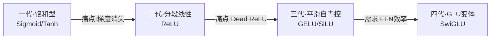

# 03 · 激活函数家族综述

> 对应原对话 **Q9：激活函数的综述**。
>
> 有了前两章的底子（梯度消失、Dead ReLU、导数=1 的意义），现在可以鸟瞰整个激活函数家族。人类用大约十年时间，走过四代，每一代都在解决上一代的痛点。

---

## 全景：四代演进

| 代际 | 代表 | 解决的痛点 | 引入的新痛点 | 主战场 |
|------|------|-----------|-------------|--------|
| 一代·饱和型 | Sigmoid / Tanh | — | 梯度消失、非零中心 | 门控、二分类输出 |
| 二代·分段线性 | ReLU / Leaky / ReLU6 | 梯度消失 | Dead ReLU、量化离群 | CNN、端侧部署 |
| 三代·平滑自门控 | GELU / SiLU / Mish | Dead ReLU、优化地貌 | 计算昂贵、量化难 | Transformer、ViT |
| 四代·门控线性单元 | SwiGLU | FFN 参数效率 | 算子融合复杂、离群点 | 现代 LLM |



---

## 第一代：饱和型激活函数（Saturating）

> 「饱和」指：输入绝对值较大时，输出趋于一个固定值，导数趋于 0。

### Sigmoid

$$
\sigma(x) = \frac{1}{1+e^{-x}}, \qquad \sigma'(x) = \sigma(x)(1-\sigma(x)) \le 0.25
$$

- **特征**：把任意实数压到 $(0,1)$，输出可解释为概率。
- **致命缺陷**：
  1. **梯度消失**：导数最大才 0.25，深层连乘必死。
  2. **非零中心**：输出恒正，后续层梯度更新方向被「捆绑」，呈 zig-zag 震荡。
  3. **计算贵**：含指数运算。
- **现状**：基本退出隐藏层，仅用于二分类输出层、LSTM/GRU 门控（概率开关）。

### Tanh（双曲正切）

$$
\tanh(x) = \frac{e^x - e^{-x}}{e^x + e^{-x}}, \qquad \tanh'(x) = 1 - \tanh^2(x) \le 1
$$

- **特征**：输出 $(-1,1)$，**零中心化**（缓解 zig-zag），是 sigmoid 的缩放平移：$\tanh(x) = 2\sigma(2x)-1$。
- **比 sigmoid 好在**：导数最大可达 1（在 $x=0$），零中心。
- **仍未解决**：梯度消失（$|x|$ 稍大导数骤降）。
- **现状**：GAN 生成器输出、传统 RNN。

---

## 第二代：分段线性与工程霸主（Piecewise Linear）

> 这是深度学习爆发的基石——用极简的数学形态，战胜了复杂的超越函数。

### ReLU

$$
f(x) = \max(0,x), \qquad f'(x) = \begin{cases}1 & x>0\\0 & x<0\end{cases}
$$

- **优势**：正轴导数 1（解决梯度消失）；计算极快（只需比较指令）；产生稀疏激活。
- **代价**：Dead ReLU；输出非零中心。
- **地位**：CV（ResNet 等）与系统部署的绝对霸主，量化极其友好（见第 04 章）。
- 详见 [01 章](01-ReLU自动微分与反向传播.md)、[02 章](02-为0与为1发生了什么.md)。

### Leaky ReLU / PReLU

$$
f(x) = \max(\alpha x, x), \quad \alpha \text{ 很小（如 0.01）}
$$

- **特征**：负半轴保留微小斜率 $\alpha$，保证 $x<0$ 也有微弱梯度流过，缓解 Dead ReLU。
- **PReLU**（Parametric ReLU）：把 $\alpha$ 设为**可学习参数**，让网络自己学最佳负斜率。
- **代价**：在 INT8 量化中，负半轴微小值容易因 scale 冲突而**下溢成 0**，事实性退化回 ReLU（见第 04 章实验）。

### ReLU6

$$
f(x) = \min(\max(0,x), 6)
$$

- **特征**：给 ReLU 加一个上限 6。
- **为何存在**：完美规避「正轴无界 → 离群点 → 量化 scale 爆炸」问题（见第 04 章）。
- **地位**：移动端 / 端侧 NPU 的标准配置（MobileNet 系列）。低比特量化的好朋友。

---

## 第三代：平滑自门控（Smooth & Self-Gated）

> 算力提升 + Transformer 兴起后，研究者发现「平滑非线性」（在零点附近曲率连续）能带来更好的优化地貌和泛化。

### GELU（Gaussian Error Linear Unit）

$$
\text{GELU}(x) = x \cdot \Phi(x)
$$

其中 $\Phi(x)$ 是标准正态分布的累积分布函数。常用 tanh 近似：

$$
\text{GELU}(x) \approx 0.5x\left[1+\tanh\!\left(\sqrt{\tfrac{2}{\pi}}\left(x + 0.044715 x^3\right)\right)\right]
$$

- **直觉**：$x$ 乘以「它自身大于 0 的概率」。可看成**概率化的 ReLU**——不是硬截断，而是按概率平滑放行。
- **地位**：BERT、GPT 系列、ViT 的标配。
- **系统代价**：含指数 / tanh，计算复杂；量化时通常需 LUT 或反量化（见第 04 章）。

### SiLU / Swish（Sigmoid Linear Unit）

$$
\text{SiLU}(x) = x \cdot \sigma(x)
$$

- **直觉**：$x$ 乘以 sigmoid 门控，是「自门控」——信号自己决定开多大。
- **特征**：单侧有界、平滑、**非单调**（负半轴有一个微小的正向隆起，保留少量负信息）。
- **来历**：谷歌通过神经架构搜索（NAS）发现，在深层网络中全面超越 ReLU。
- **地位**：YOLOv4+、EfficientNet 等现代 CNN 的首选。

### Mish

$$
\text{Mish}(x) = x \cdot \tanh(\text{softplus}(x)) = x \cdot \tanh(\ln(1+e^x))
$$

- SiLU 的「更平滑」变体，负半轴隆起更明显。在部分检测/生成任务上略有提升，但计算更贵，未成主流。

---

## 第四代：门控线性单元（GLU Variants）

> 现代 LLM（LLaMA、Qwen、PaLM）里，激活函数已不再是「层间的一个标量函数」，而是**整个 FFN（前馈网络）子结构的门控化重构**。

### SwiGLU（Swish Gated Linear Unit）

$$
\text{SwiGLU}(X, W, V) = \text{Swish}(XW) \otimes (XV)
$$

- **直觉**：把输入 $X$ 投影到**两个**空间——一个过 Swish 激活（「门」），另一个不过（「值」），再逐元素相乘。门决定放多少，值决定放什么。
- **地位**：当前百亿/千亿参数 LLM 的**事实标准**。Scaling Law 论文证明其参数利用效率显著高于传统 FFN+ReLU/GELU。
- **系统代价**：要算两个矩阵乘 + 一个 Swish + 逐元素乘，朴素实现是显存带宽灾难，必须做算子融合（见第 06 章）。

---

## 一图看完函数与导数

```bash
cd experiments && python3 04_activation_zoo.py
```

产出两张图 `activation_functions.png`（函数曲线）和 `activation_derivatives.png`（导数曲线）。关键洞察（脚本实测）：

```
Sigmoid 导数最大值 (x=0): 0.250  <-- 仅0.25, 连乘必消失
Tanh    导数最大值 (x=0): 1.000  <-- 比 sigmoid 好(=1), 但|x|稍大即骤降
ReLU    正轴导数:        1.000  <-- 恒=1, 连乘不消失 (本系列革命性所在)
GELU    正轴远端导数:    ~1.000 <-- 平滑过渡, 优化地貌更平滑
Mish    负轴有微小正隆起:        <-- 非单调, 保留少量负信息流
```

> 👀 **看导数图就能预判命运**：导数越接近 1 且平坦 → 梯度好传（ReLU/GELU 正轴）；导数尖峰狭窄 → 大部分区域梯度小（sigmoid）；导数有负值或非单调 → 保留更多负信息（Mish/SiLU）。

---

## 对比与选型指南

| 激活函数 | 计算复杂度 | 梯度消失风险 | 稀疏性 | 量化友好度 | 主要应用 |
|----------|-----------|-------------|--------|-----------|----------|
| Sigmoid | 高（$e^x$,除法）| 极高 | 无 | 差 | 门控、二分类输出 |
| Tanh | 高（$e^x$）| 高 | 无 | 差 | GAN 输出、传统 RNN |
| ReLU | 极低（max）| 无（正轴）| 高 | **极优**（INT8 标配）| 经典 CNN、端侧 |
| Leaky/PReLU | 极低 | 无 | 中 | 差（负轴易退化）| 抗 Dead ReLU |
| ReLU6 | 极低 | 无 | 高 | **完美** | 移动端、极致量化 |
| GELU | 高（近似/LUT）| 无 | 无 | 差（需反量化/LUT）| Transformer、ViT |
| SiLU/Swish | 高 | 无 | 弱 | 差 | 现代 CNN |
| SwiGLU | 高（多矩阵乘）| 无 | 无 | 中（离群点挑战）| 现代 LLM |

### 选型速查

- **端侧 / 量化部署** → ReLU 或 ReLU6（对硬件最友好）。
- **Transformer / ViT 训练** → GELU（优化地貌平滑，精度好）。
- **现代 LLM** → SwiGLU（参数效率最高）。
- **怕 Dead ReLU 又要量化** → ReLU6（比 Leaky 量化稳）。
- **二分类输出层** → Sigmoid（输出即概率）。

---

## 系统底层的执行法则

在 CUDA 这样的体系结构里，激活函数属于 **element-wise（逐元素）操作**：计算量极小，但**极度消耗显存带宽**（要把数据从 HBM 搬进搬出）。

> 🎯 **铁律**：激活函数**永远不应该作为独立 kernel 启动**，必须被框架/编译器（CUTLASS、Triton、TVM）**融合**（fusion）到上一层算子（GEMM / Conv）的 **Epilogue（尾声）**阶段。这是第 06 章 SwiGLU 的核心。

---

## 批判性视角

- **「新」不一定「好」**：Mish 比 SiLU 略好但贵很多，工业上很少用。选型要看**精度提升是否能覆盖计算/部署成本**。
- **选型受硬件约束倒逼**：论文里 GELU 精度更好，但部署到只支持 INT8 ReLU 的 NPU 时，你可能不得不蒸馏回 ReLU（见第 05 章）。
- **激活函数的演进本质是「在表达能力与计算/部署成本之间反复横跳」**。没有银弹。

---

## 📌 下一步

综述给了地图。接下来两条线：
- **工程线**：进入 **[04 章·量化中的激活函数](04-量化中的激活函数.md)**，看 ReLU 为何是量化优等生、GELU 为何是噩梦。
- **训练线**：进入 **[05 章·替换与动态切换](05-替换与动态切换.md)**，看能否把训练好的 ReLU 模型换成 GELU。
- **系统线**：进入 **[06 章·SwiGLU 底层 Kernel](06-SwiGLU底层Kernel.md)**，看大模型如何用算子融合压榨性能。

## ✍️ 练习

1. （识别）给定一张导数图：最大值 0.25、对称、两端趋于 0。这是哪个激活函数？为什么它不适合做隐藏层？
2. （推理）ReLU6 为什么对量化友好？如果不量化，ReLU6 比 ReLU 有劣势吗？
3. （实验）用 `experiments/04_activation_zoo.py` 的框架，自己加画一个 ELU（$f(x)=x$ if $x>0$ else $\alpha(e^x-1)$）的曲线和导数，观察它的零中心化特性。
4. （思考）SwiGLU 比 GELU 多了一个「门控相乘」，为什么这能提升 LLM 的参数效率？（提示：门控让网络能动态选择「哪些特征通路打开」，相当于每层做软路由。）
