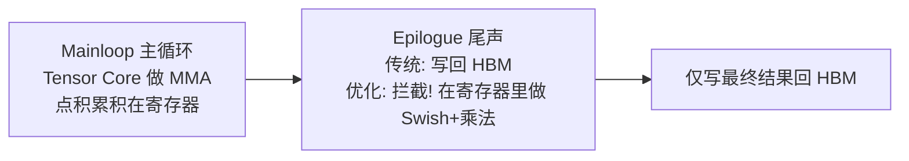

# 06 · SwiGLU 底层 Kernel：算子融合与显存带宽优化

> 对应原对话 **Q10：SwiGLU 在底层 Kernel 开发（CUDA / CUTLASS）中的算子融合与显存带宽优化策略**。
>
> 这是全系列的**进阶终章**。前五章讲的是「激活函数作为标量函数」的行为；本章讲的是「激活函数作为大模型子结构（SwiGLU）在 GPU 硅片上如何被压榨」。你的系统底层背景在这里是主场。

---

## 第 0 节：SwiGLU 是什么，为什么取代了传统 FFN

### 传统 Transformer FFN

标准 Transformer 的前馈网络（FFN）是两层线性 + 一个激活：

$$
\text{FFN}(X) = \text{GELU}(X W_1) \cdot W_2
$$

输入 $X$ 投影到中间维（gate-up），激活，再投影回原维。

### SwiGLU 的改造

现代 LLM（LLaMA、Qwen、PaLM）把 FFN 换成 SwiGLU：

$$
\boxed{\;\text{SwiGLU}(X) = \text{Swish}(X W_{\text{gate}}) \odot (X W_{\text{up}})\;}
$$

- $W_{\text{gate}}$（**门权重**）和 $W_{\text{up}}$（**上投影权重**）是两个**不同**的参数矩阵。
- $\text{Swish}(x) = x\cdot\sigma(x)$（第 03 章已介绍）。
- $\odot$ 是逐元素乘（Hadamard 积）。

**直觉**：把输入投影到**两个空间**——一个过 Swish（「门」，决定开多大），另一个不过（「值」，决定放什么），再逐元素相乘。这是一种**动态软路由**：每个样本、每个位置，网络自己决定哪些特征通路打开。

> 📈 **Scaling Law 论文的结论**：SwiGLU 的参数利用效率显著高于传统 FFN+ReLU/GELU，是百亿/千亿参数 LLM 的事实标准。

---

## 第一部分：朴素实现的「显存墙」危机

### 朴素执行流程

如果按 PyTorch 原生算子的朴素逻辑，一次 SwiGLU 要经历：

| 步骤 | 操作 | HBM 访问 |
|------|------|---------|
| 1 | GEMM1: $H_1 = X W_{\text{gate}}$ | 写 $H_1$ 回 HBM |
| 2 | GEMM2: $H_2 = X W_{\text{up}}$ | 写 $H_2$ 回 HBM（$X$ 又被读一次！）|
| 3 | Swish: 读 $H_1$，算 $\text{Swish}(H_1)$ | 写中间结果回 HBM |
| 4 | 乘法: 读 Swish 结果，读 $H_2$，相乘 | 写最终结果回 HBM |

### 为什么是灾难

GPU 架构里，**HBM（高带宽显存）带宽**（A100 ~2TB/s）远**低于** Tensor Core 的矩阵乘算力。频繁访存会让计算核心**空转**（memory-bound）。朴素 SwiGLU 产生了 3 个中间张量、6 次穿越 HBM 总线，$X$ 还被读了两遍——典型的「算得快但搬不动」。

---

## 第二部分：三大优化策略

### 策略一：权重拼接（Weight Concatenation）——单次 GEMM

观察：$X W_{\text{gate}}$ 和 $X W_{\text{up}}$ 的**输入都是 $X$**。把两个权重在内存连续维度上拼接：

$$
W_{12} = [W_{\text{gate}} \;|\; W_{\text{up}}]
$$

两次独立 GEMM 变成**一次更宽的 GEMM**：

$$
H_{12} = X \cdot [W_{\text{gate}} \;|\; W_{\text{up}}] = [H_1 \;|\; H_2]
$$

**收益**：
1. $X$ 只从 HBM 读**一次**，共享给两组权重。
2. 矩阵变宽，CUDA Threadblock/Warp 的负载饱和度提升，更好地喂饱 Tensor Core。

### 策略二：CUTLASS Epilogue 寄存器级融合（核心）

这是底层优化的灵魂。用 CUTLASS 这类高性能模板库时，一个 GEMM 分两阶段：



**关键操作**：绝不让中间 $H_1, H_2$ 落到 HBM，直接在**寄存器（Register File）**里完成激活计算。

执行流水线：

1. **Mainloop**：Tensor Core 不断执行 MMA 指令。某 Threadblock 完成一个 Tile 的点积后，结果 $[H_1 | H_2]$ 分布在各线程的**物理寄存器**里。
2. **Epilogue 拦截**：自定义 `EpilogueVisitor` / `Epilogue Functor`，在数据写回 Global Memory **之前**拦截。
3. **原位计算**：
   - 取前半寄存器算 Swish：`val_swish = h1 / (1 + expf(-h1))`
   - 取后半寄存器相乘：`result = val_swish * h2`
4. **最终写回**：只把 `result` 写回 HBM。

**收益**：中间张量的 Load/Store 被**完全抹除**。几十微秒的访存延迟，优化成几个周期的寄存器运算，**彻底打破 memory-bound**。

### 策略三：PTX 指令级优化（ILP）

Swish 含 Sigmoid（$1/(1+e^{-x})$），指数 `exp()` 在 GPU 上相对耗时。进一步压榨：

- **近似指令**：CUDA PTX 层用 `ex2.approx`（以 2 为底的快速近似指数）+ 换底公式替代标准 `expf`，或用硬件多项式拟合。FP16/BF16 下精度损失可忽略。
- **向量化访存**：最终写回 HBM 用 `float4`（128-bit）向量化 store，最大化总线利用率。
- **CuTe Layout（CUTLASS 3.x）**：通过代数 Layout 静态映射寄存器到线程，使 $H_1 \odot H_2$ 时数据在寄存器中对齐，**无需跨线程 shuffle**。

---

## 第三部分：架构师视角——SwiGLU 就是一个「带特殊收尾的 GEMM」

工业级大模型引擎（vLLM、TensorRT-LLM、ONNX Runtime 自定义 EP）实现 SwiGLU 时，外部调用看似在跑一个 FFN，在 GPU 硅片上**仅仅是一次带有特殊 Epilogue 的标准矩阵乘**。

```
外部:  out = FFN_layer(X)           # 看起来是个前馈网络
硅片:  out = fused_gemm_swiglu(X, W_concat, epilogue=swish_then_mul)
```

这与第 03 章的「系统铁律」一脉相承：**激活函数永远不该独立启动 kernel，必须融合进 GEMM 的 Epilogue**。SwiGLU 只是把「融合」做到了极致——连「两次 GEMM + 一次逐元素乘」都融进了单次 GEMM 的收尾动作。

---

## 第四部分：实验验证数值等价与访存收益

```bash
cd experiments && python3 06_swiglu_fusion.py
```

**① 数值等价性（朴素 vs 融合）：**

```
朴素输出 shape: (64, 4096)
融合输出 shape: (64, 4096)
两者最大绝对差: 0.000e+00  ==> 数学上完全等价
```

> 融合只是改变了**何时/在哪算**（寄存器 vs HBM），不改变**算什么**，所以结果逐位一致。

**② 访存分析（理论）：**

```
朴素实现中间张量 HBM 流量:
  H1 + H2 + S 各读写一次 = ~6.3MB 穿越总线; X 被读 2 次
融合实现中间张量 HBM 流量:
  仅写回最终 out = 1.0MB; H1/H2 切分与 swish 全在寄存器完成; X 只读 1 次
  ==> 中间流量从 ~6.3MB 降到 1.0MB (理论 ~6x)
```

**③ 实测耗时（CPU，方向性参考）：**

```
朴素: 106.5 ms/次
融合:  61.1 ms/次   (CPU 上融合也快 ~43%)
```

> ⚠️ 真正的收益在 **GPU** 上：GEMM 计算极快，访存成瓶颈，Epilogue 融合的收益会被放大数倍。CPU 上 GEMM 本身就慢，差距较小（但仍可见）。工业级收益来自：(1) $X$ 只读一次；(2) 中间结果不落 HBM；(3) Tensor Core 饱和度更高。

---

## 第五部分：SwiGLU × 低比特量化的新挑战

（原对话延伸）SwiGLU 与 W8A8/W4A8 量化结合时，会引入**激活离群点**问题（第 04 章已讨论）。因为 Swish 输出仍无上界，大激活值会拉大 $S$。这正是 **SmoothQuant** 等算法在 LLM 量化里专门处理 FFN 激活分布的原因。在写 SwiGLU 的量化 kernel 时，激活的离群点处理往往比 Swish 近似本身更棘手。

---

## 批判性视角

- **融合有代价**：自定义 CUTLASS Epilogue 代码复杂、可维护性差、跨架构移植难。是否值得，取决于 SwiGLU 在你推理路径上是 hot path 还是不是。
- **CuTe/CUTLASS 版本碎片化**：CUTLASS 2.x vs 3.x 的 Epilogue API 差异巨大，升级成本高。生产代码要锁版本。
- **「等价」不等于「无误差累积」**：单次融合后位级等价，但 FP16/BF16 下，融合（一次累积）与朴素（多次 round-trip 各自量化）的**舍入路径不同**，长序列推理下可能出现可观察的数值漂移。

---

## 全系列回顾

恭喜走完全程。从「ReLU 怎么反向传播」一个看似简单的问题，你已经穿越了：

| 章 | 你掌握的能力 |
|----|-------------|
| 00 | 激活函数为何存在（非线性） |
| 01 | ReLU 反向 = 掩码 ⊙ 上游梯度（梯度门控）|
| 02 | Dead ReLU / 梯度消失 / 优化器惯性 |
| 03 | 四代激活函数家族与选型 |
| 04 | 量化中各激活的处境与误差真因 |
| 05 | 替换与动态切换的训练策略 |
| 06 | SwiGLU 在 GPU 上的算子融合 |

你现在能回答：从一行 `torch.relu(x).backward()`，到 LLaMA 推理引擎里 SwiGLU 的 CUTLASS Epilogue，激活函数的每一层「为什么」。这就是「讲透」。

---

## 📌 下一步

- **动手验证**：跑完 `experiments/` 全部 7 个脚本，亲手复现所有结论。
- **深入系统**：去读 [vLLM](https://github.com/vllm-project/vllm) 或 [llama.cpp](https://github.com/ggerganov/llama.cpp) 里 SwiGLU/FFN 的融合实现，对照本章概念。
- **挑战 [exercises.md](exercises.md)**：完成所有练习，把知识变成肌肉记忆。
- 如果想进一步学 Transformer 全貌，建议看本仓库关联的 LLM 学习资料（Transformer 架构、KV Cache、vLLM 源码精读）。

## ✍️ 练习

1. （数值）手算：$X=[1,2]$，$W_{\text{gate}}=[[1],[0]]$，$W_{\text{up}}=[[0],[1]]$，求 $\text{SwiGLU}(X)$（Swish 用近似 $\sigma(1)=0.731$）。
2. （系统）朴素 SwiGLU 有几次 HBM 写、几次 HBM 读？融合后呢？为什么「$X$ 只读一次」在 GPU 上收益巨大？
3. （设计）如果你要在不支持 CUTLASS 的自研 NPU 上实现 SwiGLU，无法做寄存器级 Epilogue 融合，退而求其次你能做什么？（提示：至少做权重拼接 + 共享内存 tiling）
4. （进阶）为什么 SwiGLU 的「门控相乘」能提升参数效率？写一段话解释它与「动态稀疏激活 / 条件计算」的关系。
