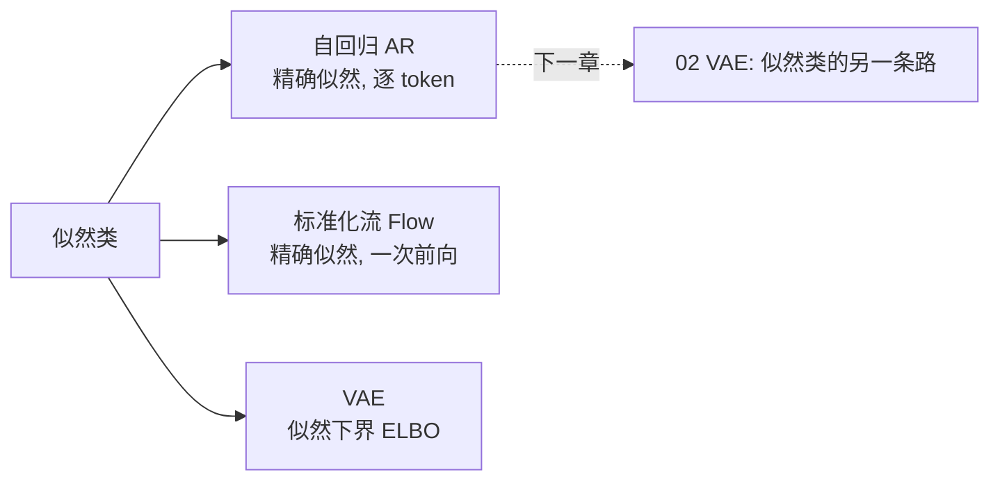

# 01 · 自回归模型 AR：GPT 的本质

> 自回归（Autoregressive, AR）是你**每天都在用**的生成模型——ChatGPT、Llama、Gemini 全家都是。它的核心机制朴素得惊人：**一个 token 一个 token 地吐，每次根据前面已经吐出来的内容，预测下一个。** 本章用 14 个字符的"迷你 GPT"把这个机制跑给你看。

---

## 1. 直觉层：自回归 = 一个字一个字地写

### 一句话比喻

> **自回归模型是"接龙高手"**：你给它开头"the cat sat on the"，它接"mat"；再把它接的"mat"当新开头，继续接下去。一句话、一篇文章，就这么一个字一个字"接"出来。

### 为什么"自回归"叫"自回归"？

"自"= 用自己的输出当输入；"回归"= 预测下一个值。合起来：**第 $i$ 个输出，是把第 $1\ldots i{-}1$ 个输出当输入，回归（预测）出来的。**

$$
\text{生成: }\quad \underbrace{x_1}_{\text{给定的开头}}\to x_2\to x_3\to\cdots\to x_n,\quad\text{每个箭头都依赖前面全部}
$$

这正是 GPT 回答你问题时的样子：你打一句，它**逐 token** 流式吐出回答。

## 2. 数学层：链式分解 + 最大似然

### 2.1 把联合概率拆成条件概率的乘积

任意序列 $x=(x_1,x_2,\ldots,x_n)$ 的联合概率，由**概率的乘法法则**可以拆成：

$$
p(x_1,x_2,\ldots,x_n) = \prod_{i=1}^{n} p\bigl(x_i \mid x_1,\ldots,x_{i-1}\bigr)
$$

这就是 AR 的全部数学基础。**每一项是一个"给定前文，预测当前字符"的条件分布**，用一个神经网络 $\theta$ 参数化：$p_\theta(x_i\mid x_{<i})$。

> 📐 **关键**：这一步拆解**无任何近似**——它是概率论的恒等式。所以 AR 能算出**精确**的 $p(x)$（这是它作为"似然类"的资格：精确似然）。

### 2.2 训练目标：最大似然 = 最小交叉熵

给定训练语料，最大化数据的对数似然：

$$
\mathcal L(\theta) = \sum_{\text{语料}} \log p_\theta(x) = \sum_{\text{语料}}\sum_{i} \log p_\theta(x_i\mid x_{<i})
$$

对单个位置，最大化 $\log p_\theta(x_i\mid x_{<i})$ **等价于最小化交叉熵**（cross-entropy）——这就是你熟悉的分类损失。所以 GPT 训练说穿了就是：**"猜下一个 token"这个分类任务，做几十亿次**。

### 2.3 Teacher Forcing：训练和生成的关键区别

| | 训练 (teacher forcing) | 生成 (free running) |
|---|---|---|
| 第 $i$ 步的输入上文 | **真实**的 $x_{<i}$ | **模型自己生成**的 $\hat x_{<i}$ |
| 能否并行 | ✅ 整句一次前向算出所有位置 | ❌ 必须一个一个来（后一个依赖前一个的采样）|

> ⚠️ **这就是 AR 生成为什么慢**：训练时整句并行，生成时只能逐 token。一张图/一句话要生成 1000 个 token，就得跑 1000 次前向。（现代推理用 **KV Cache** 缓解——那是另一门学问，属于「讲透 LLM 推理」。）

## 3. 代码层：14 个字符的迷你 GPT

```bash
cd 讲透生成模型/experiments && python3 01_autoregressive.py   # CPU 约 80 秒
```

**真实输出**（loss 从 2.633 降到 0.128，可复现）：

```
语料长度 1920 字符 | 词表大小 V=14 ( .acdeghlmnost)     <- 只有 14 种字符
训练 (teacher forcing)...
  step    0: loss = 2.633
  step  800: loss = 0.128   (越低 = 预测下一个字符越准)

=== 自回归生成 (采样, temperature=0.8) ===
the dog sat on the log. the dog sat on the log. the cat sat on the mat. the cat sat

=== 自回归生成 (近似贪心 argmax, temperature≈0) ===
the cat sat on the mat. the cat sat on the mat. the cat sat on the mat. the cat sat
```

**怎么读这两段输出：**

- **采样版（temp=0.8）**：既学到语料的句式（"the X sat on the Y"），又有变化（cat/dog、mat/log 交替）。这才是"生成"——造出训练集里**没有原样出现过**的新句子。
- **贪心版（temp≈0）**：永远挑概率最高的字，于是锁定一个句式**无限复读**。这是贪心的通病——**多样性的死亡**。

### temperature 到底是什么？

生成时，模型输出的是下一个字符的概率分布 $p$。我们不对 $p$ 直接采样，而对**调过温**的 $p/T$ 采样：

$$
p_i^{(\text{new})} = \frac{\exp(\text{logit}_i / T)}{\sum_j \exp(\text{logit}_j / T)}
$$

- $T\to 0$：分布变尖，几乎只选最高那个 → 贪心、保守、复读。
- $T=1$：原分布。
- $T\to\infty$：分布变平，接近均匀 → 多样、但容易胡言乱语。

> 你在用 ChatGPT 时调的"temperature"滑块，数学上就是上面这个 $T$。本实验里 `temperature=1e-4` 就是"近似贪心"。

## 4. AR 家族：从像素到 token

| 模型 | 生成单位 | "前文"是什么 | 应用 |
|------|---------|-------------|------|
| PixelRNN/PixelCNN | 像素 | 左上方的像素 | 图像生成（已被 Diffusion 取代）|
| WaveNet | 音频采样点 | 前面的声波 | 语音合成（TTS）|
| **GPT/Llama/Gemini** | token | 前面的 token | 对话、写作、写代码 |
| ImageGPT / DALL-é 1 | 像素 patch | 前面的 patch | 早期文生图 |

**它们共享同一个公式** $p(x)=\prod p(x_i\mid x_{<i})$，只是 $x_i$ 的"颗粒度"和"前文"的定义不同。

## 5. 批判：AR 的三个老毛病

1. **逐 token 慢**：生成长序列要 $n$ 次串行前向。KV Cache、推测解码（speculative decoding）是工程补丁，**根本的串行性改不掉**。
2. **Exposure Bias（暴露偏差）**：训练时总见真实上文，生成时上文是自己可能出错的输出——**错误会累积放大**。这是 AR 长文本"越写越离谱"的根源之一。
3. **复读与多样性死亡**：贪心或低 temperature 下陷入循环（本实验贪心版就是证据）。需靠 top-k / top-p / temperature 采样救场。

> 💡 也有优点最大的优点：**训练极其稳定**（就是分类任务），且**能算精确似然**。这是 GAN/Diffusion 都做不到的。

## 6. 在三大范式里的位置

AR 属于**似然类**（最大化精确似然）。它的"性格"符合 00 章的预言：覆盖好（学到了 cat 和 dog 两种句式）、训练稳。代价是**只能顺序生成、慢**。



---

📌 **下一步**：AR 是"逐位分解"的似然类。下一章 [02-VAE](02-VAE.md) 看"似然类"的另一条路——不逐位分解，而是用**编码器+解码器+一个叫 ELBO 的下界**。你会明白为什么 VAE 图像偏模糊（00 章实验已埋伏笔）。

✍️ **练习**
1. **概念**：本实验贪心生成会无限复读"the cat sat on the mat."。用 00 章学到的"覆盖 vs 清晰"语言解释：贪心 AR 是"覆盖好"还是"清晰"出了问题？
2. **动手**：把 `generate` 的 `temperature` 调到 `2.0` 重跑，观察输出——它会变成什么样？为什么？（提示：分布变平。）
3. **思考**：AR 训练用 teacher forcing（真实上文），生成用 free running（自己的上文）。这个不一致（exposure bias）在**本实验**里造成了什么可观察的现象？如果看不出，说明什么？
4. **进阶**：本模型只有 14 个字符、GRU。如果换成 5 万 token 的词表 + 12 层 Transformer，训练目标和损失函数**变了吗**？（答案：没变，还是交叉熵。规模不同，本质同。）
