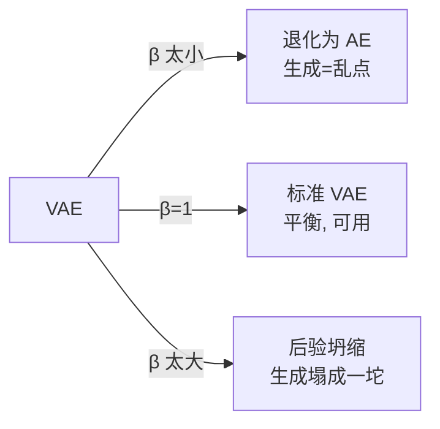

# 02 · VAE：编码、解码，与那个叫 ELBO 的下界

> VAE（Variational Autoencoder，变分自编码器）是似然类的另一条路。AR 把概率"逐位拆开"，VAE 则引入一个**隐变量** $z$：先把数据 $x$ 压缩成 $z$（编码），再从 $z$ 还原出 $x$（解码）。生成时，直接从 $z$ 的先验采样、解码，就能造新数据。它优雅、稳定，但代价是**图像偏模糊**——本章讲清这个代价从哪来。

---

## 1. 直觉层：VAE 像"有损压缩 + 解压"

### 一句话比喻

> **VAE 是"概率版的压缩软件"**：编码器把一张图压成一个**分布**（不是确定的码，而是"码大概在这些位置"），解码器再从这个分布采一个码还原出图。因为压的是"分布"，所以能**采不同的码、解出不同的新图**——这就是生成。

### 和普通自编码器（AE）的区别

| | 普通自编码器 AE | 变分自编码器 VAE |
|---|---|---|
| 编码输出 | 一个确定的点 $z$ | 一个**分布** $q(z\mid x)$（均值+方差）|
| 能生成新样本吗 | ❌（z 空间没结构，乱采样解出噪声）| ✅（z 被约束成 $\mathcal N(0,I)$，从那采样就能解出新图）|

> 关键差别就一句：**VAE 强制让所有数据的编码分布"对齐"到一个标准高斯先验**。这样先验 $\mathcal N(0,I)$ 成了"合法码的来源"，采样它就能生成。

## 2. 数学层：隐变量模型 + ELBO + 重参数化

### 2.1 隐变量模型：$p(x)=\int p(x\mid z)p(z)\,dz$

VAE 假设数据是这样产生的：先从先验采 $z\sim\mathcal N(0,I)$，再由解码器生成 $x\sim p_\theta(x\mid z)$。于是数据的边缘分布是：

$$
p_\theta(x) = \int p_\theta(x\mid z)\,p(z)\,dz
$$

**麻烦来了**：这个积分在高维 $z$ 下**算不出来**（要遍历所有 $z$）。所以 VAE 没法直接最大化 $\log p_\theta(x)$。

### 2.2 变分推断：用编码器近似后验

既然算不出真实的"给定 $x$，$z$ 在哪"（后验 $p(z\mid x)$），就**用一个编码器 $q_\phi(z\mid x)$ 去近似它**。经过一番推导（Jensen 不等式），得到对数似然的**下界**：

$$
\boxed{\;\log p_\theta(x)\;\ge\;\underbrace{\mathbb E_{q_\phi(z\mid x)}[\log p_\theta(x\mid z)]}_{\text{重构项 (越像越好)}}\;-\;\underbrace{\mathrm{KL}\bigl(q_\phi(z\mid x)\,\|\,p(z)\bigr)}_{\text{KL项 (编码别离先验太远)}}\;=\;\text{ELBO}\;}
$$

> 📐 这个下界叫 **ELBO**（Evidence Lower BOund）。VAE 训练 = **最大化 ELBO** = 同时做好两件事：**重构得像** + **编码别偏离标准高斯太远**。这两项天然**互相拉扯**（见实验）。

### 2.3 重参数化 trick：让梯度穿过"采样"

ELBO 的重构项要对 $z\sim q_\phi(z\mid x)$ 求期望，即要**采样**。但"采样"是个不可导操作，梯度传不回去。解法（**重参数化**）：把 $z$ 写成"确定性变换 + 独立噪声"：

$$
z = \mu_\phi(x) + \sigma_\phi(x)\odot\varepsilon,\qquad \varepsilon\sim\mathcal N(0,I)
$$

现在梯度能从 loss 穿过 $\mu,\sigma$ 传回编码器，而随机性全甩给 $\varepsilon$（它不需要梯度）。**这一步是 VAE 能用反向传播训练的关键。**（实验代码里那行 `z = mu + std * torch.randn_like(std)` 就是它。）

## 3. 代码层：β 拉锯与后验坍缩

```bash
cd 讲透生成模型/experiments && python3 02_vae.py    # CPU 约 65 秒
```

**真实输出**（VAE 学 two-moons，扫三个 β，可复现）：

```
β= 0.01: recon=0.011  KL=4.5074  latent方差=1.035   ← 退化为 AE
β=  1.0: recon=0.748  KL=0.5560  latent方差=0.329   ← 标准 VAE (平衡)
β= 10.0: recon=1.625  KL=0.0000  latent方差=0.000   ← 后验坍缩!
```

### 怎么读这三行（这是本章精华）

ELBO = 重构 − β·KL。β 是给 KL 项的"权重"（这就是 **β-VAE**）。调 β 会看到三种状态：

- **β=0.01（KL 几乎不计）**：重构极好（0.011），但编码器**完全无视先验**（KL=4.5，编码乱跑）。此时 VAE **退化成普通 AE**——从 $\mathcal N(0,I)$ 采样根本采不到编码器真正用的码，所以**生成 = 乱点**。
- **β=1（标准 VAE）**：重构与 KL 达成平衡，编码被拉向先验，生成基本成形。这是"对的"用法。
- **β=10（KL 主导）**：模型发现"只要让编码全部坍缩到先验中心，KL 就=0"。于是 **KL=0.000、latent 方差=0.000**——所有 $x$ 被映射到**同一个 $z$**，解码器彻底无视 $z$。这就是**后验坍缩**（posterior collapse）：生成塌成一坨。

> 🎯 **latent 方差=0.000** 是后验坍缩的铁证——隐变量失去了全部信息，模型退化成"无条件生成"（永远输出同一个东西）。

## 4. 为什么 VAE 图像偏模糊？（00 章伏笔的兑现）

00 章实验里 VAE 覆盖 8/8 模态但偏糊。根因有二：

1. **ELBO 是下界，不是似然本身**。最大化下界不等于最大化似然——模型可能学到"覆盖广但每个地方都不够尖"的解，尤其在高斯重构假设下，倾向于输出**均值**（平均 = 模糊）。
2. **正向 KL 的 mass-covering 偏置**（00 章 4.1 节）：为了不漏任何数据，VAE 把概率摊到所有地方，牺牲了锐度。

> 这不是 bug，是**似然目标 + 高斯假设的内在代价**。要更清晰的 VAE，得换重构分布（如 VQ-VAE 的离散码）或加感知损失。

## 5. 在三大范式里的位置

VAE 和 AR、Flow 同属**似然类**，但各有取舍：

| 似然类成员 | 怎么处理 $p(x)$ | 似然精确度 | 采样速度 |
|---|---|---|---|
| AR | 逐位分解 $\prod p(x_i\mid x_{<i})$ | ✅ 精确 | 慢（逐 token）|
| Flow | 可逆变换 + 变量替换（下章）| ✅ 精确 | 快 |
| **VAE** | 隐变量 + ELBO | ❌ **下界** | 快 |

VAE 的独特优势：** latent 空间有结构**（被约束成高斯），所以特别适合**表示学习、插值、可控生成**（药物设计、图像编辑）。劣势：似然只是下界，样本偏糊。

## 6. 批判：VAE 的三个软肋

1. **模糊**：似然下界 + 高斯重构的内在代价（上文）。
2. **后验坍缩**：解码器一强、KL 权重一大，latent 就废了（实验 β=10 铁证）。缓解：KL annealing（训练中 β 从小渐增）、弱化解码器。
3. **先验太简单**：标准高斯先验对复杂数据不够表达 → 后续 VAE 变体用 mixture prior、VQ 码本（VQ-VAE）补救。



---

📌 **下一步**：似然类到此（AR/VAE，下章 Flow 收尾似然类）。但 00 章实验里 GAN 那栏只命中 1/8 模态——下一章 [03-GAN](03-GAN.md) 深入"隐式类"，看对抗训练为什么会让模型崩溃，以及怎么救。

✍️ **练习**
1. **概念**：用一句话解释"为什么 AE 不能生成新样本，VAE 能"。（提示：先验对齐。）
2. **动手**：把 `02_vae.py` 的 β 再加一个 `0.3`，重跑。预测它的 latent 方差和生成质量落在 β=0.01 和 β=1.0 之间的哪里，然后验证。
3. **洞察**：β=10 时 KL=0.000。这说明 $q_\phi(z\mid x)$ 等于什么？（提示：KL=0 当且仅当两个分布相同，而先验是 $\mathcal N(0,I)$。）
4. **进阶**：重参数化 `z=μ+σ⊙ε` 中，为什么梯度能穿过 $\mu,\sigma$ 却不能穿过"直接采样"？把 $\varepsilon$ 当成"外部噪声"想一遍。
