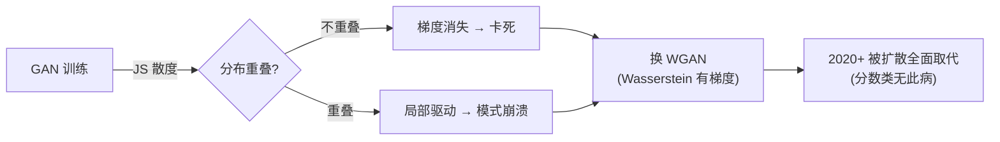

# 03 · GAN：造假者与警察的对抗，以及为什么它会崩

> GAN（Generative Adversarial Network，生成对抗网络）是**隐式类**的唯一代表，思路天才而暴力：训一个**造假者 G**（生成器）和一个**警察 D**（判别器），让它们互相博弈。G 拼命造假骗过 D，D 拼命识破 G 的假货——最终 G 造的假足以乱真。GAN 曾统治图像生成六年（2014–2020，StyleGAN 系列），但有个臭名昭著的毛病：**模式崩溃**。本章讲清它为什么崩，以及 WGAN 怎么救。

---

## 1. 直觉层：造假者 vs 警察

### 一句话比喻

> **GAN 是"造假者和警察的军备竞赛"**：警察越精明，造假者就被迫造得越逼真；造假者越厉害，警察也被迫升级。两边互相逼着对方变强，最后造假者造出的假钞连最好的警察都认不出——生成成功。

### 和似然类的根本不同

| | 似然类（VAE/AR）| 隐式类（GAN）|
|---|---|---|
| 写不写 $p(x)$ | ✅ 显式建模 | ❌ **完全不写**，只让样本"像" |
| 怎么判断好坏 | 算似然 | 让判别器**分不清真假** |
| 优化的是 | KL 散度 | **对抗损失**（等价 JS 散度）|

> GAN 连概率都不算——它只关心"生成的样本分布 ≈ 真实分布"，至于 $p(x)$ 是多少，**根本不在乎**。这就是"隐式"的含义：隐式地让分布对齐，而不显式写出密度。

## 2. 数学层：min-max 博弈

### 2.1 目标函数

$$
\boxed{\;\min_G\,\max_D\;V(D,G)=\mathbb E_{x\sim p_{data}}[\log D(x)]+\mathbb E_{z\sim p(z)}[\log(1-D(G(z)))]\;}
$$

读法：
- **$\max_D$**：警察 $D$ 要最大化——对真钞 $x$ 输出高概率 $D(x)\to1$，对假钞 $G(z)$ 输出低概率 $D(G(z))\to0$。
- **$\min_G$**：造假者 $G$ 要最小化 $\log(1-D(G(z)))$，即**让 $D$ 把假钞也判成真**（$D(G(z))\to1$）。

### 2.2 最优解：等价于最小化 JS 散度

固定 $G$，最优判别器是 $D^*(x)=\dfrac{p_{data}(x)}{p_{data}(x)+p_G(x)}$。代回目标，最优 $G$ 等价于最小化：

$$
\min_G\;\mathrm{JS}\bigl(p_{data}\,\|\,p_G\bigr)
$$

JS 散度（Jensen–Shannon）是衡量两个分布相似度的尺子，最小值 0 当且仅当 $p_G=p_{data}$——此时 GAN 完美。

## 3. 代码层：模式崩溃 vs WGAN 救场

```bash
cd 讲透生成模型/experiments && python3 03_gan.py    # CPU 约 140 秒
```

**真实输出**（8-高斯上，vanilla vs WGAN，可复现）：

```
vanilla GAN : 2/8   <- 经典模式崩溃 (判别器只看局部, 不罚漏模态)
WGAN        : 8/8   <- Wasserstein 距离更平滑, 覆盖显著改善
```

vanilla GAN 2000 个样本只挤进 2 个模态，丢了 6 个；WGAN 覆盖全部 8 个。**为什么差这么多？**

## 4. 为什么 GAN 会崩？（00 章 4.2 节的数学化）

### 4.1 病根一：JS 散度对"漏模态"不惩罚

00 章说过，GAN 优化 JS，而 **JS 对"生成器漏掉某个模态"几乎没有惩罚**——警察只看眼前这张假钞像不像，**不关心"还有 6 种真钞你都没造"**。于是生成器走捷径：只把 1-2 个模态练到极致逼真，照样骗过警察。**这就是模式崩溃。**

### 4.2 病根二：JS 在分布不重叠时梯度消失

更致命的是：当 $p_G$ 和 $p_{data}$ **支撑集不重叠**（生成样本根本没落在真实数据所在区域）时：

$$
\mathrm{JS} = \log 2\;\text{（常数）}\quad\Rightarrow\quad \nabla_G\,\mathrm{JS}=0
$$

**梯度为零，生成器完全学不动！** 这是 GAN 训练"突然卡死/崩溃"的数学根源——它不是 bug，是 JS 散度的几何性质。

## 5. WGAN：换一把有梯度的尺子

### 5.1 Wasserstein 距离：即使不重叠也有梯度

Wasserstein 距离（又叫"推土机距离" Earth-Mover's）衡量"把一个分布搬运成另一个分布的最小代价"：

$$
W(p_{data},p_G)=\sup_{\|f\|_L\le 1}\;\mathbb E_{x\sim p_{data}}[f(x)]-\mathbb E_{x\sim p_G}[f(x)]
$$

关键性质：**即使两个分布完全不重叠，$W$ 仍随距离平滑变化、梯度非零。** 所以生成器永远能收到"往真实分布靠拢"的有用梯度，不会卡死。

### 5.2 实现要点：critic + Lipschitz 约束

- 把判别器 $D$ 改成 **critic**（输出实数分数，**去掉 sigmoid**）。
- critic 必须满足 **Lipschitz 连续**（变化不能太快），否则上面的 sup 会爆炸。两种约束方式：
  - **Weight clipping**（WGAN 原版）：把 critic 权重硬裁剪到 $[-c,c]$。简单但粗糙。（本实验用的）
  - **Gradient penalty**（WGAN-GP）：惩罚 critic 梯度的范数偏离 1。更稳，是现代标配。

> 实验里那行 `p.data.clamp_(-c, c)` 就是 weight clipping。换个约束、换个尺子，模式崩溃从 2/8 飙升到 8/8。

## 6. GAN 家族与巅峰

| 模型 | 贡献 | 时代 |
|------|------|------|
| DCGAN (2015) | 卷积 GAN 架构，首次稳定生成图像 | GAN 起飞 |
| **StyleGAN** (2019-2021) | 分层样式控制，超写实人脸 | GAN 图像生成巅峰 |
| BigGAN (2019) | 大规模 + 类条件，ImageNet SOTA | GAN 规模化极限 |
| WGAN-GP (2017) | gradient penalty 稳定训练 | 工程标配 |

## 7. 批判：为什么 2020 后 GAN 被扩散取代？

1. **训练不稳**：min-max 博弈天然难调（学习率、G/D 平衡、容量比例……）。00 章 GAN 1/8、本实验 2/8 都是这种脆弱性的体现。
2. **没法算似然**：隐式的代价是**无法评估** $p(x)$，难以用似然做模型选择。
3. **模式崩溃顽固**：WGAN 只能缓解，根治不了。扩散模型用"逐点学分数"彻底绕过了这个问题（见第 05 章）。

> 但 GAN 的遗产巨大：**对抗训练思想**（discriminator 驱动）至今用在检测生成内容、对齐 LLM 等场景。它输的不是思路，是"扩散在样本质量+稳定性上全面超越"。



---

📌 **下一步**：隐式类（GAN）到此。下一章 [04-Flow](04-Flow.md) 回到**似然类**，看一个"既精确又快"的另类——**标准化流**：用可逆变换算精确似然，还能一次前向生成。它是似然类的优雅终章。

✍️ **练习**
1. **概念**：用一句话解释为什么"警察只看局部假钞像不像"会导致模式崩溃（提示：和"覆盖 vs 清晰"挂钩）。
2. **动手**：把 `03_gan.py` 的 WGAN `weight clipping` 上限 `c` 从 0.01 改成 0.1，重跑——覆盖会变好还是变差？为什么？（提示：$c$ 太大 → Lipschitz 约束失效。）
3. **洞察**：JS 散度在分布不重叠时梯度为 0，而 Wasserstein 仍有梯度。用"两个不重叠的山头"画图想清楚这句话。
4. **进阶**：GAN 的判别器输出概率（sigmoid），WGAN 的 critic 输出实数。为什么 WGAN 必须去掉 sigmoid？（提示：sigmoid 会把任意分数压回 [0,1]，抹平梯度。）
