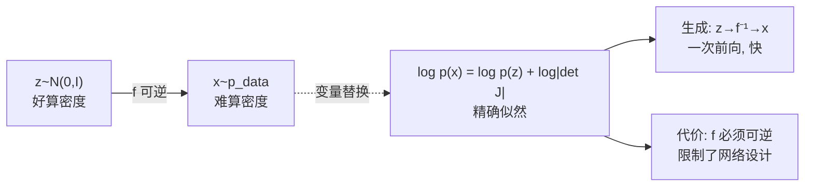

# 04 · 标准化流：可逆变换，精确似然

> 标准化流（Normalizing Flow）是似然类的优雅终章。它用一串**可逆变换**把简单分布 $\mathcal N(0,I)$ 揉成数据分布——像揉面团，正向揉成数据，反向揉回噪声。因为变换可逆、且雅可比行列式好算，Flow 能算出**精确的对数似然**（VAE 只能给下界，GAN 干脆不算），还能**一次前向**完成生成（不像 AR 要逐 token）。代价是：变换必须可逆，这严重限制了网络设计。

---

## 1. 直觉层：Flow = 可逆的"揉面团"

### 一句话比喻

> **Flow 是一台可逆的揉面机**：正向开，把一团光滑的高斯面团揉成 two-moons 的形状；反向开，把 two-moons 揉回光滑面团。因为机器**完全可逆**，你能精确算出"面团每个点原本在哪"——于是能算精确概率，也能反向生成。

### Flow 的两个独特优势

| 优势 | 解释 | 对比 |
|------|------|------|
| **精确似然** | 变换可逆 + 雅可比可算 → $\log p(x)$ 精确 | VAE 只有下界，GAN 不算 |
| **快速生成** | 反向变换是一次前向，**一步**出结果 | AR 要逐 token，Diffusion 要多步去噪 |

## 2. 数学层：变量替换公式 + 雅可比

### 2.1 变量替换（Change of Variables）

设 $x=f(z)$，$z\sim\mathcal N(0,I)$，$f$ 可逆。概率密度的变换遵循**变量替换公式**：

$$
\boxed{\;p_X(x) = p_Z\bigl(f^{-1}(x)\bigr)\,\Bigl|\det\frac{\partial f^{-1}(x)}{\partial x}\Bigr|\;}
$$

取对数：

$$
\log p_X(x) = \underbrace{\log p_Z(z)}_{\text{高斯,好算}} + \underbrace{\log\bigl|\det J_{f^{-1}}\bigr|}_{\text{雅可比行列式的对数}},\quad z=f^{-1}(x)
$$

> 📐 **关键**：只要 $f$ 可逆且雅可比行列式好算，$\log p(x)$ 就**精确可得**。这就是 Flow 能做精确最大似然的原因。

### 2.2 多层变换：logdet 累加

$f$ 可以是多层变换 $f=f_L\circ\cdots\circ f_1$。行列式的性质 $\det(AB)=\det A\det B$ 让 logdet 逐层累加：

$$
\log\bigl|\det J_f\bigr| = \sum_{i=1}^{L}\log\bigl|\det J_{f_i}\bigr|
$$

### 2.3 RealNVP 的天才设计：三角雅可比

难点在于"雅可比行列式好算"——一般网络的雅可比是 $d\times d$ 满秩矩阵，行列式 $O(d^3)$ 算不动。**RealNVP 的 coupling layer** 巧妙化解：

把 $x=[x_1,x_2]$ 分两半，**只改一半，依赖另一半**：

$$
y_1 = x_1,\qquad y_2 = x_2\odot\exp\bigl(s(x_1)\bigr)+t(x_1)
$$

这个变换的雅可比是**下三角**矩阵：

$$
J=\begin{bmatrix} I & 0\\ * & \mathrm{diag}(\exp s)\end{bmatrix}\quad\Rightarrow\quad \det J=\prod_i\exp(s_i)=\exp\Bigl(\sum_i s_i\Bigr)
$$

**行列式 = 指数和，$O(d)$ 算完！** 且变换显然可逆（$x_2=(y_2-t)/\exp s$）。多层 coupling + 交替改哪一半，就构成了 RealNVP。

## 3. 代码层：最小 RealNVP 算精确似然

```bash
cd 讲透生成模型/experiments && python3 04_flow.py    # CPU 约 80 秒
```

**真实输出**（RealNVP 学 two-moons，可复现）：

```
step    0: NLL=3.124
step 1500: NLL=0.346
精确平均对数似然 log p(x) = -0.358   (Flow 能算精确值, VAE 只能算下界)
```

**怎么读：**
- **NLL（负对数似然）从 3.124 降到 0.346**——模型越来越"相信"数据来自自己。
- **log p(x)=−0.358 是精确值**。对比：VAE 训练优化的是 ELBO（似然的**下界**），Flow 优化的是**真·似然**。这是 Flow 相对 VAE 的理论优势。
- 编码后的 latent $z=f(x)$ 接近标准高斯——说明变换成功把 two-moons "正态化"了。

## 4. 三种似然类的精确度对比

| 似然类 | 优化的目标 | 是不是真似然？ |
|--------|-----------|:---:|
| AR | $\sum\log p(x_i\mid x_{<i})$ | ✅ 精确 |
| **Flow** | $\log p_Z(f^{-1}(x))+\log|\det J|$ | ✅ **精确** |
| VAE | ELBO | ❌ **下界** |

> Flow 和 AR 都能算精确似然，但 **Flow 生成只需一次前向**（反向变换），AR 要逐 token。这是 Flow 的独特卖点。

## 5. Flow 家族

| 模型 | 雅可比结构 | 特点 |
|------|-----------|------|
| NICE (2014) | 对角 | 最早，只加不缩 |
| **RealNVP** (2016) | 三角（coupling） | 本实验所用，平衡与表达力 |
| Glow (2018) | 三角 + 1×1 卷积 | 高分辨率图像生成 |
| MAF / IAF (2017) | 自回归三角 | 表达力强，但单向慢 |

## 6. 批判：为什么 Flow 没成主流？

1. **可逆性是枷锁**：网络必须可逆 → 维度不能变、不能用池化/下采样（或要用特殊设计），严重限制了架构自由度。图像生成上打不过 GAN/Diffusion。
2. **高维表现有限**：在像素级图像上，Flow 的样本质量明显逊于 Diffusion。
3. **但仍有用武之地**：在**需要精确似然**的场景——密度估计（异常检测）、可解释建模、语音合成（WaveGlow）——Flow 不可替代。



至此**似然类三兄弟**（AR / VAE / Flow）全部讲完。它们的共同点：最大化（或近似最大化）似然，性格都是"覆盖好但可能模糊/受限"。

---

📌 **下一步**：似然类收官。下一章 [05-Diffusion](05-Diffusion.md) 进入**分数类**——当代图像/视频生成的霸主。你会看到为什么它一举超越 GAN，以及"前向加噪、反向去噪"为何能无中生有。

✍️ **练习**
1. **概念**：为什么 Flow 能算精确似然，VAE 只能算下界？（提示：可逆 + 雅可比可算 vs 隐变量积分不可解。）
2. **动手**：把 `04_flow.py` 的 coupling 层数从 6 改成 12，重跑——NLL 会更低吗？生成更好吗？（提示：更多层 = 更强表达力，但更难训。）
3. **洞察**：RealNVP 的 coupling 改一半 $x_2$、依赖另一半 $x_1$。如果**每一层都改同一半**会怎样？（提示：另一半永远不动 → 学不到。所以要交替 flip。）
4. **进阶**：变量替换公式里 $|\det J|$ 的几何含义是什么？（提示：体积的伸缩因子——变换把一小块体积放大/缩小多少倍。）
