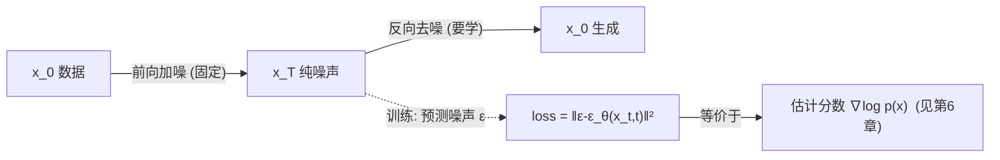

# 05 · 扩散模型 Diffusion：当代图像生成的霸主

> 扩散模型（Diffusion）是**分数类**的代表，也是 2020 年以来图像/视频生成的绝对霸主——Stable Diffusion、Midjourney、DALL·E、Sora 全家都是它。思路精妙而反直觉：**先把数据一点点加噪声毁成纯噪声（前向），再训练一个网络学会把噪声一点点去回去（反向）**。生成时，从纯噪声出发，反向去噪，就"无中生有"出数据。本章拆解它为什么能一举超越 GAN。

---

## 1. 直觉层：烧毁与重建

### 一句话比喻

> **扩散模型像"烧掉一幅画再学会修复"**：前向过程是固定的——按物理规律（加噪声）把画一点点烧成灰（纯噪声）；反向过程是要学的——训练一个"修复师"网络，学会从灰烬里一点点把画还原回来。生成时，你随便抓一把灰（噪声），让修复师还原，就得到一幅**新的**画。

### 两个过程

| 过程 | 方向 | 学不学 | 作用 |
|------|------|:---:|------|
| **前向**（加噪）| 数据 $\to$ 噪声 | ❌ 固定（不用学）| 把数据逐步毁成纯噪声 |
| **反向**（去噪）| 噪声 $\to$ 数据 | ✅ **要学** | 训练网络逐步去噪 = 生成器 |

> 关键洞察：**前向是已知的物理过程，反向才需要学。** 而且反向要学的只是一个简单任务——"预测这一步加了多少噪声"。

## 2. 数学层：前向闭式 + 反向参数化 + 预测噪声

### 2.1 前向过程：一步步加噪，但有闭式跳转

定义马尔可夫链 $x_0\to x_1\to\cdots\to x_T$，每步加小噪声：

$$
q(x_t\mid x_{t-1})=\mathcal N\bigl(x_t;\,\sqrt{1-\beta_t}\,x_{t-1},\,\beta_t I\bigr)
$$

$\beta_t$ 是预设的"噪声调度"（本实验线性 $10^{-4}\to 0.02$）。**妙处**在于，累积 $t$ 步有**闭式解**（不用一步步算）：

$$
\boxed{\;q(x_t\mid x_0)=\mathcal N\bigl(x_t;\,\sqrt{\bar\alpha_t}\,x_0,\,(1-\bar\alpha_t)I\bigr),\quad \bar\alpha_t=\prod_{s\le t}(1-\beta_s)\;}
$$

即 $x_t=\sqrt{\bar\alpha_t}\,x_0+\sqrt{1-\bar\alpha_t}\,\varepsilon$，$\varepsilon\sim\mathcal N(0,I)$。**训练时可以直接从 $x_0$ 跳到任意 $x_t$，省去逐步采样。**

### 2.2 反向过程：要学的去噪

反向 $p_\theta(x_{t-1}\mid x_t)$ 也是高斯，参数化为：

$$
p_\theta(x_{t-1}\mid x_t)=\mathcal N\bigl(x_{t-1};\,\mu_\theta(x_t,t),\,\sigma_t^2 I\bigr)
$$

$\mu_\theta$ 是要学的去噪网络。DDPM 论文用 **Tweedie 公式**把最优 $\mu_\theta$ 重写成用"噪声预测网络" $\varepsilon_\theta$ 表达：

$$
\mu_\theta(x_t,t)=\frac{1}{\sqrt{\alpha_t}}\Bigl(x_t-\frac{\beta_t}{\sqrt{1-\bar\alpha_t}}\,\varepsilon_\theta(x_t,t)\Bigr)
$$

### 2.3 训练目标：预测噪声（出奇地简单）

最终的训练损失被化简成一句：

$$
\boxed{\;\mathcal L(\theta)=\mathbb E_{t,x_0,\varepsilon}\Bigl[\bigl\|\varepsilon-\varepsilon_\theta(x_t,t)\bigr\|^2\Bigr]\;}
$$

**读法**：随机选时间步 $t$，把数据 $x_0$ 加噪到 $x_t$（记得加的是哪个 $\varepsilon$），让网络预测那个 $\varepsilon$，用 MSE 监督。**就这么简单——一个回归任务。**

> 📐 实验代码里 `pred = net(xt, t); loss = ((pred - eps)**2).mean()` 就是这一行的直译。

### 2.4 生成（反向采样）：从纯噪声一步步去噪

从 $x_T\sim\mathcal N(0,I)$ 出发，重复 $T$ 步：

$$
x_{t-1}=\frac{1}{\sqrt{\alpha_t}}\Bigl(x_t-\frac{\beta_t}{\sqrt{1-\bar\alpha_t}}\varepsilon_\theta(x_t,t)\Bigr)+\sigma_t z,\quad z\sim\mathcal N(0,I)
$$

每步用网络预测噪声、减掉它，再加一点随机扰动。**$T$ 步后得到生成样本。**（本实验 $T=100$，真实 Stable Diffusion 用 1000 步。）

## 3. 代码层：前向加噪 vs 反向去噪的轨迹

```bash
cd 讲透生成模型/experiments && python3 05_diffusion.py    # CPU 约 35 秒
```

**真实输出**（Swiss-roll 上最小 DDPM，可复现）：

```
step    0: MSE=1.0144
step 2500: MSE=0.7253   (18s)
图已保存: diffusion_process.png   (上行=前向加噪, 下行=反向去噪)
```

**怎么读这张 2×5 的图：**
- **上行（前向，不学）**：Swiss-roll 从 $t=0$（清晰螺旋）逐步被噪声淹没，到 $t=T$（纯噪声）。这是一条**单向不归路**。
- **下行（反向，生成）**：从纯噪声 $t=T$ 出发，网络一步步去噪，到 $t=0$ 重现螺旋形状。**这就是生成的全过程**——把噪声"雕刻"回数据。

## 4. 为什么扩散超越了 GAN？（兑现 00 章 4.3 节）

00 章说过，扩散属于**分数类**，它学的是分布的"斜率" $\nabla_x\log p(x)$。这带来两个 GAN 没有的优势：

1. **训练极稳**：损失就是 MSE（预测噪声），**没有对抗、没有 min-max、没有模式崩溃**。对比 GAN 的脆弱训练，这是革命性的。
2. **覆盖与清晰兼得**：分数是逐点的局部信息，既不像 VAE 被迫摊薄，也不像 GAN 只骗判别器。所以扩散**既覆盖全模态、样本又锐利**（00 章实验 8/8 是证据）。

> 代价只有一个：**采样慢**——要跑 $T$ 步（1000 步）。这是扩散唯一的硬伤，也是大量后续工作（DDIM、一致性模型）要解决的。

## 5. 从 DDPM 到 Stable Diffusion：三步飞跃

| 创新 | 做法 | 意义 |
|------|------|------|
| **DDPM (2020)** | 像素空间逐步去噪 | 证明扩散可行 |
| **Latent Diffusion (2022)** | 在 VAE 的**潜空间**做扩散（不像素级）| 大幅降本 → **Stable Diffusion** |
| **条件化** | 用 CLIP 文本编码做条件 | **文生图**："一只戴墨镜的猫" |

> Stable Diffusion = **VAE（压到潜空间）+ 扩散（在潜空间生成）+ CLIP（读懂文字）**。这三个组件缺一不可，但核心生成引擎还是扩散。

## 6. 应用全景（2024–2026）

- **文生图**：Stable Diffusion 3、Midjourney v6、DALL·E 3
- **文生视频**：Sora、可灵、Runway Gen-3
- **文生音频**：MusicGen、AudioLDM
- **科学**：AlphaFold 3（蛋白质结构扩散）、分子设计
- **统一架构**：DiT（Diffusion Transformer）—— 把 Transformer 搬进扩散，Sora 的骨架

## 7. 批判：扩散的软肋

1. **采样慢**：1000 步是标配。DDIM 压到 50 步、一致性模型压到 1 步，但质量有损。
2. **理论未完备**：为什么这么简单的 MSE 目标能生成这么好的样本？严格的理论分析仍在进行。
3. **可控性**：想精确控制生成内容（姿势、构图）需 ControlNet 等外挂，理论不够优雅。



---

📌 **下一步**：扩散的"预测噪声"为什么等价于"估计分数"？为什么它和另一类叫"分数匹配"的方法是同一回事？下一章 [06-统一-Score与SDE](06-统一-Score与SDE.md) 用 Yang Song 的统一框架把分数匹配、DDPM、随机微分方程（SDE）串成**一件事**——这是理解整个分数类的终极视角。

✍️ **练习**
1. **概念**：用一句话解释"为什么前向过程不用学，反向过程要学"。（提示：前向是已知物理规律，反向需要从数据里学。）
2. **动手**：把 `05_diffusion.py` 的步数 $T$ 从 100 改成 20，重跑——生成质量会变好还是变差？为什么？（提示：步少=每步去噪幅度大=粗糙。）
3. **洞察**：训练损失是预测噪声的 MSE。为什么"学会去噪"等价于"学会生成"？（提示：能从任意噪声还原数据 = 能生成。）
4. **进阶**：Stable Diffusion 不在像素空间、而在 VAE 的潜空间做扩散。这样做省了什么？（提示：1024×1024 图 = 300万像素 vs 潜空间 64×64×4 = 16K，省约 200 倍计算。）
