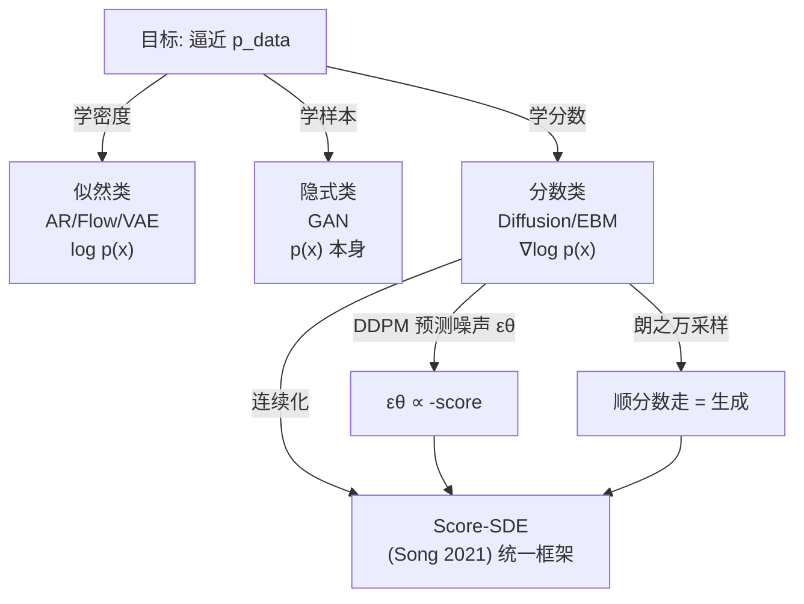

# 06 · 统一视角：Score、SDE，与为什么扩散=分数匹配

> 这一章是整个教程的"收束"。我们会证明一件惊人的事：**第 5 章扩散模型"预测噪声"的训练目标，和"分数匹配"（score matching）是同一件事**——它们都在学数据分布的**分数** $s(x)=\nabla_x\log p(x)$。Yang Song 在 2021 年更进一步，用一个**随机微分方程（SDE）**把分数匹配、DDPM、朗之万采样全部串成**一件事**。理解了这个统一视角，你就拿到了理解整个"分数类"的钥匙。

---

## 1. 直觉层：分数是分布的"路标"

### 一句话比喻

> **分数 $s(x)=\nabla_x\log p(x)$ 是分布地形上的"指路牌"**：它指向"密度更高"的方向。你站在任何一点，看一眼分数箭头，就知道往哪走能到数据密集的地方（模态）。顺着这些箭头一路走，就从荒野（噪声）走到了城市（数据）。

### 实验 06 的图在说什么

`06_score.py` 画了三张图：

1. **左图（分数场）**：在两个高斯模态的混合分布上，画出每个点的分数箭头。你能看到箭头**全都指向两个模态中心**——像磁场把铁屑吸向磁极。
2. **中图（朗之万轨迹）**：从均匀分布（≈噪声）出发的一堆点，顺着分数走 200 步，**逐步被吸进两个模态**。
3. **右图（结果）**：朗之万采样的最终点（红）和真实样本（黑）几乎重合——**只靠分数，就完成了生成**。

## 2. 数学层：分数 → 朗之万 → DDPM → SDE

### 2.1 分数的定义

$$
s(x)\;=\;\nabla_x \log p(x)
$$

它是 $\log p(x)$ 的梯度——分布"陡峭程度和方向"。关键性质：$s(x)$ **不需要知道归一化常数** $Z=\int p(x)dx$，因为 $\nabla\log(p/Z)=\nabla\log p$。这使得分数比密度好学得多。

### 2.2 朗之万采样：顺分数走 = 生成

朗之万动力学（Langevin dynamics）：从噪声出发，每步顺分数爬 + 加随机扰动：

$$
\boxed{\;x_{k+1}=x_k+\frac{\eta}{2}\,s(x_k)+\sqrt{\eta}\,\varepsilon,\quad \varepsilon\sim\mathcal N(0,I)\;}
$$

- 第一项：顺分数向高密度爬。
- 第二项：随机扰动（防止全部点卡死在模态中心，保证多样性）。

当 $\eta\to 0$、步数 $\to\infty$，$x_k$ 的分布**收敛到 $p(x)$**。**这就是分数类的生成机制——和扩散的"反向去噪"本质相同。**

### 2.3 分数匹配：怎么学分数？

训练目标——**分数匹配**（score matching），让网络 $s_\theta$ 拟合真实分数：

$$
\min_\theta\;\mathbb E_{x\sim p_{data}}\bigl\|s_\theta(x)-\nabla_x\log p_{data}(x)\bigr\|^2
$$

但 $\nabla\log p_{data}$ 未知。**去噪分数匹配**（denoising score matching）的妙招：给数据加一点高斯噪声 $x_t=\alpha x+\sigma\varepsilon$，然后学去噪分数，等价证明：

$$
\text{学 } s_\theta(x_t)\;\equiv\;\text{学 } -\frac{\varepsilon}{\sigma^2}
$$

**这和 DDPM 的"预测噪声"是同一个目标！**

### 2.4 终极等价：DDPM = 分数匹配

把 DDPM 的前向 $x_t=\sqrt{\bar\alpha_t}\,x_0+\sqrt{1-\bar\alpha_t}\,\varepsilon$ 代入分数匹配，得到：

$$
\boxed{\;\varepsilon_\theta(x_t,t)=-\sqrt{1-\bar\alpha_t}\;s_\theta(x_t)\;}
$$

> 📐 **结论**：DDPM 的噪声预测网络 $\varepsilon_\theta$ 和分数网络 $s_\theta$ **只差一个已知常数因子**。**扩散模型就是分数匹配**，反向去噪就是朗之万采样。这就是为什么第 5 章说"预测噪声 = 估计分数"。

### 2.5 Score-SDE：把离散 DDPM 推广到连续（Song Yang, 2021）

DDPM 是离散时间步（$t=0\ldots T$）。把它的时间轴连续化，前向过程变成一个**随机微分方程（SDE）**：

$$
dx = f(x,t)\,dt + g(t)\,dw
$$

对应的**反向 SDE**（生成）需要分数：

$$
dx = \bigl[f(x,t)-g(t)^2\,\nabla_x\log p_t(x)\bigr]dt + g(t)\,d\bar w
$$

> 关键：**反向 SDE 里出现了 $\nabla_x\log p_t$（分数）**。所以"解反向 SDE 生成"="用学到的分数做朗之万采样"。DDPM、分数匹配、朗之万、SDE，**四合一**。

## 3. 代码层：纯解析展示分数与朗之万

```bash
cd 讲透生成模型/experiments && python3 06_score.py    # CPU 约 5 秒 (纯解析, 无训练)
```

本实验故意用**已知分布**（两个高斯混合），这样分数 $\nabla\log p$ 能**解析算**（不用学），直接展示"顺分数走能生成"这个机制。真实场景下分数未知，才需要 DDPM/分数匹配去**学**它。

## 4. 统一视角：五大家族的最终归类

现在回头看整个教程，所有生成模型都是"学分布 $p_{data}$"，但视角不同：

| 模型 | 学的是 | 数学对象 |
|------|--------|---------|
| AR / Flow / VAE | 学密度 $p(x)$（似然）| $\log p(x)$ |
| GAN | 学样本分布（隐式）| $p(x)$ 本身（通过判别器）|
| **Diffusion / EBM** | **学分数 $\nabla\log p(x)$** | $s(x)=\nabla_x\log p(x)$ |

**密度、样本、分数——是同一个分布的三种表征。** 似然类用密度，隐式类用样本，分数类用分数。这就是 00 章"统一视角"的数学深化。



## 5. 这个统一为什么重要？

1. **理论优雅**：散落的方法（DDPM、NCSN、朗之万）被一个 SDE 统一，互相可推导。
2. **启发新方法**：连续视角催生了 **Probability Flow ODE**（确定性版本的扩散，可精确似然）、**一致性模型**（一步生成）、**整流流 Flow Matching**（2023 热点，把 Flow 和 Diffusion 统一）。
3. **跨域迁移**：蛋白质结构（AlphaFold 3）、分子、视频生成都受益于这套连续分数框架。

## 6. 批判：统一不等于万能

- 分数匹配在高维、低密度区域**分数估计不准**（数据稀少处没东西可学）→ 这正是 DDPM 用"多尺度噪声调度"的原因：在不同噪声水平都注入分数信号。
- SDE 的理论漂亮，但**采样慢**的根本问题仍在。
- 统一框架是**回顾性的理论整合**，不是新的生成能力突破。

---

📌 **下一步**：至此三大范式 + 五大家族 + 统一视角全部讲完。下一章 [07-横评与选型](07-横评与选型.md) 给你一张**决策树**——真实场景里到底该选哪个生成模型。然后 [08-批判与未解](08-批判与未解.md) 诚实交代生成模型还没解决的问题。

✍️ **练习**
1. **概念**：为什么学分数 $s(x)=\nabla\log p(x)$ 比学密度 $p(x)$ 容易？（提示：分数不依赖归一化常数 $Z$。）
2. **动手**：把 `06_score.py` 的朗之万步数从 200 改成 50，重跑——生成点会更集中还是更分散？为什么？（提示：步少=没走够=没收敛到模态。）
3. **洞察**：朗之万采样公式里那项 $\sqrt{\eta}\,\varepsilon$（随机扰动）去掉会怎样？（提示：没有它，所有点会**确定性**地爬到模态中心，失去多样性。）
4. **进阶**：DDPM 用很多个噪声水平 $t$ 训练（不只一个）。为什么？（提示：单一噪声水平的分数只在那个尺度准；多尺度覆盖从粗到细的全部结构。）
