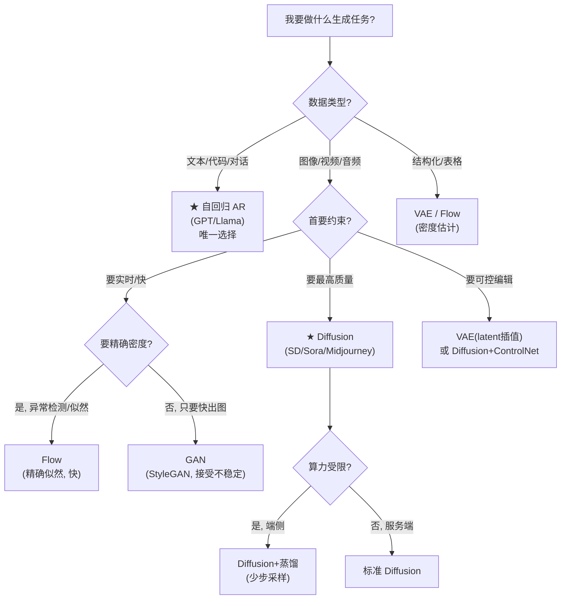

# 07 · 横评与选型：真实场景该用哪个生成模型？

> 学完全家桶，回到工程灵魂问题：**我的任务，该选哪个？** 本章用一张实证对比表 + 一棵决策树，把"什么场景用什么生成模型"讲死。核心原则和「讲透激活函数」的选型树一样：**"哪个最好"是错问题，"在我的约束下哪个最合适"才是对问题。**

---

## 1. 实证横评（全教程实验汇总）

把三大范式丢去学同一个 8-高斯分布，bash 跑通的结论（`07_selection_guide.py`）：

| 范式 | 模态覆盖 | 训练时间 | 性格（实证）|
|------|:---:|:---:|------|
| **VAE**（似然类）| 8/8 | 19s | 覆盖全，样本偏糊 |
| **GAN**（隐式类）| **2/8** | 30s | 模式崩溃，但崩溃的模态极清晰 |
| **Diffusion**（分数类）| 8/8 | 18s | 兼顾覆盖与清晰 |

> 这张表是 00 章黄金对比的复现，结论完全一致——说明这些"性格"不是偶然，是**目标函数的必然偏置**。

## 2. 五大流派综合能力对比

| 维度 | AR | Flow | VAE | GAN | **Diffusion** |
|------|:--:|:--:|:--:|:--:|:--:|
| 样本质量 | 高 | 中 | 中（糊）| 高 | **最高** |
| 样本多样性（覆盖）| 高 | 高 | 高 | **低（崩溃）** | 高 |
| 训练稳定性 | 高 | 高 | 高 | **低** | 高 |
| 能算精确似然 | ✅ | ✅ | ❌（下界）| ❌ | ❌ |
| 生成速度 | 慢（逐token）| 快 | 快 | 快 | **慢**（多步）|
| 可控性 | 中（prompt）| 低 | 中（latent）| 中 | 中（ControlNet）|

## 3. 选型决策树

## 4. 按任务的黄金选型

### 4.1 文本生成（对话、写作、代码）→ **AR（自回归）**
**没有悬念。** GPT/Llama/Gemini 全是 AR。原因：文本是离散 token 序列，AR 的逐 token 建模天然契合，且训练稳定、能算精确似然。**别在文本上用 GAN/Diffusion**（历史上试过，效果远不如 AR）。

### 4.2 图像生成（文生图、图生图）→ **Diffusion（扩散）**
2020 年后的事实标准。Stable Diffusion、Midjourney、DALL·E 全是它。**除非你有极端的实时性要求，否则默认选 Diffusion。**

### 4.3 实时/超快生成 → **GAN 或 Flow**
- **GAN**：StyleGAN 实时人脸编辑、DeepFake。接受训练不稳的代价换一次前向的极速生成。
- **Flow**：实时音频合成（WaveGlow）。需要精确密度时也选它。

### 4.4 表示学习 / 可控插值 / 数据压缩 → **VAE**
VAE 的 latent 空间有结构（约束成高斯），特别适合：药物分子设计、图像编辑（在 latent 空间插值）、压缩。也是 Stable Diffusion 的"前端压缩器"。

### 4.5 密度估计 / 异常检测 → **Flow**
需要算精确 $p(x)$ 的场景：判断"这个样本有多异常"（低概率=异常）。Flow 是唯一兼顾精确似然和快速推理的选项。

## 5. 工程实践建议

1. **先抄不先造**：图像生成直接用 Stable Diffusion 生态，文本用开源 LLM，别从零训。
2. **数据决定上限**：再好的模型，数据脏/少也白搭。生成模型尤其依赖**大量、多样、干净**的数据。
3. **评估要谨慎**：别只看几张好看的样本（cherry-picking）。用 FID/KID 量化 + 大规模人工评估（见第 8 章）。
4. **算力是硬约束**：Diffusion 训练成本是 GAN 的数倍。预算有限时考虑 LoRA 微调而非全量训练。

## 6. 一个反直觉的提醒

> **"最新/最热"不等于"最适合"。** Diffusion 虽是图像霸主，但如果你要做**实时人脸滤镜**，StyleGAN（GAN）仍是更务实的选择——它的推理是一次前向，而 Diffusion 要几十步去噪。**选型看约束，不看热度。**

---

📌 **下一步**：选型懂了，但生成模型还有一堆没解决的难题。最后一章 [08-批判与未解](08-批判与未解.md) 诚实交代：评估为什么难、可控生成为什么不优雅、理论还缺什么。

✍️ **练习**
1. **应用**：你要做"实时把用户的脸换成明星"的 App。按决策树，选哪个？为什么？
2. **应用**：你要做"检测信用卡交易是否异常"的系统。选哪个？为什么？（提示：要算 $p(x)$。）
3. **批判**：本教程所有实验都在 2D 玩具数据上。从 2D 到真实图像（百万像素），最大的工程挑战是什么？（提示：维度灾难、算力、数据。）
4. **思考**：为什么文本生成被 AR 独占，而图像生成被 Diffusion 独占？（提示：离散 token vs 连续像素；自回归在长序列上的成本。）
