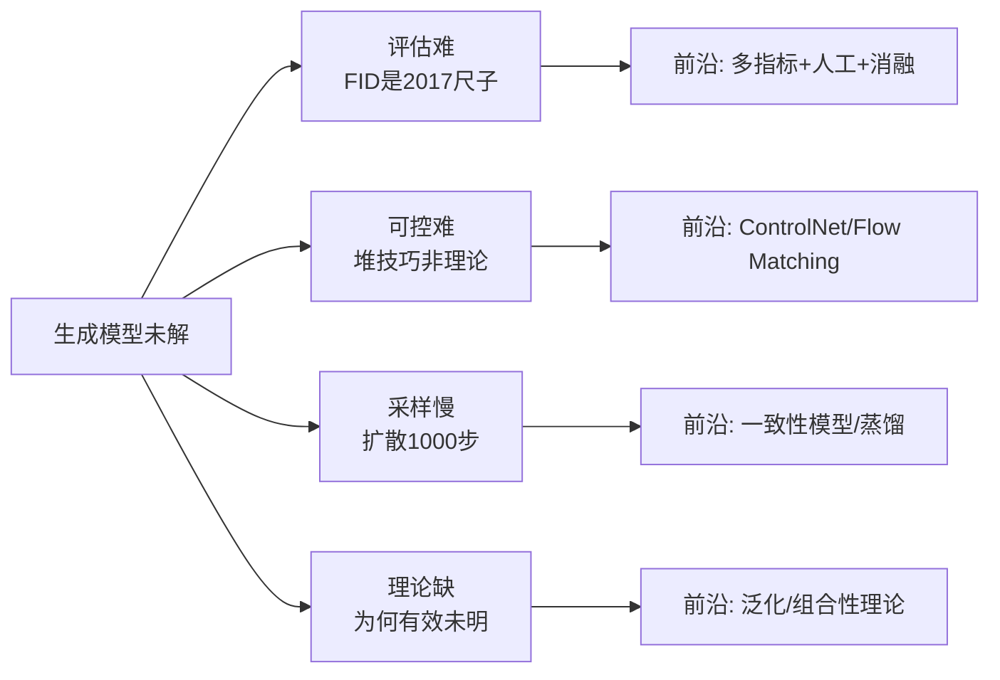

# 08 · 批判与未解：生成模型还没解决什么

> 诚实地收尾。生成模型在 2020–2026 取得了爆炸性进展（Sora、AlphaFold 3、GPT-4），但远未"解决"。本章交代四块尚未啃下的硬骨头：**评估难、可控难、采样慢、理论缺**。理解这些"不知道"，比背诵"已知"更能区分专家和门外汉。

---

## 1. 评估难题：怎么量化"像不像"？

判别模型有准确率，干净利落。生成模型呢？**"生成的图像像不像真实图像"是个极度主观的问题**，没有唯一答案。学界发明了一堆**代理指标**，但每个都有硬伤：

| 指标 | 衡量什么 | 硬伤 |
|------|---------|------|
| **IS（Inception Score）** | 样本清晰度 + 多样性 | 依赖 Inception 分类器，和人类感知相关性弱 |
| **FID（Fréchet Inception Distance）** | 生成分布 vs 真实分布的距离 | 用 ImageNet 特征，对非自然图像（医学/艺术）失真 |
| **KID（Kernel Inception Distance）** | 同 FID 但无偏 | 同样依赖 Inception |
| **CLIP Score** | 图文匹配度 | 只测"符不符合文字"，不测美学 |

### 核心困境

1. **FID 是 2017 年的尺子**：它用预训练 ImageNet 分类器的中间特征算距离。但如果你的生成领域是**医学影像、抽象艺术、科学数据**，ImageNet 特征根本不适用——FID 会给出误导性数字。
2. **多样性 vs 质量的根本张力**：一个只生成一张完美图、其他全是噪声的模型，可能比一个平庸但多样的模型 FID 更好。**FID 奖励"质量"，惩罚不够，掩盖了模式崩溃的某些形态。**
3. **人类评估贵且慢**：最终还是要人看，但大规模人工评估不可扩展。

> 💡 **现状**：FID 仍是论文标配，但**大家都知道它不完美**。好的研究必须配多样指标 + 人工评估 + 消融实验，单看 FID 排名会被误导。

## 2. 可控生成：怎么让模型听指挥？

"画一只**戴墨镜、在沙滩上、夕阳下**的猫"——要精确控制，而 Diffusion 默认只能粗略响应文字。

### 现状：工程补丁而非理论优雅

- **条件化**：把文本/类别作为额外输入注入网络。基础但只能粗控。
- **ControlNet**：用一个外挂网络注入空间约束（边缘、深度、姿态）。**强力但笨重**——每个控制类型要单独训。
- **Prompt 工程**：靠精心设计的提示词。**玄学**——为什么加"4k, masterpiece"就变好？没有理论解释。
- **Classifier-free guidance**：放大条件信号。有效但**会牺牲多样性**（guidance 太强 → 所有图长得像）。

### 未解

没有统一、优雅、可证明的可控生成框架。**可控性目前是堆技巧，不是理论。**

## 3. 采样慢：扩散的阿喀琉斯之踵

Diffusion 生成要 $T$ 步（标准 1000 步）。这是它**唯一的硬伤**，也是最大研究热点。

### 加速方案谱系

| 方案 | 思路 | 代价 |
|------|------|------|
| **DDIM** (2020) | 把随机反向改成确定性，少步数（50步）| 质量略降 |
| **Progressive Distillation** | 蒸馏成步数更少的模型 | 训练贵，需多轮 |
| **一致性模型** (2023) | 直接学"一步到数据"的映射 | 质量仍不如多步 |
| **Flow Matching / Rectified Flow** (2023) | 用直线路径代替曲线路径 | 前沿，理论优雅 |
| **Cache/量化** | 工程层面省算力 | 通用但增益有限 |

> 现状：50 步能出可接受质量，1 步仍明显逊色。**"实时高质扩散"仍是开放问题。**

## 4. 理论缺口：为什么这玩意儿有效？

最尴尬的问题：**扩散模型这么简单的目标（预测噪声的 MSE），为什么能生成这么好的样本？严格理论至今不完整。**

### 几个未解的理论问题

1. **泛化**：扩散模型会"背训练数据"吗？还是真的学到了分布？（已发现 Stable Diffusion 能近乎复现训练图——**版权与隐私风险**。）
2. **为什么分数匹配够用**：分数在高维低密度区估计不准，但扩散却 work。**严格的分析仍在推进。**
3. **最优调度未知**：$\beta_t$ 怎么排最优？现在是经验调参（linear、cosine），理论指导不足。
4. **组合泛化**：训练集没见过的组合（"戴墨镜的猫"），模型为什么能生成？这种**系统性泛化**的能力边界在哪？

## 5. 前沿方向（2024–2026）

- **世界模型**：用生成模型预测物理世界演化（Sora、Genie）——能否真正"理解"世界，还是高级模式匹配？
- **统一架构 DiT**：把 Transformer 作为扩散骨干（Sora 骨架），迈向"一个架构通吃"。
- **多模态生成**：文本+图像+视频+音频统一生成（GPT-4o、Gemini）。
- **Flow Matching**：把 Flow 和 Diffusion 统一的新范式，2023–2025 快速崛起。
- **科学生成**：AlphaFold 3 用扩散做蛋白质结构预测——生成模型进入自然科学核心。

## 6. 一句话总结这个领域

> **生成模型在 2020–2026 从"玩具"变成"工业级工具"，但它的理论地基远不如判别模型扎实。我们造出了能画惊艳图像、写流畅文章的机器，却仍不能完全解释它们为什么能做到。这是这个领域最迷人的张力——工程跑在理论前面。**

---

📌 **下一步**：教程到此结束。回到 [README](README.md) 重看那张统一视角图，你会发现现在每个箭头都懂了。建议做 [exercises.md](exercises.md) 的综合练习巩固。生成模型是理解现代 AI（GPT、Sora、AlphaFold）的钥匙——你现在已经拿到了。

✍️ **练习**
1. **批判**：FID 用 ImageNet 特征。如果你训练一个生成**医学 X 光片**的模型，FID 还可信吗？该怎么评估？
2. **伦理**：扩散模型能近乎复现训练图。这对**版权、隐私、deepfake 防御**意味着什么？技术上有缓解思路吗？
3. **洞察**：本教程反复强调"工程跑在理论前面"。举一个你日常用的 AI 产品，说明它的工程效果远超理论解释。
4. **展望**：Flow Matching（2023）试图统一 Flow 和 Diffusion。基于第 4、6 章的知识，猜猜它可能怎么统一？（提示：都在学一个"流"，只是路径形状不同。）
