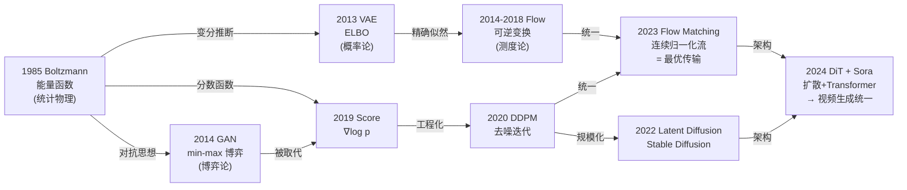

# 讲透生成模型 · 思想史

> **一句话定位**：所有其他章节讲"怎么实现"，本章问"**为什么是现在这样**"——生成模型四十年的思想演进，不是技术的线性叠加，而是五次范式转移的震荡史：每一次"赢家"都解决了前一个的致命缺陷，又埋下了下一个的种子。

> 配套：[`讲透AI历史/00-为什么学AI历史`](../讲透AI历史/00-为什么学AI历史.md)（思想史方法论）× [`讲透AI历史/advanced/01-范式转移的库恩分析`](../讲透AI历史/advanced/01-范式转移的库恩分析.md)（库恩框架）× 本系列 [00-统一视角](./00-统一视角.md)（三大范式的技术骨架）

---

## 0. 方法论：思想史怎么看生成模型

本系列其他章节（01-08）回答"**生成模型怎么实现**"。本章追问不同的"为什么"：

| 问题 | 答案在 |
|---|---|
| 某个思想**何时**出现？ | 年代史（本章不全做年代史） |
| 某个思想**为什么此时此地**出现？ | **思想史（本章的核心）** |
| 某个方向**为什么被淘汰**？ | 思想史 |
| 某个老方法**为什么复兴**？ | 思想史 |
| 当前格局**有多少是偶然**？ | 思想史 |

### 0.1 五条原则（承自讲透AI历史）

1. **思想史 > 年代史**——不只问"何时"，问"为什么此时"。
2. **路径依赖敏感**——扩散模型的胜利不是必然；GAN 的衰落不是技术不够好。
3. **失败与成功同等重要**——Helmholtz machine 被遗忘了，但它的灵魂在 VAE 里复活。
4. **跨学科**——生成模型的思想根在统计物理（玻尔兹曼）、概率论（变分推断）、最优传输（OT）。
5. **批判性**——不把"赢家"当真理。扩散模型当前统治图像生成，但 Flow Matching 正在抢地盘。

### 0.2 生成模型的范式转移周期

### 0.3 生成模型思想史的主轴

> 🎯 **全篇锚点**：生成模型四十年思想史的主轴是一对永恒的矛盾——**"覆盖"（coverage）vs "清晰"（sharpness）**。
>
> - VAE（似然类）拼命覆盖，代价是模糊。
> - GAN（隐式类）拼命清晰，代价是缺模态。
> - 扩散模型（分数类）试图兼顾，代价是慢。
> - Flow Matching 试图在兼顾的基础上变快。
>
> **没有银弹，只有取舍。理解这对矛盾的漂移，就理解了生成模型全部历史。**

---

## 1. 前夜：Boltzmann Machine 与 Helmholtz Machine（1983-1995）

### 1.1 思想根源：统计物理给 AI 的第一份礼物

1983 年，Hinton 与 Sejnowski 提出了 **Boltzmann Machine**（玻尔兹曼机）。它的思想直接来自统计物理：

- **一个神经元的状态是 0 或 1，代表"粒子"的自旋。**
- **网络有一个能量函数** $E(x)$，定义了每种状态组合的"势能"。
- **系统服从 Boltzmann 分布**：$p(x) \propto e^{-E(x)/T}$，低能态概率高。
- **学习规则**：调整权重让数据的能量降低、非数据的能量升高。

这在当时是革命性的——**这是第一个能学习任意概率分布的神经网络模型**。但 Boltzmann Machine 有致命缺陷：**推理需要在整个状态空间上做 MCMC 采样，极慢**。对于一个 100 个可见单元的网络，$2^{100}$ 种状态不可能遍历。

### 1.2 Restricted Boltzmann Machine（RBM）

Smolensky（1986）和后来的 Hinton 把 Boltzmann Machine 限制为**两层、层内无连接**的 **Restricted Boltzmann Machine**（RBM）。这一限制让 Gibbs 采样只需交替更新两层，计算量大幅下降。Hinton 2002 年发明 **Contrastive Divergence**（CD）算法，用"一步近似"替代精确采样，让 RBM 变得可训练。2006 年，Hinton 用 RBM 堆叠成 **Deep Belief Network**（DBN），标志深度学习复兴的前夜。

> 🎯 **思想史洞察**：Boltzmann Machine 的核心遗产不是它本身——它后来几乎被遗忘了。遗产是**"能量函数定义概率分布"**这个思想框架。VAE 的 ELBO、扩散模型的分数函数 $\nabla \log p$，乃至 LeCun 坚持推的 Energy-Based Model，全都是这条线的后代。

### 1.3 Helmholtz Machine：被遗忘的先驱

1995 年，Hinton、Dayan、Neal 和 Frey 提出了 **Helmholtz Machine** 和 **Wake-Sleep Algorithm**。这是后来 VAE 的**直接思想祖先**：

- **两个网络**：一个"识别网络" $Q(z|x)$（编码器）和一个"生成网络" $P(x|z)$（解码器）。
- **Wake 阶段**：用真实数据 $x$ 训练生成网络 $P(x|z)$，固定识别网络。
- **Sleep 阶段**：用生成网络造"幻想"数据 $\hat{x}$，训练识别网络 $Q(z|\hat{x})$。
- **目标**：让两个网络相互近似对方的后验。

如果你把 Wake-Sleep 换成 ELBO 优化、把启发式更新换成反向传播——**你得到的就是 VAE**。

> ⚠️ **反常识**：VAE 不是"凭空发明"的。Kingma 2013 年的贡献不是"发明编码器-解码器"，而是**用变分推断给了 Helmholtz Machine 一个严格的概率论骨架**——重参数化技巧让 ELBO 可以反向传播。思想史的意义在于：**Kingma 站在 Hinton 1995 的肩膀上**，而大多数人不知道 Hinton 1995 这步。

### 1.4 NADE：自回归的概率论骨架

Larochelle & Murray（2011）提出 **NADE**（Neural Autoregressive Density Estimator），把概率链式规则 $p(x) = \prod p(x_i | x_{<i})$ 用神经网络参数化。NADE 是 PixelCNN / GPT 的先驱——**它证明了"逐维自回归"可以精确计算似然**，且在 MNIST 上跑出了当时最好的 likelihood。NADE 的思想后来被 van den Oord 用到图像（PixelRNN/PixelCNN）和 DeepMind 用到音频（WaveNet）。

---

## 2. 第一次范式转移：VAE（2013）

### 2.1 为什么是 2013 年

2013 年 12 月，Kingma 和 Welling 在 arXiv 贴出 *Auto-Encoding Variational Bayes*。几乎同时，Rezende、Mohamed 和 Wierstra 贴出 *Stochastic Backpropagation and Approximate Inference in Deep Generative Models*。两篇论文做的是**同一件事**：**把变分推断和深度神经网络缝合**。

**为什么此时**？三个条件在 2013 年同时成熟：

1. **反向传播对随机变量的梯度**一直是个硬伤——你不能对采样操作 $z \sim q(z|x)$ 求导。**重参数化技巧**（reparameterization trick）解决了：把 $z = \mu + \sigma \cdot \epsilon$（$\epsilon \sim \mathcal{N}(0,I)$）提出来，让梯度能流过 $\mu, \sigma$。
2. **GPU 算力**足以训练多层编码器-解码器。
3. **变分推断**在贝叶斯统计界已经成熟（Jordan、Wainwright、Hoffman 等人的 VB、SVI 工作）。

### 2.2 核心贡献：ELBO 给了生成模型"可优化的目标"

VAE 的 ELBO（Evidence Lower BOund）：

$$
\log p(x) \geq \underbrace{\mathbb{E}_{q(z|x)}[\log p(x|z)]}_{\text{重建项}} - \underbrace{\mathrm{KL}(q(z|x) \| p(z))}_{\text{正则项}}
$$

**思想史意义**：VAE 第一次给生成模型一个**稳定的、可反向传播的、端到端的训练目标**。对比 Boltzmann Machine 的 MCMC 训练——那是"等上帝掷骰子"，VAE 是"直接拿梯度走路"。

### 2.3 VAE 的致命缺陷：模糊

VAE 优化的正向 KL 散度 $\mathrm{KL}(p_{data} \| p_\theta)$ 有个数学性质：**只要有一个真实数据点落在 $p_\theta = 0$ 的地方，KL 就爆炸**。于是模型拼命把概率"摊到所有真实数据可能出现的地方"——**覆盖全，但每个地方都平庸**。结果：VAE 生成的图像**模糊**。

这个"模糊"不是 bug，而是**似然目标本身的数学偏置**。详见本系列 [00-统一视角 §4.1](./00-统一视角.md)。

> 🎯 **思想史伏笔**：VAE 的"模糊"催生了对"清晰生成"的强烈需求——这正是 GAN 诞生的直接动机。Goodfellow 2014 年发明 GAN 时，心里想的对手就是 VAE 的模糊。

---

## 3. GAN 革命（2014）

### 3.1 一个酒馆里的灵感

2014 年的一个夜晚，Ian Goodfellow 在蒙特利尔一家酒馆和朋友讨论生成模型。朋友建议用 Boltzmann Machine 做，Goodfellow 觉得太复杂——**"不如让两个网络对抗"**。当晚回家，他写出了 GAN 的第一版代码，**在 MNIST 上跑通了**。

GAN 的形式：

$$
\min_G \max_D \;\mathbb{E}_{x \sim p_{data}}[\log D(x)] + \mathbb{E}_{z \sim p(z)}[\log(1 - D(G(z)))]
$$

**生成器 $G$ 想骗过判别器 $D$；判别器想区分真假。** 这个博弈的纳什均衡是 $p_G = p_{data}$。

### 3.2 为什么 GAN 是革命

GAN 革命性在哪？**它根本不算 $p(x)$**。它不建模概率密度，不写似然，不搞变分推断——它只让"生成样本≈真实样本"。这叫**隐式生成模型**（implicit generative model）。

**思想史意义**：GAN 绕开了困扰生成模型三十年的配分函数问题。之前所有方法（Boltzmann、Helmholtz、VAE）都在和"如何归一化 $p(x)$"搏斗。GAN 说：**"我不算 $p(x)$，我只让样本对就行。"**

结果：**GAN 样本清晰到令人震惊**。2014 年的 GAN 还只能做 MNIST，但到了 DCGAN（2015）、Progressive GAN（2017 NVIDIA）、StyleGAN（2019 NVIDIA），GAN 生成的逼真人脸已经骗过了大多数人类评委。

### 3.3 GAN 的致命缺陷：模式崩溃与训练不稳定

GAN 优化的是 Jensen-Shannon 散度（JS）。JS 对"漏掉模态"**几乎没有惩罚**——判别器只看"眼前这个样本像不像真的"，不关心"还有 7 个模态你都没生成"。于是生成器走捷径：**只练一个模态到极致，照样骗过判别器**。这就是**模式崩溃**（mode collapse）。

此外，GAN 的 min-max 博弈**天生不稳定**——生成器和判别器互相追赶，容易震荡、不收敛。后续大量的工程补丁——WGAN（2017，Arjovsky 用 Wasserstein 距离替换 JS）、谱归一化（spectral norm, 2018）、TTUR（2018）、BigGAN（2018）——都是在给这个不稳定性"打补丁"。

> 🎯 **思想史悖论**：GAN 清晰是因为它**不罚漏模态**；GAN 不稳定是因为**对抗博弈天生没有全局保证**。这两个缺陷是同一个数学结构（对抗 min-max）的**一体两面**——你不可能只享受它的清晰而不承受它的不稳定。这就是为什么 2020 年后 GAN 逐渐被扩散模型取代。

---

## 4. Normalizing Flow（2014-2018）

### 4.1 思想：可逆变换 = 精确似然

Normalizing Flow 的思想极其优雅：**如果一个变换 $f$ 是可逆的（$x = f(z)$，$z = f^{-1}(x)$），那么概率密度可以通过变量替换精确计算**：

$$
\log p(x) = \log p_z(f^{-1}(x)) + \log |\det J_{f^{-1}}|
$$

其中 $J$ 是 Jacobian 矩阵。**唯一的约束**：$f$ 必须可逆，且 Jacobian 行列式可算。

**Tabak & Vanden-Eijnden（2010）** 最早提出 flow 的思想，**Rezende & Mohamed（2015）** 把它做成深度学习模型（Normalizing Flows）。**Dinh 等人（2014 NICE, 2016 Real NVP）** 设计了 **coupling layer**——把向量劈成两半，一半不变，另一半做仿射变换，保证 Jacobian 是下三角，行列式直接可算。**Kingma & Dhariwal（2018 Glow, OpenAI）** 进一步优化架构，在人脸生成上取得了当时最好的 likelihood。

### 4.2 Flow 的优势与天花板

**优势**：精确似然（不需要变分下界）、采样快（一次前向）、可做密度估计。

**天花板**：**可逆约束太强**。为了可逆，网络架构被严重限制——coupling layer 只能改一半维度、不能随意用 ReLU/Sigmoid。结果是 Flow 在低维数据上好（音频、表格数据），但**在高维图像上竞争不过 GAN/Diffusion**——架构限制让它表达力不够。

> 🎯 **思想史伏笔**：Flow 在 2018 年后逐渐淡出主流视野——但它**没有死**。2023 年的 **Flow Matching** 把 Flow 的思想从"可逆变换"推广到"连续时间的概率流"，成为了扩散模型的有力竞争者。Flow 的遗产是：**精确似然和可逆性是值得追求的目标**，只是实现方式变了。

---

## 5. 自回归生成模型：PixelRNN 到 GPT（2016-2023）

### 5.1 PixelRNN/PixelCNN：图像的自回归

van den Oord 等人（2016，DeepMind）提出 **PixelRNN** 和 **PixelCNN**：**把图像的每个像素当成序列的一个 token**，用概率链式规则：

$$
p(x) = \prod_{i=1}^{n} p(x_i | x_1, \ldots, x_{i-1})
$$

PixelCNN 在 CelebA 人脸数据集上跑出了**当时最好的精确对数似然**（3.03 bits/dim）。**它证明了"逐像素自回归"在图像上可行**——虽然慢（要逐像素生成），但数学上干净利落。

### 5.2 WaveNet：音频的自回归

van den Oord 等人（2016）的 **WaveNet** 把同样的思想用于音频——逐采样点生成波形。WaveNet 的 dilated causal convolution 让它能"看到"很长的历史，生成的语音质量**大幅超越当时所有 TTS 系统**。Google Assistant 的早期语音就是 WaveNet 驱动的。

### 5.3 GPT 系列：文本的自回归

GPT-1（2018）到 GPT-4（2023）的路线，本质是**自回归生成在语言上的极端放大**。但 GPT 的思想史地位不止于"大"——它引入了 **Transformer 自回归** + **自回归预训练**，让"逐 token 生成"从一种技术选择变成了一种**世界观**。

**思想史洞察**：自回归模型是似然类生成模型中**唯一一个至今仍是主流的**。为什么？因为序列数据（文本、音频）天然有序，链式规则是自然的。图像没有天然顺序，所以自回归在图像上竞争不过扩散模型。**数据的结构决定了最优的生成范式**——这是贯穿整部思想史的铁律。

### 5.4 DALL·E 系列：自回归 × 图像

OpenAI 的 **DALL·E**（Ramesh et al., 2021）用一个 dVAE 把图像压缩成离散 token，再用 GPT 做**图文联合自回归**。DALL·E 2（2022）引入了 CLIP + Diffusion，DALL·E 3（2023）进一步强化了文本对齐。DALL·E 的思想史意义在于：**它把自回归和扩散模型缝合在了一起**——文本用自回归，图像用扩散，两者用 CLIP 桥接。

---

## 6. 第二次范式转移：扩散模型（2019-2022）

### 6.1 被忽视的先驱：Sohl-Dickstein（2015）

2015 年，斯坦福大学的 **Jascha Sohl-Dickstein** 发表了 *Deep Unsupervised Learning using Nonequilibrium Thermodynamics*。他提出：**把数据分布逐步加噪声变成纯高斯（前向），再学一个反向过程把噪声变回数据（反向）**。这个思想来自**非平衡热力学**——扩散过程。

这篇论文当时几乎无人问津——它太反直觉了，而且实验不够惊艳。**五年后，它被证明是生成模型最重要的思想之一。**

### 6.2 DDPM：Ho 2020 的工程突破

2020 年 6 月，UC Berkeley 的 **Jonathan Ho、Ajay Jain、Pieter Abbeel** 发表了 **DDPM**（Denoising Diffusion Probabilistic Models）。他们的贡献不是新思想——Sohl-Dickstein 2015 已有——而是**工程化**：

1. **简化了训练目标**：不学完整反向分布 $p_\theta(x_{t-1}|x_t)$，只学预测噪声 $\epsilon_\theta(x_t, t)$。目标变成简单的 MSE。
2. **证明了扩散模型可以生成高质量图像**：在 CelebA 256×256 上，DDPM 的 FID 打败了 Progressive GAN。
3. **揭示了扩散模型和分数匹配的关系**：预测噪声 $\epsilon$ 等价于学分数函数 $\nabla_x \log p(x)$。

**思想史意义**：DDPM 是扩散模型的"AlexNet 时刻"——不是新思想，而是**证明了旧思想可以 scale**。

### 6.3 Score-based：Yang Song 的统一视角

2019 年，斯坦福的 **Yang Song** 和 Stefano Ermon 发表了 *Generative Modeling by Estimating Gradients of the Data Distribution*。他们提出：**直接学习数据分布的分数函数** $s(x) = \nabla_x \log p(x)$，然后用 **Langevin dynamics** 采样。这叫 **Score Matching**。

2021 年，Song 等人在 *Score-Based Generative Modeling through SDEs* 中证明了**惊天动地的统一**：

> **DDPM（去噪扩散）、Score Matching（分数匹配）、Langevin Dynamics（朗之万动力学）——三者是同一个随机微分方程（SDE）的不同离散化。**

这篇论文给出了连续时间的框架：前向 SDE 把数据变噪声，反向 SDE 把噪声变数据。**所有离散化的扩散模型（DDPM、DDIM、score matching）都是这个连续 SDE 的特例。**

> 🎯 **博士级洞察**：Song 2021 的统一不只是数学优雅——它打开了**设计空间**。在连续 SDE 框架下，你可以自由选择噪声调度（noise schedule）、采样器（DDIM、DPM++、ancestral sampling），甚至选择不同的 SDE（VE-SDE、VP-SDE、sub-VP-SDE）。**统一带来了工程自由度**——这是 2022 年后扩散模型工程化爆发的前提。

### 6.4 Latent Diffusion 与 Stable Diffusion（2022）

**Rombach 等人（2022，LMU Munich / Runway / CompVis）** 提出了 **Latent Diffusion**：**不在像素空间做扩散，先在 VAE 的潜在空间（latent space）做扩散**。

这是工程天才——像素空间 512×512×3 有 786432 维，在潜在空间可能只有 64×64×4 = 16384 维。计算量降了 **50 倍**，让扩散模型可以在单张消费级 GPU 上训练和运行。

**Stable Diffusion** 是 Latent Diffusion 的开源版本，由 **Stability AI**（Emad Mostaque）资助、CompVis 团队实现，2022 年 8 月开源。**它是生成模型史上最重要的开源事件**——任何人都能在一张 3060 上跑文字生成图像。一夜之间，AI 艺术社区爆发。

> 🎯 **思想史洞察**：Stable Diffusion 的爆炸不只因为技术——**开源**是关键。如果 Latent Diffusion 只在 OpenAI 的服务器里跑，它不会改变世界。Stability AI 的"开源赌注"把扩散模型从学术论文变成了大众工具。**技术的民主化有时比技术本身更重要。**

### 6.5 为什么扩散模型取代了 GAN

到 2022 年底，扩散模型在图像生成上全面碾压 GAN。**为什么**？

| 维度 | GAN | 扩散模型 |
|---|---|---|
| **训练稳定性** | 极不稳定（对抗博弈） | 稳定（就是回归 MSE） |
| **模式覆盖** | 差（模式崩溃） | 好（分数匹配逐点覆盖） |
| **数学根基** | 博弈论，缺收敛保证 | SDE，有坚实的概率论 |
| **可扩展性** | 大模型难训（博弈更难收敛） | 可以 scale（就是 U-Net/Transformer） |
| **可控生成** | 需大量工程技巧 | Classifier-free guidance 天然支持 |

**一句话**：扩散模型用"迭代去噪"换掉了"对抗博弈"，用"回归 MSE"换掉了"min-max"——**更稳定、更可扩展、更好控制**。GAN 不是不够好，是**扩散模型的数学结构更适合深度学习时代**。

---

## 7. 第三次范式转移：Flow Matching / Rectified Flow（2022-2023）

### 7.1 扩散模型的痛点：慢

扩散模型最大的痛点是**采样慢**——DDPM 要 1000 步，DDIM 加速到 50 步仍是"迭代 50 次"。这限制了实时应用。

### 7.2 Rectified Flow：Liu 2022 的"拉直"思想

2022 年，马里兰大学的 **Qiang Liu** 团队提出了 **Rectified Flow**。核心洞察：**扩散模型的前向加噪路径是弯曲的（SDE 的随机轨迹），如果我们能把它"拉直"成一条直线（ODE），采样就能一步完成。**

Rectified Flow 用最优传输（optimal transport）的思想：**在前向噪声和数据之间建立直线映射，让反向采样沿着直线走**。数学上，这等价于一个连续归一化流（CNF），但用最优传输初始化避免了"弯曲路径"的弯路。

### 7.3 Flow Matching：Lipman 2023 的统一框架

2023 年初，Meta AI 的 **Yaron Lipman** 等人发表了 *Flow Matching for Generative Modeling*。他们提出了一个优雅的框架：

$$
\mathcal{L} = \mathbb{E}_{t, x_0, x_1} \| v_\theta(x_t, t) - (x_1 - x_0) \|^2
$$

训练一个速度场 $v_\theta$，让它在每个时刻 $t$ 预测从噪声 $x_0$ 到数据 $x_1$ 的"直线速度"。采样时用 ODE 积分。

**Flow Matching 统一了什么**？

- **它是连续归一化流（CNF）的训练方法**——之前 CNF 要用 NODE（Neural ODE）+ adjoint method，训练极慢；Flow Matching 让 CNF 可以高效训练。
- **它是扩散模型的一般化**——DDPM 可以写成特殊的 Flow Matching（用特定的概率路径）；Flow Matching 可以选择任意概率路径，包括最优传输的直线。
- **它是最优传输的连续化**——选择直线路径 = 最优传输。

### 7.4 Stable Diffusion 3 与 Flux：Flow Matching 走向工业

2024 年，Stability AI 的 **Stable Diffusion 3** 和 Black Forest Labs 的 **Flux** 都采用了 Rectified Flow / Flow Matching 架构。**这标志着 Flow Matching 从理论走向了工业**——它不是取代扩散模型，而是**扩散模型的进化版**：更好的概率路径、更快的采样、更高的质量。

> 🎯 **思想史洞察**：Flow Matching 的胜利是"统一"的胜利——它把扩散模型、连续归一化流、最优传输放在了同一个框架里。**好的统一框架不只让数学更优雅，还打开了设计空间**——你可以自由选择概率路径，以前只有 DDPM 的弯曲路径，现在有最优传输的直线。**这就是 Yang Song 2021 Score-SDE 统一之后，生成模型的第二次大统一。**

---

## 8. Diffusion Transformer（DiT, 2022-2024）

### 8.1 用 Transformer 替代 U-Net

2022 年，UC Berkeley 的 **William Peebles 和 Saining Xie** 发表了 **DiT**（Diffusion Transformer）。核心思想：**用 Vision Transformer（ViT）替代 U-Net 作为扩散模型的去噪网络**。

为什么这很重要？**U-Net 的卷积归纳偏置不适合 scale**。Peebles & Xie 证明了：**DiT 的性能随模型大小（参数量）和计算量（FLOPs）平滑提升**——就像 GPT-3 的 scaling law。这第一次给了扩散模型**"越大越好"的可靠 scaling law**。

### 8.2 从 DiT 到 Sora

DiT 的 scaling law 直接启发了 OpenAI 的 **Sora**（2024 年 2 月发布）。Sora 的技术报告明确说：**Sora 是一个 DiT 架构的视频扩散模型**。DiT → Sora 的路径只有两年：2022 年证明 DiT 可以 scale，2024 年 Sora 证明了 DiT 在视频上也能 scale。

> 🎯 **思想史洞察**：DiT 的贡献不是"发明 Transformer"——Transformer 2017 年就有了。贡献是**证明了 Transformer 在生成任务上也能 scale**，打破了"卷积更适合图像"的迷思。**Scaling law 是最重要的——架构不重要，能 scale 才重要**。

---

## 9. 第四次范式转移：视频生成统一（Sora 2024-2026）

### 9.1 Sora 的震撼

2024 年 2 月 15 日，OpenAI 发布了 Sora 的演示视频。一段 60 秒的高清视频，包含复杂的物理交互、镜头运动、角色一致性——**此前没有任何 AI 模型做到接近的水平**。

Sora 的核心架构（从技术报告推断）：
1. **时空 patch 化（Spacetime Patchification）**：把视频切成时空 patch，就像 ViT 把图像切成 patch。这是 **"视频 = 序列的 patch"** 的统一化。
2. **DiT 作为去噪网络**：大 Transformer 在视频上 scale。
3. **Latent diffusion**：在 VAE 的时空潜在空间做扩散。
4. **Flow Matching**（推测）：用 Rectified Flow 做概率路径。

### 9.2 视频生成统一的前沿

2024-2025 年，视频生成领域出现了多个系统：
- **Sora**（OpenAI）：DiT + diffusion，闭源但演示震撼。
- **Veo**（Google DeepMind）：视频生成 + 电影级编辑。
- **Kling**（快手）：高质量视频生成，中国最强。
- **HunyuanVideo**（腾讯）：开源大规模视频模型。
- **Wan**（阿里）：开源视频生成框架。

2025-2026 年的趋势是**统一**：文本、图像、视频、音频用同一个模型生成——自回归（文本）+ 扩散/Flow Matching（图像/视频）正在被融合。Meta 的 **Movie Gen**、Google 的 **Veo 2/3** 都在走这条路。

> 🎯 **思想史洞察**：Sora 代表的不是"视频版 Stable Diffusion"——它代表的是**"世界模拟器"的可能性**。如果扩散模型能生成物理上合理的视频，说明它学到了某种**物理世界的内部模型**。这是从"生成像素"到"理解世界"的跃迁——**生成模型的终极目标可能不是"像真的"，而是"理解真的"**。

---

## 10. 思想史反思：五个反常识

### 反常识 1：扩散模型的种子在 2015 年就种下了，但被忽视了五年

Sohl-Dickstein 2015 发表时几乎无人关注。DDPM 2020 才引爆。**为什么一个正确的思想被忽视五年？** 因为 2015 年的实验不够好、思想太反直觉、而且学术界的注意力在 GAN 上。**好思想需要"对的时间 + 对的实验"才能爆发**——这不是例外，这是规律。

### 反常识 2：GAN 的"衰落"不是因为技术不好，而是数学结构不适合 scale

GAN 不是被"打败"的——它是**自己 scale 不上去**的。对抗博弈在百亿参数级别几乎不收敛。**扩散模型用 MSE 回归替代对抗博弈，本质上是"换了更适合 scale 的数学结构"**。技术好 ≠ 能 scale。

### 反常识 3：Flow Matching 不是新东西，是"老东西终于被做对了"

连续归一化流（CNF）2018 年就有了（Neural ODE）。但它训练太慢——adjoint method 极其昂贵。Flow Matching 的贡献是**让 CNF 可以高效训练**。**革命性不是"新思想"，是"让老思想变得可行"**。AlexNet 也是——CNN 1989 年 LeCun 就做了，AlexNet 让它 scale。

### 反常识 4：VAE 没有死——它是 Stable Diffusion 的"地基"

Stable Diffusion 表面是扩散模型，但它**在 VAE 的潜在空间上做扩散**。没有 VAE 的 encoder/decoder 把像素压缩到 latent，扩散模型在像素空间跑不动。**VAE 从"主角"变成了"基础设施"——它没死，只是换了角色**。

### 反常识 5：生成模型的"圣杯"可能在自回归和扩散的融合中

文本用自回归（GPT），图像/视频用扩散（SD/Sora）。但 **2024-2025 年的趋势是融合**：用自回归做"高层规划"（如"先想画面结构"），用扩散做"底层生成"（如"画细节"）。Google 的 MusicLM、OpenAI 的 Sora 都在走这条路。**最终范式可能是"自回归 × 扩散"的混合体，而不是单一范式的胜利**。

---

## 11. 关键人物谱系

### 11.1 Ian Goodfellow（GAN 之父）

- **核心贡献**：2014 年发明 GAN。
- **师承**：Bengio（蒙特利尔 MILA）。
- **思想史地位**：GAN 开创了"隐式生成"范式，2014-2020 统治图像生成。但 GAN 的训练不稳定性催生了对"更稳定的生成范式"的需求——间接推动了扩散模型的崛起。**Goodfellow 的遗产不只是 GAN 本身，还有"对抗训练"这个思想**——RLHF 里的 reward model 本质就是 GAN 的判别器。

### 11.2 Jonathan Ho（DDPM 之父）

- **核心贡献**：2020 年 DDPM，把 Sohl-Dickstein 2015 的扩散思想工程化。
- **师承**：Pieter Abbeel（UC Berkeley），机器人学习 + 生成模型。
- **思想史地位**：DDPM 是扩散模型的"AlexNet 时刻"——证明扩散模型可以生成高质量图像。Ho 后来加入 Google，继续做视频扩散（Imagen Video）。

### 11.3 Yang Song（Score-SDE 统一者）

- **核心贡献**：2019 年 Score Matching，2021 年 Score-SDE 统一，2023 年 Consistency Models。
- **师承**：Stefano Ermon（斯坦福）。
- **思想史地位**：Song 是生成模型史上最重要的统一者。**Score-SDE 把扩散模型、分数匹配、朗之万动力学放在了同一个 SDE 框架里**——这不是小修小补，而是**范式级别的统一**，像 Maxwell 方程统一电和磁。Song 的 Consistency Model（2023）进一步尝试把扩散的多步采样压缩到一步——这可能是下一个范式的前奏。

### 11.4 Jascha Sohl-Dickstein（扩散模型的思想先驱）

- **核心贡献**：2015 年提出扩散模型的数学框架。
- **背景**：斯坦福大学，统计物理背景。
- **思想史地位**：**一个被忽视了五年的先驱**。Sohl-Dickstein 2015 的论文在 2020 年 DDPM 之后才被"重新发现"。**思想史最残酷的一面**：正确的思想如果时机不对，会被遗忘——直到有人把它重新点燃。

### 11.5 Yaron Lipman / Qiang Liu（Flow Matching / Rectified Flow 的推动者）

- **Lipman**（Meta AI）：几何深度学习背景，2023 年 Flow Matching 把连续归一化流和扩散统一。
- **Liu**（马里兰大学）：最优传输 + 概率推断，2022 年 Rectified Flow 用 OT 思想"拉直"扩散路径。
- **思想史地位**：他们代表了生成模型的**"第三次统一"**——扩散 × Flow × 最优传输。

### 11.6 William Peebles / Saining Xie（DiT）

- **贡献**：2022 年 DiT，证明 Transformer 在扩散模型上也能 scale。
- **思想史地位**：DiT 直接启发了 Sora。**"架构不重要，能 scale 才重要"——这个洞察在 2024 年被 Sora 验证**。

---

## 12. 失败方向：被淘汰与被边缘化的生成模型

### 12.1 Boltzmann Machine：被遗忘的先驱

Boltzmann Machine 的思想（能量函数定义概率）是对的，但 MCMC 训练太慢。Hinton 的 RBM + CD 算法让它在 2006 年短暂复活（Deep Belief Network），但很快被 VAE 取代。**遗产**：能量函数思想在 Energy-Based Model（EBM）中延续，LeCun 至今在推。

### 12.2 Helmholtz Machine / Wake-Sleep：被 VAE 吸收

Helmholtz Machine 是 VAE 的直接祖先，但它的训练算法（Wake-Sleep）是启发式的，没有严格的概率论保证。**VAE 用变分推断 + 重参数化"正确地"做了 Helmholtz Machine 想做的事**。遗产：完全被吸收进 VAE，已无独立研究者。

### 12.3 GAN：从霸主到边缘化

2014-2020 年，GAN 是图像生成的绝对霸主。StyleGAN 系列（NVIDIA）在人脸生成上达到了惊人的质量。但 2020 年后：
- **训练不稳定性**让 GAN 在 scale 时几乎不可用。
- **模式崩溃**让 GAN 在多样性上永远追不上扩散模型。
- **Classifier-free guidance**让扩散模型在可控生成上也追上了 GAN。

2024 年，GAN 在学术界已经大幅边缘化——新论文几乎都是扩散/Flow Matching。但 **GAN 在工业界的特定场景仍有价值**：实时生成（StyleGAN 在 30ms 出一张脸）、对抗训练（reward model）、GAN-based 超分辨率（Real-ESRGAN）。

> ⚠️ **思想史警示**：不要嘲笑 GAN。2017 年它也被认为是"终极方案"。**今天的主流可能就是明天的 GAN**——扩散模型也会遇到它的天花板。

### 12.4 Normalizing Flow：被 Flow Matching "还魂"

Flow 在 2018 年后淡出主流，因为可逆约束太限制表达力。但 **Flow Matching 把 Flow 的思想推广到连续时间**——"可逆变换"变成了"可逆 ODE"，约束大大放松。**Flow 没有死，它进化了**。

### 12.5 NADE / PixelRNN / PixelCNN：被自回归主流吸收

NADE 和 PixelCNN 的思想（自回归 + 精确似然）在 GPT 系列中得到了极致发扬。**它们没有失败——它们的成功太成功了，以至于被吸收进更大的框架，失去了独立身份**。

---

## 13. 路径依赖与偶然性

### 13.1 如果 Sohl-Dickstein 2015 被更多人注意

扩散模型可能在 2016-2017 年就爆发，而不是等到 2020 年。**五年里 GAN 统治了图像生成——如果扩散模型早五年起，这五年可能是另一个故事**。

### 13.2 如果 Goodfellow 那晚没去酒馆

GAN 的灵感来自一次酒馆对话。如果 Goodfellow 那晚没去，或者朋友没有提到 Boltzmann Machine，**GAN 可能晚一两年出现**——但别小看这一两年：GAN 的早出现直接催生了对"更好生成模型"的需求，间接推动了 VAE 和扩散模型的加速。

### 13.3 如果 Stability AI 没有开源 Stable Diffusion

Stable Diffusion 的技术（Latent Diffusion）是学术界成果。如果 Stability AI 没有资助开源，**Latent Diffusion 可能只是 Runway/CompVis 的闭源工具**——AI 艺术社区不会在 2022 年爆发，Midjourney 可能不会有如此大的竞争压力。**开源是改变传播速度的关键变量**。

### 13.4 如果 DiT 没有证明 scaling law

如果 Peebles 2022 没有做 DiT，Sora 可能不存在——或者用了 U-Net 架构，scale 不上去。**一个 Berkeley PhD 生的论文，直接决定了 2024 年最重要的 AI 产品**。思想史的蝴蝶效应。

### 13.5 "赢家"的偶然性

为什么扩散模型赢了 GAN？宏观答案是"数学结构更适合 scale"。但微观答案充满了偶然：DDPM 2020 如果像 Sohl-Dickstein 2015 一样被忽视，扩散模型可能再等五年。**历史有宏观规律（scaling law 决定长期赢家），但微观充满了偶然（谁在什么时间做了什么实验）**。

---

## 14. 开放问题

### 14.1 扩散/Flow Matching 的"终极速度"在哪？

一致性模型（Consistency Model, Song 2023）尝试把多步采样压缩到一步。如果成功，扩散模型可以实时生成。**但这可能牺牲质量**——一步生成和迭代去噪的 tradeoff 在哪？

### 14.2 视频/物理的世界模型能否实现？

Sora 展示了"看起来物理合理"的视频，但它真的理解物理吗？**生成 vs 理解的边界在哪？** 如果扩散模型只是"记住"了训练数据里的物理模式（而不是学了物理定律），那在 OOD（分布外）场景它会怎样？

### 14.3 统一架构：自回归 × 扩散 × Flow Matching？

2025-2026 年的趋势是融合。Meta 的 Chameleon、Google 的 Gemini 都是"大一统"方向。**最终会不会有一个模型，用自回归做文本、扩散/Flow 做图像/视频，全部在一个 Transformer 里？** 如果有，它的数学骨架是什么？

### 14.4 生成模型的"理论天花板"在哪？

当前的 scaling law 是经验观察。**有没有一个理论告诉我们"生成模型的极限质量"在哪？** 如果有，我们离它还有多远？如果没有，那当前的"越大越好"何时会撞墙？

### 14.5 能量模型会回归吗？

LeCun 坚持推 Energy-Based Model（EBM），认为它是"正确的生成模型框架"。但 EBM 的训练极难——score matching 是 EBM 的一个特例，但更一般的 EBM 还没有高效训练方法。**EBM 是"未来范式"还是"永远的 promise"？**

### 14.6 数据墙与合成数据

所有生成模型都需要海量数据。但互联网上高质量图文数据快训完了。**生成模型生成的数据能用来训练下一代生成模型吗？** Model Collapse 的研究表明：不行——合成数据训练会导致退化。**数据墙可能是当前范式最大的威胁**。

---

## 15. 配套资源

### 15.1 关键论文（按思想史顺序）

| 年份 | 论文 | 意义 |
|---|---|---|
| 1983 | Hinton & Sejnowski, *Boltzmann Machine* | 能量函数定义分布 |
| 1995 | Hinton et al., *Helmholtz Machine / Wake-Sleep* | VAE 的直接祖先 |
| 2011 | Larochelle & Murray, *NADE* | 自回归精确似然 |
| 2013 | Kingma & Welling, *VAE* | 变分推断 + 神经网络 |
| 2014 | Goodfellow et al., *GAN* | 隐式生成革命 |
| 2015 | Sohl-Dickstein, *Diffusion* | 扩散模型思想先驱 |
| 2015 | Rezende & Mohamed, *Normalizing Flow* | 可逆变换精确似然 |
| 2016 | van den Oord, *PixelRNN/PixelCNN* | 图像自回归 |
| 2016 | Dinh et al., *Real NVP* | Coupling layer |
| 2018 | Kingma & Dhariwal, *Glow* | Flow 巅峰 |
| 2019 | Song & Ermon, *Score Matching* | 分数函数生成 |
| 2020 | Ho et al., *DDPM* | 扩散模型工程化 |
| 2021 | Song et al., *Score-SDE* | 统一框架 |
| 2022 | Rombach et al., *Latent Diffusion* | 潜在空间扩散 |
| 2022 | Liu et al., *Rectified Flow* | OT 拉直扩散路径 |
| 2022 | Peebles & Xie, *DiT* | Transformer 扩散 |
| 2023 | Lipman et al., *Flow Matching* | 连续归一化流统一 |
| 2023 | Song et al., *Consistency Model* | 一步生成 |
| 2024 | OpenAI, *Sora* | 视频生成统一 |

### 15.2 配套阅读

- 本系列 [00-统一视角](./00-统一视角.md)：三大范式的技术骨架
- 本系列 [05-Diffusion](./05-Diffusion.md)：扩散模型技术详解
- 本系列 [06-统一-Score与SDE](./06-统一-Score与SDE.md)：Score-SDE 统一数学
- [讲透AI历史/00-为什么学AI历史](../讲透AI历史/00-为什么学AI历史.md)：思想史方法论
- [讲透AI历史/advanced/01-范式转移的库恩分析](../讲透AI历史/advanced/01-范式转移的库恩分析.md)：库恩范式转移框架

---

## 16. 费曼回炉

### F2 卡壳点

- **卡点 A**：长期把 VAE → GAN → Diffusion → Flow Matching 看成"每个都比前一个好"的线性进步。重读思想史后才意识到：**每次"进步"都是在解决前一次的"结构性缺陷"，但同时也埋下了新的结构性缺陷**。VAE 解决了 Boltzmann 的 MCMC 慢→但引入了模糊；GAN 解决了 VAE 模糊→但引入了模式崩溃和不稳定；Diffusion 解决了 GAN 不稳定→但引入了采样慢；Flow Matching 解决了 Diffusion 慢→但牺牲了理论简洁性。**这是一条"解决一个矛盾、引入另一个矛盾"的螺旋**，不是直线前进。

- **卡点 B**：不理解为什么 Sohl-Dickstein 2015 被忽视了五年。重读后才顿悟：**好思想≠好时机**。2015 年 GAN 正在爆发（DCGAN），学术界的注意力全在对抗训练上。扩散模型的"加噪去噪"太反直觉，实验也不够好。**思想被接受需要"时机 + 可信实验 + 社区注意力"三者同时到位**——这正是库恩说的"异常累积到危机才会催生范式转移"。

### F3 术语翻译

- **"范式转移"（paradigm shift）** → 一群研究者集体换了"该问什么问题、怎么答、什么算合格答案"的默契——不是"更好的方法取代旧方法"，而是"换了问题"。
- **"能量函数"（energy function）** → 给每种状态打一个"势能分"——低能态概率高，高能态概率低。玻尔兹曼分布 $p(x) \propto e^{-E(x)}$ 就是"物理世界的 softmax"。
- **"分数函数"（score function）** → 概率分布在每个点的"山坡斜率"——指向上坡（更高密度）的方向。扩散模型学斜率不学山高，采样时顺着斜率走就到山顶。
- **"最优传输"（optimal transport）** → 两组数据之间的"最省力搬运方案"——Rectified Flow 用 OT 的直线传输替代扩散模型的弯曲路径。

### F4 回炉

- **v1（错误直觉）**：以为扩散模型赢了是因为"算法更好"——DDPM 的 MSE 比比 GAN 的 min-max "更优雅"。
- **v2（修正后）**：扩散模型赢是因为**它的数学结构更适合 scale**——MSE 回归在大模型上稳定收敛，min-max 对抗博弈不收敛。**"更好的数学"不等于"更适合 scale 的数学"**。GAN 在小模型上可能比扩散模型好，但生成模型的未来是 scale，而 scale 青睐 MSE。diff 在于：v1 把胜利归因于"算法优雅"，v2 把胜利归因于"数学结构 × 硬件时代"。

---

> 🎯 **全篇一句话**：生成模型四十年思想史 = 围绕"覆盖 vs 清晰"这对永恒矛盾的五次范式转移（Boltzmann → VAE → GAN → Diffusion → Flow Matching），每次转移都是"解决前一个的结构性缺陷，引入新的结构性缺陷"的螺旋——没有终极方案，只有"当前最适合 scale 的取舍"。

---

## 🎭 欺骗动力学视角

> 承接 [`欺骗动力学-社会进步的隐秘引擎.md`](../欺骗动力学-社会进步的隐秘引擎.md) §5。

### 三问

1. **讲透生成模型思想史 防的是什么欺骗？** → "赢家叙事"——把扩散模型当必然，把 GAN 当"过时的错误"。
2. **被什么攻破？** → 当下主义偏倚——用 2026 年的视角评判 2014 年的 GAN。
3. **沉淀进哪条主链？** → 反欺骗主链——思想史训练让你看到"当前赢家也可能是明天的 GAN"。

### 一句话

> 诚实的思想史不把任何范式当终极方案——扩散模型也会遇到天花板，重要的是理解**为什么**它现在是赢家、以及**什么时候**它会被取代。
