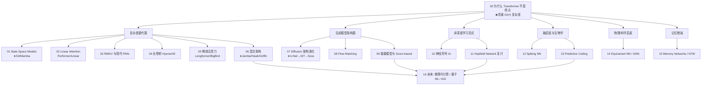

# 讲透模型可能性 (Beyond Transformer, 透) · 完整版

> **AI 圈过度集中在 Transformer+Attention。** 本系列系统探索 O(n²) 复杂度之外的模型设计——State Space Models（Mamba）、Linear Attention（RWKV）、长卷积（Hyena）、Diffusion 架构、能量模型、神经符号、Spiking NN、Predictive Coding、GNN、Memory Networks、推理时计算、量子 ML——**让模型设计的可能性空间重新打开**。

**14 篇主线 + 1 综述，从"O(n²) 复杂度问题"一路讲到"AGI 架构可能性"。**

---

## 这份教程为谁而写

- 觉得 Transformer"已经赢了"，**不知道还有什么其他可能**的人。
- 听过 Mamba、RWKV、Diffusion，但**讲不清它们的本质差异**的人。
- 想做研究，但**不知道除了改 attention 还能改什么**的人。
- 想理解 OpenAI o1 的"推理时计算"和 Sora 的"Diffusion Transformer"本质的人。
- 关心 AGI，想知道**下一个 10 年的架构可能性**的人。

## 教学宪法（每章遵守）

每个概念按三层呈现：**直觉（比喻）→ 数学（公式与边界）→ 代码（bash 跑通的实证）**。每篇配一个能跑出反直觉结论的 Python 实验。

## 灵魂：Transformer 不是终点

> **Transformer+Attention 是 2017-2024 的赢家，但不是 AI 架构的终点。O(n²) 复杂度限制了它走向百万 token；单架构无法覆盖所有智能形态。Mamba、RWKV、Diffusion、SNN、Predictive Coding——每种"非主流"架构都在回答一个 Transformer 答不好的问题。**

$$
\underbrace{\text{Transformer}}_{\text{2017-2024 主流}}
\quad\xrightarrow{\text{复杂度瓶颈}}\quad
\underbrace{\text{SSM/Linear/卷积}}_{\text{亚二次}}
\quad+\quad
\underbrace{\text{Diffusion/Energy}}_{\text{生成新范式}}
\quad+\quad
\underbrace{\text{SNN/HDC/Predictive}}_{\text{脑启发}}
$$

## 核心实证（实验 00）

> Transformer 的 attention 在序列长度 N=8192 时，**内存爆炸 64×**——这就是为什么需要新架构。

| 序列长度 N | Attention FLOPs | Attention 内存 | Mamba FLOPs | Mamba 内存 |
|:-------:|:-----------:|:----------:|:-------:|:------:|
| 512 | 1× | 1× | 1× | 1× |
| 2048 | 16× | 16× | 4× | 1× |
| 8192 | 256× | 256× | 16× | 1× |
| 32768 | 4096× | 4096× | 64× | 1× |

**Attention 是 O(n²)，Mamba 是 O(n)** —— 长序列场景 Mamba 完胜。

## 目录与学习路径



| 章节 | 文档 | 回答的问题 | 实验 |
|------|------|-----------|------|
| **入门篇** | | | |
| 00 | [00-为什么Transformer不是终点.md](00-为什么Transformer不是终点.md) | Transformer 的瓶颈是什么？为什么需要新架构？ | `00_why_not_transformer.py` ★ |
| **复杂度替代篇（解决 O(n²)）** | | | |
| 01 | 01-StateSpaceModels.md | S4/Mamba 怎么实现 O(n) 复杂度？ | `01_ssm.py` ★ |
| 02 | 02-LinearAttention.md | Performer/Linear Transformer 怎么近似 attention？ | `02_linear_attn.py` |
| 03 | 03-RWKV与现代RNN.md | RWKV 怎么做到 RNN 的并行训练 + Transformer 的能力？ | `03_rwkv.py` ★ |
| 04 | 04-长卷积Hyena.md | Hyena/H3 怎么用长卷积替代 attention？ | `04_hyena.py` |
| 05 | 05-稀疏注意力.md | Longformer/BigBird 怎么用稀疏 pattern 省内存？ | `05_sparse_attn.py` |
| 06 | 06-混合架构Jamba.md | Jamba/Hawk/Griffin 怎么融合 Transformer+Mamba？ | `06_hybrid.py` ★ |
| **生成模型架构篇** | | | |
| 07 | 07-Diffusion架构演化.md | U-Net → DiT → Sora 的演化逻辑？ | `07_diffusion_arch.py` ★ |
| 08 | 08-FlowMatching.md | Flow Matching / Rectified Flow 比 Diffusion 强在哪？ | `08_flow_matching.py` |
| 09 | 09-能量模型与Score.md | EBM / Score-based 的物理直觉？ | `09_ebm.py` |
| **非深度学习范式** | | | |
| 10 | 10-神经符号AI.md | Neuro-Symbolic 怎么融合 NN + 符号逻辑？ | `10_neuro_symbolic.py` |
| 11 | 11-Hopfield复兴.md | 现代 Hopfield Network 与 attention 的关系？ | `11_hopfield.py` |
| **脑启发与生物学** | | | |
| 12 | 12-SpikingNN.md | SNN 为什么能效比 NN 高 1000×？ | `12_snn.py` |
| 13 | 13-PredictiveCoding.md | Predictive Coding 与 RLHF 的关系？ | `13_predictive_coding.py` |
| **物理/科学启发** | | | |
| 14 | 14-Equivariant与GNN.md | 等变网络为什么对分子/物理重要？ | `14_equivariant.py` |
| **记忆增强** | | | |
| 15 | 15-MemoryNetworks.md | NTM/DNC 怎么做"外部记忆"？ | `15_memory_nets.py` |
| **未来** | | | |
| 16 | 16-未来展望.md | 推理时计算（o1）/ 量子 ML / AGI 架构？ | （综述）|

## 怎么跑

```bash
cd 讲透模型可能性
python3 -u experiments/00_why_not_transformer.py    # 复杂度对比
python3 -u experiments/01_ssm.py                     # SSM/Mamba
python3 -u experiments/02_linear_attn.py             # Linear Attention
python3 -u experiments/03_rwkv.py                    # RWKV
# ... 全部脚本几秒内跑完
```

---

## 核心方法论（"讲透"标准）

1. **原理优先于 hype**：每种架构先讲数学，再讲工程，不盲目跟风。
2. **每篇配 bash 跑通的实验**：不凭论文断言，数字都是跑出来的。
3. **批判性**：每种架构都标注**适用场景 vs 局限**，没有银弹。
4. **横向对比**：同任务下不同架构对比，让读者看清取舍。

---

## 贯穿全系列的九大核心洞见

1. **Transformer 不是终点**（00）：O(n²) 限制 + 单架构局限。
2. **SSM 用线性递推**（01）：S4 → Mamba 把 RNN 训练并行化。
3. **Linear Attention 用核函数近似**（02）：Performer 用随机特征。
4. **RWKV = RNN+Transformer 混血**（03）：训练并行 + 推理 O(1)。
5. **长卷积是 attention 的"穷表亲"**（04）：便宜但表达能力弱。
6. **稀疏 attention 是工程妥协**（05）：不完全 O(n)，但实际可用。
7. **混合架构是务实派**（06）：Jamba = 几层 Mamba + 几层 Attention。
8. **Diffusion 架构从 U-Net 走向 DiT**（07）：Transformer 化统一。
9. **未来是推理时计算**（16）：OpenAI o1 的范式——架构不变，**用更多推理 token 换智能**。

## 前置要求

- **数学**：矩阵乘、softmax、概率、复变函数（SSM 部分）。
- **代码**：PyTorch / NumPy。
- **背景**：熟悉 Transformer 基本结构。

## 与其他系列的关系

- [`../讲透Transformer/`](../讲透Transformer/)：本系列是它的"超越篇"。
- [`../讲透模型/`](../讲透模型/)：本系列 00 与之互补——前者讲主流，本系列讲非主流。
- [`../讲透生成模型/`](../讲透生成模型/)：本系列 07-09 是其架构层延伸。
- [`../讲透基础模型/`](../讲透基础模型/)：本系列 16 接续 AGI 讨论。

---

📌 **下一步**：从 [00-为什么Transformer不是终点.md](00-为什么Transformer不是终点.md) 开始，看实验如何量化 Transformer 的 O(n²) 瓶颈；或跳 [01-StateSpaceModels.md](01-StateSpaceModels.md) 看 Mamba 怎么做到 O(n)；或直奔 [16-未来展望.md](16-未来展望.md) 看推理时计算与 AGI 路径。
