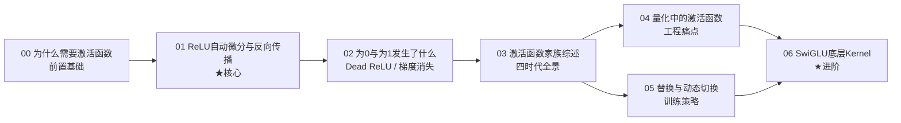
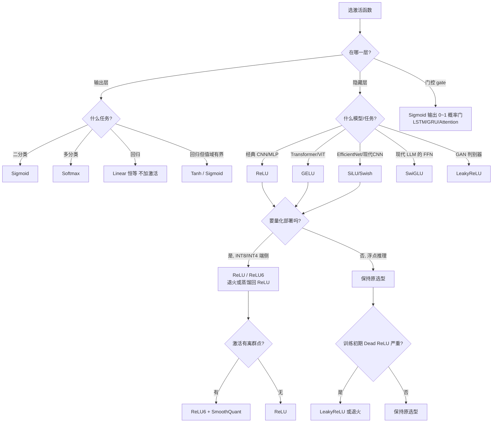

# 讲透激活函数

> 从「ReLU 怎么做自动微分」一个问题出发，一路追问到反向传播掩码机制、Dead ReLU、量化挑战、PyTorch/ONNX Runtime 工程实现、误差来源、激活函数替换与动态切换、家族综述，最后落到大模型 SwiGLU 底层 Kernel 融合。
>
> 本教程由一份引导式问答（原 Gemini 对话）重构而成：**保留其层层追问的探索路径，但补上为「数学零基础」读者准备的直觉推导，并把每一个结论都用可运行代码跑通验证。**

---

## 这份教程为谁而写

- **数学薄弱、但系统/工程扎实**的读者：直觉层补数学，工程层发挥你的优势。
- 想理解「PyTorch 的 `relu.backward()` 底层到底干了什么」的人。
- 想搞清楚「为什么训练好的 ReLU 模型不能直接换成 GELU」的人。
- 做模型量化部署、被激活函数卡住算子融合的人。

## 教学宪法（每章遵守）

每个概念按三层呈现：

1. **直觉层**——一句话比喻 + 为什么需要它（先于公式）。
2. **数学层**——关键公式与推导主线，标注假设与边界。
3. **代码层**——可运行的最小脚本，并用 `bash` 真正跑出结果作为实证。

结尾固定给出 **📌 下一步** 与（核心章）**✍️ 练习**。

## 目录与学习路径



| 章节 | 文档 | 解决的原对话问题 | 实验脚本 |
|------|------|------------------|----------|
| 00 | [00-为什么需要激活函数.md](00-为什么需要激活函数.md) | （综述开场：没有激活函数网络坍缩为线性） | `experiments/00_why_activation.py` |
| 01 | [01-ReLU自动微分与反向传播.md](01-ReLU自动微分与反向传播.md) | Q1 ReLU 怎么做自动微分与反向传播 | `experiments/01_relu_autograd.py` |
| 02 | [02-为0与为1发生了什么.md](02-为0与为1发生了什么.md) | Q2 为0时会更新吗 / Q3 为1时呢 | `experiments/02_dead_relu.py` `experiments/03_gradient_vanishing.py` |
| 03 | [03-激活函数家族综述.md](03-激活函数家族综述.md) | Q9 激活函数综述 | `experiments/04_activation_zoo.py` |
| 04 | [04-量化中的激活函数.md](04-量化中的激活函数.md) | Q4 量化问题 / Q5 框架如何处理 / Q6 误差主要来源 | `experiments/05_quantization_demo.py` |
| 05 | [05-替换与动态切换.md](05-替换与动态切换.md) | Q7 能否替换 / Q8 先变体后ReLU | — |
| 06 | [06-SwiGLU底层Kernel.md](06-SwiGLU底层Kernel.md) | Q10 SwiGLU 底层算子融合 | `experiments/06_swiglu_fusion.py` |
| — | [exercises.md](exercises.md) | 输出倒逼输入 | — |
| 选型 | （见下方「场景选型决策树」） | 综合应用：在多重约束下选激活函数 | `experiments/07_selection_guide.py` |

---

## 场景选型决策树

> 「哪个激活函数最好」是错问题。正确问题是「**在我的约束（层位置 + 任务 + 硬件 + 训练阶段 + 数据）下，选哪个最合适**」。下面这棵树给出可操作的决策路径。



### 实证：选错激活函数的代价（实验 07）

```bash
cd experiments && python3 07_selection_guide.py
```

**隐藏层选型（6 层 MLP，make_moons）——「收敛速度」才是隐藏层选型的核心考量：**

```
Sigmoid    : 收敛(loss<0.3)步数= 57   <- 梯度消失, 比别人慢 10~28 倍
Tanh       : 收敛步数=  2
ReLU       : 收敛步数=  4
LeakyReLU  : 收敛步数=  5
GELU       : 收敛步数=  2
SiLU       : 收敛步数=  3
```

**输出层选错（回归任务）——「任务类型」硬性决定输出层，选错模型物理性无法表达目标：**

```
输出层=Linear : 预测值域=[-2.15,+2.09]  MSE=0.0009  # 正确
输出层=Sigmoid: 预测值域=[+0.00,+1.00]  MSE=1.1179  # 输出被压死在(0,1)
输出层=Tanh   : 预测值域=[-1.00,+1.00]  MSE=0.3261  # 幅度不够
```

---

## 环境与运行

```
torch 2.10.0 (CPU 即可)  |  matplotlib 3.10  |  numpy 1.26  |  python 3.12
```

一键跑通所有实验：

```bash
cd 讲透激活函数/experiments
for f in 0*.py; do echo "===== $f ====="; python3 "$f"; done
```

每个脚本独立、可单独运行，输出即文档中引用的「实证」。

## 这份教程与原对话的关系

原对话是**单链追问式**（10 轮问答，从算法问到系统），价值极高但有两个短板：

1. **数学对零基础不友好**——直接甩「次梯度」「Hadamard 积」「链式法则」，没有铺垫。本教程在每章开头补足直觉。
2. **结论全是「据说」**——没有跑代码证明。本教程把每个关键结论（ReLU 反向=掩码乘、sigmoid 梯度消失、Leaky 量化退化、SwiGLU 融合等价…）都用脚本验证并贴出真实输出。

> 一句话：**原对话给「地图」，本教程给「越野车 + 仪表盘」。**

## 一张图看懂激活函数演进

```mermaid
graph TB
    subgraph 一代[一·早期饱和型]
        S1[Sigmoid σ=1/(1+e^-x)] -->|问题:梯度消失/非零中心| S2[Tanh]
    end
    subgraph 二代[二·分段线性 工程霸主]
        R1[ReLU max 0,x] -->|问题:Dead ReLU| R2[Leaky/PReLU]
        R1 -->|问题:正轴无界→量化离群| R3[ReLU6]
    end
    subgraph 三代[三·平滑自门控 大模型]
        G1[GELU x·Φx<br/>BERT/GPT] 
        G2[SiLU/Swish x·σx<br/>EfficientNet]
    end
    subgraph 四代[四·门控线性单元 现代LLM]
        W1[SwiGLU = Swish xW ⊙ xV<br/>LLaMA/Qwen 事实标准]
    end
    S2 --> R1
    R2 --> G1
    R3 --> G2
    G1 --> W1
    G2 --> W1
```

---

📌 **下一步**：如果你对激活函数还没概念，从 [00-为什么需要激活函数.md](00-为什么需要激活函数.md) 开始；如果只想搞懂 ReLU 反向传播，直接跳 [01](01-ReLU自动微分与反向传播.md)；如果你在做量化部署，直奔 [04](04-量化中的激活函数.md)。
