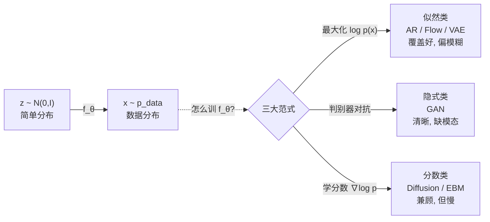

# 00 · 统一视角：生成模型到底都在干什么？

> **如果你只能从本教程带走一件事，就带这件：所有生成模型都在干同一件事，只是用了三种不同的训练招式。把这三种招式的"性格"想明白，VAE/GAN/Diffusion 就不再是三坨毫不相干的黑魔法，而是同一棵树上的三根枝。**

---

## 0. 先回答一个问题：什么是"生成"？

你已经用过 ChatGPT、Midjourney、Sora。它们都在做同一件事：**凭空造出训练时没见过的、但"像训练数据"的新东西**。

- ChatGPT 造新句子（没在互联网上原样出现过）
- Midjourney 造新图像
- Sora 造新视频

这种能力叫**生成**（generation）。能做到这件事的模型叫**生成模型**（generative model）。

但"生成"这个词太泛，容易和"判别"混淆。我们先把它和判别模型摆在一起对比——这是理解一切的起点。

## 1. 直觉层：判别 vs 生成

### 一句话比喻

> **判别模型是"质检员"**：你递给它一张图，它说"这是猫"。
> **生成模型是"造假者"**：你给它一堆真猫的照片，它要画出一张**新的、足以乱真**的猫。

| | 判别模型 | 生成模型 |
|---|---|---|
| 角色 | 质检员 | 造假者 |
| 学的分布 | $p(y\mid x)$——给 $x$，预测标签 $y$ | $p(x)$——数据 $x$ 本身怎么分布 |
| 输入→输出 | 图 $\mapsto$ "猫" | 噪声 $\mapsto$ 图 |
| 关心 | 边界（猫和狗怎么分）| 全貌（猫长什么样）|
| 典型 | ResNet、BERT(分类头) | GPT、Stable Diffusion |

### 为什么生成比判别难？

判别只要学会"猫 vs 狗的**区别**"——狗的特征可以完全不懂。生成要学会"猫的**全部**"——毛发、瞳孔、胡须、姿态、光影……**漏掉任何细节都造不像**。这就是为什么 2012 年判别（AlexNet）就起飞了，而生成（像样的图像）要到 2014（GAN）甚至 2020（Diffusion）才真正能用。

## 2. 数学层：生成模型的形式化

### 2.1 目标：让 $p_\theta$ 逼近 $p_{data}$

设真实数据服从某个未知分布 $p_{data}(x)$。生成模型要学一个带参数的分布 $p_\theta(x)$，让它尽量接近 $p_{data}$：

$$
\text{目标：}\quad p_\theta(x) \;\xrightarrow{\;\text{逼近}\;}\; p_{data}(x)
$$

**怎么衡量"接近"？** 最标准的尺度是 **KL 散度**（Kullback–Leibler divergence）：

$$
\mathrm{KL}\bigl(p_{data}\,\|\,p_\theta\bigr) = \mathbb{E}_{x\sim p_{data}}\!\left[\log\frac{p_{data}(x)}{p_\theta(x)}\right]
= \underbrace{-\mathbb{E}_{x\sim p_{data}}[\log p_\theta(x)]}_{\text{负对数似然 NLL}} \;-\; \underbrace{H(p_{data})}_{\text{常数}}
$$

> 📐 **关键结论**：最小化 $\mathrm{KL}(p_{data}\|p_\theta)$ **等价于最大化对数似然** $\mathbb{E}[\log p_\theta(x)]$。
>
> 这就是"似然类"生成模型的数学根：**最大化似然 = 最小化 KL = 让模型分布逼近数据分布。**

### 2.2 但有个硬骨头：$p_\theta(x)$ 不好算

对复杂的 $x$（比如 1024×1024 的图），直接写出一个能归一化（$\int p_\theta = 1$）的概率密度几乎不可能。于是三大流派给出了**三种绕开这个难题**的招式——这就是本教程的总纲。

### 2.3 三大训练范式（务必记住这张表）

$$
\boxed{
\begin{array}{c|c|c}
\textbf{范式} & \textbf{怎么训练} & \textbf{目标函数} \\
\hline
\textbf{① 似然类} & \text{直接最大化 } \log p_\theta(x) & \displaystyle\max_\theta\,\mathbb{E}_{x\sim data}[\log p_\theta(x)] \\
\text{(AR/Flow/VAE)} & \text{(= 最小化 KL)} & \\
\hline
\textbf{② 隐式类} & \text{不写 } p,\text{ 用判别器} & \displaystyle\min_G\max_D\,\mathbb{E}[\log D(x)]+\mathbb{E}[\log(1{-}D(G(z)))] \\
\text{(GAN)} & \text{驱动"像不像"} & \\
\hline
\textbf{③ 分数类} & \text{学分布的斜率} & \displaystyle\min_\theta\,\mathbb{E}\bigl\|s_\theta(x)-\nabla_x\log p_{data}(x)\bigr\|^2 \\
\text{(Diffusion/EBM)} & \text{（分数匹配）} & s_\theta\approx\nabla_x\log p(x)
\end{array}}
$$

> 这里**不用**看懂每个公式的细节（后面每章会逐个拆）。现在只要记住：**三派不是三个互不相干的方法，而是"逼近 $p_{data}$"这个同一个目标的三个解法。**

## 3. 代码层：用一组数据把三派"画"给你看

光讲理论是空的。我们把 **VAE（似然）/ GAN（隐式）/ Diffusion（分数）** 三大范式，丢去学**同一个**目标分布：8 个高斯团围成一圈（"8-Gaussians"，生成模型教学经典 benchmark）。

```bash
cd 讲透生成模型/experiments && python3 00_unified_view.py
```

**真实输出**（bash 跑通，每次可复现）：

```
真实数据: 8 个模态, 共 8 个高斯团

[VAE]        训练完成 (39s)
[GAN]        训练完成 (85s)
[Diffusion]  训练完成 (44s)

=== 模态覆盖统计 (命中 8 个高斯团中的几个) ===
  VAE       : 8/8   <- 似然类: 覆盖全, 样本偏模糊
  GAN       : 1/8   <- 隐式类: 易模式崩溃 (缺模态)
  Diffusion : 8/8   <- 分数类: 兼顾覆盖与清晰, 代价是采样慢 (T=100 步)
```

把 2000 个生成样本撒到平面上（`unified_view.png`），你看到的会是：

- **左一 真实数据**：8 个整齐的高斯团。
- **左二 VAE**：8 个团都在（8/8 命中），但**每个团都偏大、偏糊**——VAE 不敢漏掉任何模态，于是把概率"摊薄"。
- **左三 GAN**：**只有 1 个团**（1/8）！2000 个样本全挤进一个模态——这就是臭名昭著的**模式崩溃**（mode collapse）。
- **左四 Diffusion**：8 个团都在，而且**每个都清晰紧致**——但它要反向采样 100 步才出一张图，是三者里最慢的。

**这张图浓缩了生成模型四十年的核心张力。** 下一节我们回答：**为什么三派会有这样的性格差异？**

## 4. 深度洞察：为什么三派性格不同？（★本教程最值钱的部分）

这是初学最容易跳过、但理解了就"通透"的一节。我们追问：**为什么似然类总是"覆盖好但模糊"，隐式类总是"清晰但缺模态"，分数类却能兼顾？**

答案藏在它们**优化的散度（衡量"接近"的尺子）不同**。

### 4.1 似然类为什么"覆盖全但模糊"？

似然类最大化 $\mathbb{E}[\log p_\theta(x)]$，等价于最小化 **正向 KL** $\mathrm{KL}(p_{data}\|p_\theta)$。正向 KL 有个**不对称**的脾气：

$$
\mathrm{KL}(p_{data}\|p_\theta) \;\text{在「真实有、模型却说没有」的地方}\;\to\;\infty
$$

意思是：**只要有一个真实数据点落在 $p_\theta=0$ 的地方，KL 就爆炸。** 所以模型为了不爆炸，会拼命把概率**摊到所有真实数据可能出现的地方**——宁可每个地方都平庸，也不能漏。结果就是：**覆盖全（8/8），但每个模态都"摊薄"了，样本偏糊。**

> 这正是 **VAE 图像模糊**的根本原因。它不是"VAE 训练得不好"，而是**似然目标本身的偏置**。

### 4.2 隐式类为什么"清晰但缺模态"？

GAN 不算 $p$，而是让生成器和判别器对抗。可以证明它优化的等价是 **Jensen–Shannon 散度**（JS）。JS 对"漏掉模态"**没有无穷大惩罚**——判别器只看"眼前这个样本像不像真的"，**根本不关心"还有 7 个模态你都没生成"**。

于是生成器走捷径：与其费力学会全部 8 个模态，不如**把一个模态练到极致逼真**，照样骗过判别器。这就是**模式崩溃**：1/8。但那个被生成的模态，质量**极高**——因为全部的"造假功力"都集中在它身上。

> 这正是 **GAN 样本极清晰、但常丢模态**的根本原因。它是**隐式目标的偏置**，不是 bug。

### 4.3 分数类为什么"兼顾"？

扩散模型学的是**分数** $s(x)=\nabla_x\log p(x)$——分布在每个点的"斜率"（指向更高密度方向的箭头）。分数匹配让模型在每个真实数据点附近都学到正确的斜率。采样时（朗之万动力学 / DDPM 反向），从噪声出发，**顺着学到的斜率一路走**，自然回到每个模态。

关键在于：分数是**局部的、逐点的**信息。它既不像似然类那样被"必须覆盖"逼着摊薄（因为它学的是斜率不是概率质量），也不像 GAN 那样只靠一个判别器（每个点都有自己的斜率要学对）。所以它**既覆盖全、又清晰**。

代价呢？**采样要一步步走**（DDPM 走 1000 步，本实验简化到 100 步），是三者里最慢的。

### 4.4 三派性格一表收

| | 优化的散度 | 对"漏模态"的惩罚 | 性格 | 根源 |
|---|---|---|---|---|
| **似然 (VAE)** | 正向 KL $\mathrm{KL}(p_{data}\|p_\theta)$ | **无穷大**（必须覆盖）| 覆盖全、偏模糊 | 似然 = mass-covering |
| **隐式 (GAN)** | JS / Wasserstein | 很弱（判别器只看局部）| 清晰、缺模态 | 对抗无覆盖约束 |
| **分数 (Diffusion)** | 分数匹配 $\|s_\theta-\nabla\log p\|^2$ | 中等（逐点学斜率）| 兼顾、但慢 | 局部斜率 = 精准导航 |

> 🎯 **一句话总结**：VAE 像"博学的庸才"（什么都懂一点，都不精）；GAN 像"偏科的奇才"（一科满分，其他交白卷）；Diffusion 像"踏实的好学生"（每科都好，就是写得慢）。**没有银弹，只有取舍。**

## 5. 统一视角：三派都是"变换 + 训练"

回到开头的灵魂一句话。所有生成模型都可以写成：

$$
z\sim\mathcal N(0,I) \;\xrightarrow{\;f_\theta\;}\; x=f_\theta(z)\sim p_{data}
$$

五大家族，只是 $f_\theta$ 的**形式**不同：

| 家族 | $f_\theta$ 的形式 | 怎么训练 $f_\theta$ | 范式 |
|------|------------------|--------------------|------|
| **自回归 AR** | 一步步采样 $x_i\sim p(x_i\mid x_{<i})$ | 最大似然（逐位）| 似然 |
| **标准化流 Flow** | 可逆网络 $x=f(z)$，$\det J$ 可算 | 精确最大似然 | 似然 |
| **VAE** | 解码器 $x=f(z)$，$z$ 来自编码器 | ELBO（似然下界）| 似然 |
| **GAN** | 生成器 $x=G(z)$ | 对抗 | 隐式 |
| **Diffusion** | 反向去噪网络 $x_{t-1}=f(x_t,t)$ | 噪声预测（=分数匹配）| 分数 |

**这就是全部生成模型的地图。** 后面 01–05 章逐一拆解每根枝，06 章再把它们在数学上统一（Score-SDE）。

## 6. 批判：生成模型的核心难题（预告）

本教程会诚实地告诉你：生成模型至今有三大未竟之业——

1. **评估难**：判别模型有准确率，生成模型怎么量化"像不像"？FID / IS 都是代理指标，**和人类感知相关性并不完美**。详见第 08 章。
2. **可控难**：怎么让模型"画一只戴墨镜的猫"而不是随便画？条件生成、ControlNet 是工程补丁，**理论上仍不优雅**。
3. **理论未解**：为什么扩散模型这么有效？为什么 GAN 训练会突然崩溃？**严格的泛化与收敛理论至今不完整。**

## 7. 一张图收尾



---

📌 **下一步**：去 [01-自回归AR.md](01-自回归AR.md) 看 GPT 背后的自回归——它是似然类里最直观、也是你每天都在用的生成模型。或直接跳 [05-Diffusion.md](05-Diffusion.md) 看当代图像生成霸主。

✍️ **练习（输出倒逼输入）**
1. **概念**：用一句话向没学过 ML 的人解释"判别模型"和"生成模型"的区别。
2. **洞察**：本实验里 GAN 只命中 1/8 模态。如果让你改 GAN 的训练来缓解模式崩溃，你会往哪个方向想？（提示：第 4.2 节的"漏模态惩罚弱"。）
3. **动手**：把 `00_unified_view.py` 里 GAN 的判别器训练步数从 1 步/轮改成 **3 步/轮**（让判别器更强），重跑——观察模态覆盖会不会变化。记录你的发现。
4. **思考**：为什么图像生成本实验用"8 个高斯团"而不是 1 个高斯团当目标？（提示：单模态分布根本看不出"模式崩溃"。）
