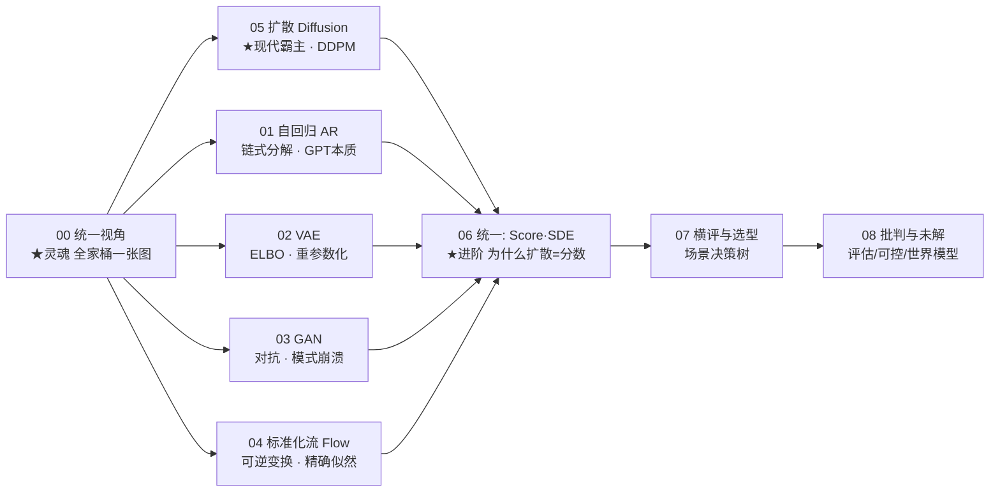
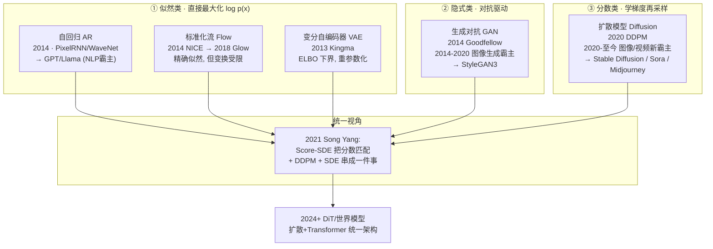

# 讲透生成模型

> **机器怎么学会「无中生有」？**
>
> 判别模型学的是 $p(y\mid x)$——给一张图，告诉我是不是猫。生成模型学的是 $p(x)$——数据本身长什么样，从而能**凭空造出**新的猫、新的句子、新的视频。
>
> 这是深度学习里最浪漫、也最难的子领域：从 GPT 吐出通顺的句子，到 Midjourney 画出惊艳的图，到 Sora 生成连贯的视频——背后都是生成模型。本教程的目标，是让你看懂这**一整片**版图，而不是迷失在 VAE/GAN/Diffusion 各是一坨的细节里。
>
> 承接「[讲透激活函数](../讲透激活函数/）」「[讲透泛化](../讲透泛化/）」，主题独立：激活函数回答"网络**能不能训练**"，泛化回答"训练好了**为何对新数据有效**"，生成模型回答"**怎么让网络造出全新的数据**"。

---

## 这份教程为谁而写

- 听过 GAN/VAE/Diffusion，但**分不清它们到底有什么本质区别**的人。
- 用过 Stable Diffusion / ChatGPT，想搞懂"它是怎么生成出来的"的人。
- 被"ELBO""重参数化""模式崩溃""分数匹配""前向加噪反向去噪"这些术语吓退的人。
- 想知道**为什么 2020 年之后扩散模型一举取代 GAN** 成为图像生成霸主的人。
- 数学薄弱但工程扎实：直觉层补数学，工程层发挥你的优势。

## 教学宪法（每章遵守）

每个概念按三层呈现：

1. **直觉层**——一句话比喻 + 为什么需要它（先于公式）。
2. **数学层**——关键公式与推导主线，标注假设与边界。
3. **代码层**——可运行的最小脚本，并用 `bash` 真正跑出结果作为实证。

诚实标注哪些是"已证明"、哪些是"经验现象"、哪些"仍未解决"。结尾固定给出 **📌 下一步** 与（核心章）**✍️ 练习**。

---

## 灵魂：生成模型的统一视角（一句话钉死）

> **所有生成模型都在干同一件事：学一个变换 $f$，把一个我能轻易采样的简单分布（标准高斯 $\mathcal N(0,I)$）变成数据分布 $p_{data}$。各家流派，只差在「变换怎么设计」和「变换怎么训练」上。**

$$
\underbrace{z \sim \mathcal N(0,I)}_{\text{简单分布, 易采样}}
\;\xrightarrow{\;f_\theta\;}\;
\underbrace{x = f_\theta(z) \;\sim\; p_{data}}_{\text{数据分布, 难直接采}}
$$

**判别 vs 生成**，一句话区分：

| | 学什么 | 输入→输出 | 典型任务 |
|---|---|---|---|
| **判别模型** | $p(y\mid x)$ | $x \mapsto y$（图→标签）| 分类、检测 |
| **生成模型** | $p(x)$ | $z \mapsto x$（噪声→数据）| 画图、对话、视频 |

## 三大训练范式（这是最清晰的分类法）

把生成模型按"**怎么训练那个变换**"分成三类，你就抓住了全部脉络。**这是本教程的总纲，务必先记住。**

| 范式 | 核心思想 | 训练目标 | 代表模型 | 性格 |
|------|---------|---------|---------|------|
| **① 似然类**<br/>Likelihood | 直接建模 $p_\theta(x)$，最大化数据出现的概率 | $\max\limits_\theta \log p_\theta(x)$ | **AR**(GPT)、**Flow**、**VAE** | **覆盖好**（要把所有数据的似然都拉高），但样本常**偏模糊** |
| **② 隐式类**<br/>Implicit | 不建模 $p$，只让生成样本≈真实样本，用判别器驱动 | 对抗 min-max 博弈 | **GAN** | 样本**清晰**（要骗过判别器就得逼真），但易**模式崩溃**（覆盖差）|
| **③ 分数类**<br/>Score-based | 学分布的"斜率" $\nabla_x\log p(x)$，再顺着斜率采样 | 分数匹配 | **Diffusion**(DDPM)、**EBM** | **兼顾覆盖与清晰**，代价是采样要迭代很多步（**慢**）|

**贯穿全教程的主线 ——「覆盖 vs 清晰」的取舍：**

$$
\underbrace{\text{似然类 (VAE)}}_{\text{覆盖全, 但模糊}}
\quad\longleftrightarrow\quad
\underbrace{\text{隐式类 (GAN)}}_{\text{清晰, 但缺模态}}
\quad\xrightarrow{\text{分数类 (Diffusion) 兼顾}}\quad
\text{又清又全, 但慢}
$$

实验 00 用同一组数据把这件事**画给你看**（见下文实证速览）。

## 目录与学习路径



| 章节 | 文档 | 回答的问题 | 三大范式 | 实验 |
|------|------|-----------|---------|------|
| 00 | [00-统一视角.md](00-统一视角.md) | 生成模型到底都在干什么？五大流派如何统一？ | 全部 | `00_unified_view.py` ★ |
| 01 | [01-自回归AR.md](01-自回归AR.md) | GPT 是怎么"一个字一个字"生成的？为什么逐 token 慢？ | 似然 | `01_autoregressive.py` |
| 02 | [02-VAE.md](02-VAE.md) | 编码器-解码器+ELBO 是怎么回事？为什么 VAE 图像模糊？ | 似然 | `02_vae.py` |
| 03 | [03-GAN.md](03-GAN.md) | 对抗训练为什么不稳定？模式崩溃怎么救？ | 隐式 | `03_gan.py` |
| 04 | [04-Flow.md](04-Flow.md) | 什么叫"可逆变换"？为什么能算精确似然？ | 似然 | `04_flow.py` |
| 05 | [05-Diffusion.md](05-Diffusion.md) | 前向加噪+反向去噪为何能生成图？为什么统治了图像？ | 分数 ★ | `05_diffusion.py` |
| 06 | [06-统一-Score与SDE.md](06-统一-Score与SDE.md) | 为什么 DDPM、分数匹配、SDE 是同一件事？ | 全部 ★ | （理论+图解）|
| 07 | [07-横评与选型.md](07-横评与选型.md) | 我的场景该选哪个生成模型？ | 全部 | `07_selection_guide.py` |
| 08 | [08-批判与未解.md](08-批判与未解.md) | 生成模型还解决不了什么？怎么评估"像不像"？ | — | — |
| — | [exercises.md](exercises.md) | 输出倒逼输入 | — | — |

## 五大流派速查表

| 流派 | 变换形式 | 能否算精确 $p(x)$ | 采样速度 | 样本质量 | 训练稳定性 | 巅峰应用 |
|------|---------|:-:|:-:|:-:|:-:|------|
| **自回归 AR** | $p(x)=\prod_i p(x_i\mid x_{<i})$ | ✅ 精确 | 慢（逐 token）| 高 | 高 | GPT、Llama、Gemini |
| **标准化流 Flow** | 可逆 $x=f(z)$，变量替换 | ✅ 精确 | 快（一次前向）| 中 | 高 | Glow、语音合成 |
| **VAE** | 编码+解码，ELBO 下界 | ❌ 仅下界 | 快 | 中（偏糊）| 高 | 图像压缩、药物设计 |
| **GAN** | 生成器 vs 判别器对抗 | ❌ 无法算 | 快（一次前向）| 高（清晰）| **低**（难训）| StyleGAN、DeepFake |
| **Diffusion** | 前向加噪+反向去噪 | ❌ 隐式 | **慢**（多步迭代）| **最高** | 高 | Stable Diffusion、Sora、Midjourney |

> 三大范式 × 五大流派的关系：**AR/Flow/VAE = 似然类**；**GAN = 隐式类**；**Diffusion = 分数类**。

## 实证速览（全部 bash 跑通）

> 实验 00 是全教程的"定海神针"——用 **VAE / GAN / Diffusion 三大范式学同一个 8-高斯分布**，把"覆盖 vs 清晰"的取舍**直接画出来**。

| 范式 | 命中模态 (共 8) | 含义 |
|------|:-:|------|
| 真实数据 | 8/8 | 8 个高斯团 |
| **VAE**（似然类）| **8/8** | 覆盖全，但样本团偏大/模糊（为拉高所有数据似然而"摊薄"）|
| **GAN**（隐式类）| **1/8** | 严重**模式崩溃**——2000 个样本全挤进 1 个模态（vanilla GAN 经典失败）|
| **Diffusion**（分数类）| **8/8** | 兼顾覆盖与清晰，代价是反向采样要走 100 步 |

```bash
cd experiments && python3 00_unified_view.py   # CPU 约 2~3 分钟, 输出 unified_view.png
```

> 注：GAN 的 1/8 不是"GAN 垃圾"，而是 **vanilla GAN 未调优**的真实表现——这正是第 03 章要解决的痛点。现代 GAN（StyleGAN + 大量稳定化技巧）能覆盖全部模态。

## 环境与运行

```
torch 2.10 (CPU 即可, 但单线程更快)  |  matplotlib 3.10  |  numpy 1.26  |  python 3.12
```

> ⚠️ 经实测，本机 torch 在小矩阵上**多线程反而更慢**（线程争抢 > 计算）：默认 8 线程 19ms/步，`torch.set_num_threads(1)` 降到 5ms/步。**所有脚本已内置此设置。**

一键跑通所有实验：

```bash
cd 讲透生成模型/experiments
for f in 0*.py; do echo "===== $f ====="; python3 "$f"; done
```

## 一张图看懂生成模型演进



---

📌 **下一步**：如果你对生成模型还没概念，从 [00-统一视角.md](00-统一视角.md) 开始——它把全家桶用一张图、一个公式讲透；如果你只关心"为什么 GPT 能生成文字"，跳 [01-自回归AR.md](01-自回归AR.md)；如果你只想懂 Stable Diffusion，直奔 [05-Diffusion.md](05-Diffusion.md)。
