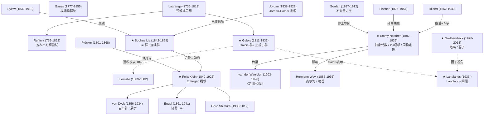

# 讲透群论 · 思想史（HISTORY）

> 一句话定位：群论是怎么从"解方程"长成"现代数学的语言 + 物理对称性的语法"的？
>
> **博士级标准**：这不是"年份+人物"的维基年表。这是一份**思想史**（history of ideas）——群论为什么在 1830 年代诞生于巴黎而不是 1730 年代？它经历了多少次范式转移？当前的"统一"叙事有多少是事后合理化？

---

## 0. 方法论说明

### 0.1 思想史 vs 年代史

教科书讲群论史，通常是：1770 Lagrange → 1824 Abel → 1832 Galois → 1854 Cayley → 1872 Klein → 1920s Noether。这种年表给你"事实"，但**不告诉你为什么此时此地**。

**思想史问的问题**：

| 问题 | 例子 |
|------|------|
| 为什么此时此地？ | 为什么"群"的概念在 1830 年代的巴黎而非 1680 年代的莱比锡诞生？ |
| 为什么这个方向被淘汰？ | 为什么 Ruffini 1799 年的五次不可解证明被忽视了 25 年？ |
| 谁影响了谁？ | Galois 不是即兴天才——他站在 Lagrange 1770 论文的肩膀上 |
| 偶然性：如果……？ | 如果 Noether 是男性？如果 Galois 没死在决斗中？ |

### 0.2 库恩范式转移

Thomas Kuhn 的范式转移框架（常规科学 → 异常累积 → 危机 → 范式革命 → 新常规科学）完美适用于群论史。本文识别了**四次大范式转移**：

| 范式转移 | 时期 | 旧范式 | 新范式 |
|---------|------|--------|--------|
| **第一次** | 1830s | 群 = 解方程的辅助工具 | 群 = 独立的数学对象 |
| **第二次** | 1872 | 群 = 代数结构 | 几何 = 群的不变量 |
| **第三次** | 1920s | 具体群（置换群、矩阵群） | 抽象结构（环/理想/同调代数） |
| **第四次** | 1950s- | 群 = 对象本身 | 群 = 函子/范畴中的对象 |

### 0.3 为什么学群论史

1. **避免重新发明轮子**——今天"对称性深度学习"（equivariant NN）的很多思想，1960s 的物理学家已经用过（Wigner 表示论）
2. **理解路径依赖**——群论为什么是"单群分类"的形状而不是别的？因为 19 世纪解方程的历史偶然
3. **训练判断力**——下一个大方向（Langlands？几何化？）的判断需要历史视野

---

## 1. 起源：方程根的对称（1770s-1830s）

### 1.1 Lagrange 的预解式（1770）

群论的真正起点不是 Galois，而是 **Joseph-Louis Lagrange**（1736-1813）。1770 年，Lagrange 发表了里程碑论文 *Réflexions sur la résolution algébrique des équations*（关于代数方程求解的反思），试图回答一个折磨了欧洲数学家 200 年的问题：**二次、三次、四次方程都有求根公式，五次方程为什么没有？**

Lagrange 的关键发明是**预解式**（resolvent）。对于三次方程 $x^3 + px + q = 0$，设根为 $x', x'', x'''$，取单位立方根 $1, \omega, \omega^2$，Lagrange 构造了表达式：

$$R = x' + \omega x'' + \omega^2 x'''$$

他注意到：$R$ 在根的 6 种排列（permutation）下只取 2 个不同的值。三次方程之所以可解，正是因为根的排列群 $S_3$ 可以被"逐层简化"为交换群。

**但 Lagrange 从未把排列复合起来**——他没有意识到排列本身构成一个"群"。他离发现群论只有一步之遥，但这一步他没迈出去。MacTutor 评价："虽然排列群论的雏形在这篇工作中清晰可见，Lagrange 从未复合他的排列，因此在某种意义上他从未讨论过群。"

### 1.2 Ruffini 与 Abel：五次不可解

**Paolo Ruffini**（1765-1822）在 1799 年出版了一部著作，试图证明五次方程没有根式通解。他引入了"permutazione"的概念，显式使用了封闭性，并将排列分为循环群（permutazione semplice）和非循环群（permutazione composta）。但他的证明有漏洞——直到 Abel 之前无人接受。

**Niels Henrik Abel**（1802-1829），挪威数学家，在 1824 年给出了五次方程不可根式求解的**第一个被接受的证明**。Abel 使用了已有的排列思想，但真正的新贡献不多。他 26 岁死于肺结核。

**反常识 1**：Ruffini 在 Abel 之前 25 年就尝试了这个证明，但被忽视了。科学史不只看"谁先发现"，还看"谁被听见了"。

### 1.3 Galois：把"方程能否解"翻译成"群的结构"

**Évariste Galois**（1811-1832）是群论的真正发明者。据 MacTutor 传记记载：

- **1811 年 10 月 25 日**出生于巴黎附近的 Bourg-la-Reine
- **1827 年 2 月**首次上数学课，立刻入迷。老师报告说："对数学的激情支配了他"
- **1828 年**第一次考 École Polytechnique 失败
- **1829 年 4 月**发表第一篇数学论文（连分数），5 月向巴黎科学院提交代数方程论文，**Cauchy 被指定为审稿人**
- **1829 年 7 月 2 日**，父亲 Nicholas Gabriel Galois 因被伪造文字陷害而自杀——这对 Galois 打击极大
- **1829 年**第二次考 Polytechnique 失败
- **1830 年 2 月**提交新论文《论方程根式可解的条件》参加科学院大奖——**审稿人 Fourier 在 4 月去世，论文丢失**
- **1831 年 1 月**第三版论文提交，**Poisson 退稿说"论证不够清楚也不够充分"**
- **1832 年 5 月 30 日**，与 Pescheux d'Herbinville 决斗（与一位叫 Stéphanie-Félicie du Motel 的女子有关）
- **1832 年 5 月 31 日**，在 Cochin 医院死于腹膜炎，**年仅 20 岁**

Galois 的核心发明可以用一句话概括：

> **不要问"方程怎么解"，要问"方程根的对称结构是什么"。**

给定多项式 $f(x)$，其根 $\{r_1, \ldots, r_n\}$ 上所有"保持根的代数关系不变"的置换构成一个群——**Galois 群** $\text{Gal}(f)$。方程能否根式求解，**完全等价于**这个群是否"可解"（有合成列，各商群为交换群）。

五次方程的一般 Galois 群是 $S_5$。Galois 发现 $S_5$ 的合成列中含非交换单群 $A_5$，故不可解。MacTutor 记载："到 1832 年，Galois 发现最小非交换单群的阶是 60。"——这就是 $A_5$。

### 1.4 Galois 手稿的传奇

决斗前夜，Galois 在手稿页边写下（MacTutor 原文）：

> **"There is something to complete in this demonstration. I do not have the time."**
>（"这个证明有需要补充的地方。我没有时间了。"）

MacTutor 特别指出：**"这导致了传说——他在最后一夜写出了他所知的全部群论。这个故事似乎被夸大了。"**

事实上，Galois 的手稿是他**过去五年研究的整理**，不是一夜即兴。他在狱中、在课堂笔记中、在给朋友的信中已反复推敲过这些思想。决斗前夜的写作是"最后的编辑"，不是"从零发明"。

他的朋友 Chevalier 和弟弟 Alfred 抄写了手稿，寄给 Gauss、Jacobi 等人。**Gauss 和 Jacobi 的回复记录至今未被发现**。直到 1843 年 9 月，Joseph Liouville 在巴黎科学院宣布：

> "我在 Galois 的遗稿中找到了……一个简洁而深刻的解法：给定一个不可约素数次方程，判断它是否可以根式求解。"

1846 年，Liouville 在自己的期刊上发表了 Galois 的全部论文。群论从此进入数学主流。

**反常识 2**：Galois 不是"天才即兴发明"——他站在 Lagrange 肩膀上（读过 Lagrange 的论文），他的手稿是五年积累的整理。"决斗前夜写出全部群论"是浪漫传说，不是史实。

---

## 2. 第一次范式转移：从"工具"到"对象"（1840s-1870s）

### 2.1 Cauchy 与置换群的独立化

**Augustin-Louis Cauchy**（1789-1857）是那个"丢掉 Galois 论文"的审稿人（讽刺的是，他也是法国最伟大的分析学家之一）。但 Cauchy 对置换群的贡献是独立而重要的：

- **1815 年**：第一篇关于排列的论文，但动机仍是方程根的排列
- **1844 年**：发表重大著作，**第一次将置换群理论确立为一门独立的数学学科**。他引入了置换的幂、阶、轮换记号，并使用术语 *système des substitutions conjuguées*（共轭替换系统）来指代群

Cauchy 的 1844 年工作是关键的过渡：群不再只为方程服务，而是有了自己的研究对象。

### 2.2 Cayley：抽象群的诞生（1854）

**Arthur Cayley**（1821-1895），英国数学家，在 1854 年写了两篇**革命性**的论文。据 MacTutor 记载：

> "在 1854 年，Cayley 写了两篇论文，其洞察力之深远令人惊叹。当时已知的群只有置换群——即便是这也还是一个全新的领域——然而 Cayley 定义了抽象群并给出了展示群乘法的表格。他给出了特殊置换群的'Cayley 表'，但更重要的是引入抽象群概念——他意识到**矩阵和四元数也是群**。"

Cayley 的论文标题是 *On the theory of groups, as depending on the symbolic equation $\theta^n = 1$*。这是人类历史上第一次：群不再被定义为"某些排列的集合"，而是被定义为**满足四条公理（封闭、结合、单位、逆）的任意集合**。

MacTutor 接着说了一句令人心碎的话：

> **"Cayley 1854 年的论文远远超前于他的时代，几乎没有产生任何影响。"**

直到 1878 年，Cayley 重新回到这个主题，连续发表四篇论文，其中一篇就叫《群论》。**这时时机才成熟**。1878 年之后，抽象群概念开始走向数学研究的中心。

### 2.3 从 Jordan 到 von Dyck：群论的建制化

- **Camille Jordan**（1865-1870）：定义了置换群的同构，证明了 Jordan-Hölder 定理（置换群版本）
- **Otto Hölder**（1889）：将 Jordan-Hölder 定理推广到抽象群；1893 年分类了 $p^3, pq^2, pqr, p^4$ 阶的群
- **Walther von Dyck**（1882-83）：Klein 的学生，构造了自由群，用生成元和关系定义抽象群——这是现代群展示（presentation）的起源
- **William Burnside**（1897）：出版《有限阶群论》，群论第一本教科书
- **Heinrich Weber**（1895-96）：出版两卷本《代数教程》，成为标准教材

**库恩视角**：从 1854 Cayley 到 1878 Cayley，抽象群概念等了**24 年**才被接受。这不是"新思想不够好"，而是"旧的置换群范式还没完成常规科学阶段"。范式转移需要旧范式的潜力被充分挖掘、旧工具的极限被充分暴露。

---

## 3. 第二次范式转移：对称 = 几何（1872 Erlangen）

### 3.1 Klein 的 Erlangen 纲领

**Felix Klein**（1849-1925）在 1872 年的就职演讲（Erlangen 大学教授就职论文）中提出了一个革命性的纲领：

> **每种几何 = 某个变换群的不变量理论。**

- 欧几里得几何 = 等距变换群（旋转 + 平移 + 反射）的不变量
- 仿射几何 = 仿射变换群的不变量
- 射影几何 = 射影变换群的不变量
- 拓扑 = 同胚群的不变量

这个思想把当时散乱的几何分支（射影几何、非欧几何、微分几何……）统一在一个框架下：**几何的差异 = 变换群的差异**。

### 3.2 Sophus Lie 与连续群

**Marius Sophus Lie**（1842-1899），挪威数学家，是 Klein 的挚友与合作者。据 MacTutor 详细传记：

- 1862 年在 Christiania 大学听了 **Ludwig Sylow** 代课的 Galois 理论课程（Sylow 定理的 Sylow！）
- 1869-1870 年游学柏林和巴黎，在柏林结识 Klein。两人因共同崇拜 Plücker 的线几何而一见如故
- **1870 年春在巴黎**：Lie 和 Klein 一起接触了 Darboux、Chasles 和 **Camille Jordan**。MacTutor 记载："Jordan 似乎以一种 Sylow 没能做到的方式让 Lie 认识到群论对几何研究的重要性"
- **1870 年 8 月**：普法战争爆发。Lie（挪威人）决定从巴黎徒步去意大利，途经 Fontainebleau 时**被当作普鲁士间谍逮捕**——他的数学笔记被认为是密码！**Darboux 出面干预后才获释**
- **1873-74 年冬**：Lie 开始系统发展连续变换群理论（后来称为 Lie 群）。他的动机是：**为微分方程做 Galois 理论做过的事情**

Lie 的核心思想：代数方程有 Galois 群（离散的置换群），微分方程也应该有"对称群"——但微分方程的对称是**连续的**（如旋转可以取任意角度）。由此诞生了 **Lie 群** 和 **Lie 代数**。

Klein 后来派他的学生 **Friedrich Engel** 去 Christiania 协助 Lie。两人合作了 9 年，最终出版了三卷本《变换群理论》（*Theorie der Transformationsgruppen*, 1888-1893）。

**悲剧性的决裂**：1892-93 年，Lie 与 Klein 和 Engel 的友谊彻底破裂。Lie 在第三卷序言中公开攻击 Klein：

> "我不是 Klein 的学生，反过来也不是——虽然后者可能更接近事实。"

MacTutor 记载，Lie 的愤怒并非无理取闹：Klein 的 Erlangen 纲领 1872 年发表时几乎没有引起注意，是 Lie 而非 Klein 本人推动了其中数学思想的发展。Klein 后来重发纲领并撰写历史回顾，但 Lie 强烈不同意 Klein 对往事的叙述。更糟的是，**Klein 烧毁了 1877 年前 Lie 写给他的全部信件**（违反了两人之前的约定）。

Lie 1898 年回到 Christiania，1899 年 2 月死于恶性贫血，享年 56 岁。

**反常识 3**：Erlangen 纲领在 1872 年发表时**不是主流**。MacTutor 明确记载："Klein 的 Erlangen 纲领从 1872 年起就没有引起太多注意；事实上，影响其中数学发展的与其说是 Klein 本人，不如说是 Lie。"是 Klein 几十年的持续推动和 Lie 的实际贡献，才使这个纲领在 20 世纪初成为正统叙事。

### 3.3 影响：物理学的立刻吸收

Erlangen 纲领的影响远超数学：

- **晶体学**：晶体的 230 种空间群分类直接使用变换群
- **狭义相对论**（1905）：Lorentz 变换群
- **量子力学**（1925-27）：角动量的 SU(2) 表示、自旋
- **粒子物理**（1960s-70s）：标准模型的规范群 $SU(3) \times SU(2) \times U(1)$

群论从"纯数学"变成了"物理学的语法"。

---

## 4. 第三次范式转移：结构主义（1920s Noether）

### 4.1 Noether：从不变量到抽象代数

**Emmy Amalie Noether**（1882-1935）是 20 世纪最重要的代数学家之一。据 MacTutor 详细传记：

- **1882 年 3 月 23 日**出生于德国 Erlangen，父亲 Max Noether 是 Erlangen 大学数学教授
- 最初学语言，1900 年通过巴伐利亚州法语/英语教师资格考试
- **1907 年**在 Paul Gordan 指导下获博士学位——论文列出了 **331 个协变形式**（这是一种计算密集型的传统不变量理论）
- 关键转折：Ernst Fischer 接替 Gordan 后，Noether 转向 Hilbert 的抽象方法。她后来写道："我最感激 Fischer 先生，他给了我研究抽象代数的决定性推动——从算术的角度看抽象代数，这成为我后来所有工作的指导思想。"
- **1915 年**：Hilbert 和 Klein 邀请她到 Göttingen——因为他们需要不变量理论的专家来帮助广义相对论的工作

### 4.2 Noether 定理：对称 ↔ 守恒

在 Göttingen，Noether 解决了两个重要问题。第二个就是著名的 **Noether 定理**：

> **对 Lorentz 群的每一个无穷小变换，都存在一个对应的守恒定律。**

具体地说：

- 时间平移对称 → 能量守恒
- 空间平移对称 → 动量守恒
- 空间旋转对称 → 角动量守恒

Einstein 在给 Hilbert 的信中称赞了 Noether "穿透性的数学思维"。

### 4.3 女性数学家的边缘化与突破

Noether 的学术生涯是一部对抗体制歧视的历史。MacTutor 记载了关键细节：

**Hilbert 的斗争**。Hilbert 和 Klein 想让 Noether正式获得教职（Habilitation），但遭到了大学当局的激烈反对。Hilbert 允许 Noether 以他的名义开课：

> "数学物理研讨班：Hilbert 教授，E Noether 博士协助，周一 4-6 点，免学费。"

据传（这个引语被广泛引用但原始出处有争议），Hilbert 在大学评议会上的辩论中说：

> **"这是大学，不是澡堂！"**（*Dies ist keine Badeanstalt!*）

直到 **1919 年**，Noether 才终于获得 Habilitation，成为德国历史上第一位女性 Privatdozent。

### 4.4 抽象代数的诞生

1919 年后，Noether 离开了不变量理论，全力投入理想理论。她的两篇论文改变了代数的面貌：

- **1921 年**《环域中的理想理论》(*Idealtheorie in Ringbereichen*)：在任意满足升链条件的交换环中，证明理想的准素分解。这篇论文奠定了**现代交换代数**的基础
- **1924 年**《代数数域中理想理论的抽象结构》

**1924 年**，年轻的 **Bartel Leendert van der Waerden**（1903-1996）来到 Göttingen 跟随 Noether 学习一年。回到阿姆斯特丹后，他写了两卷本《近世代数》（*Moderne Algebra*, 1930）。MacTutor 记载：

> "第二卷的大部分内容由 Noether 的工作构成。"

Van der Waerden 的《近世代数》成为 20 世纪最有影响力的代数教科书——它把 Noether 的抽象代数理念传播给了全世界的数学家。

### 4.5 Noether 同构定理

Noether 系统化了三条**同构定理**，它们把"具体群"翻译为"结构"：

1. **第一同构定理**：$G/\ker\varphi \cong \text{im}\,\varphi$
2. **第二同构定理**：$(H+N)/N \cong H/(H \cap N)$
3. **第三同构定理**：$(G/N)/(M/N) \cong G/M$

这三条定理的意义在于：它们让你可以**通过商结构理解群**，而不需要看群的所有元素。这是"结构主义"数学的核心——关注关系，不关注对象。

### 4.6 流亡与死亡

**1933 年 4 月**：纳粹上台后，Noether 因犹太身份被哥廷根大学解雇，没有退休金。她写信给 Hasse："对我来说这件事比许多人好得多——至少我有一小笔遗产，可以坐下来看看。"

**1933 年 10 月**：乘船赴美，在 Bryn Mawr College 任客座教授。从 1934 年 2 月起每周在普林斯顿高等研究院（IAS）讲学。

MacTutor 记载了一个动人的细节：1934 年，Noether 访问汉堡的 Artin。Artin 的妻子回忆，在汉堡地铁上，Noether 和 Artin 大声讨论数学——"Ideal, Führer, Gruppe, Untergruppe"（理想、引导元/元首、群、子群）——每个德语词都有数学和政治双重含义，全车厢的人都竖起了耳朵，"我被吓坏了——我想天哪，接下来就有人要逮捕我们了。但 Emmy 完全浑然不觉，她说话很大声很兴奋……'Führer'（引导元/元首）和'Ideal'（理想）不断蹦出来。"

**1935 年 4 月 14 日**，Noether 在手术后的第四天突然去世，享年 53 岁。Einstein 在《纽约时报》上发表了她的讣告。Weyl 在葬礼致辞中说：

> "她对代数的意义，不能完全从她自己的论文中读出。她有巨大的激发力量，她的许多建议只在学生和合作者的作品中才成型。"

---

## 5. 二十世纪：分类工程与表示论

### 5.1 Weyl 与表示论

**Hermann Weyl**（1885-1955）是 20 世纪数学物理的桥梁人物。他的核心贡献是把群表示论（群→矩阵群的同态）系统化：

- **1925-27 年**：系统发展了紧 Lie 群的表示论（Peter-Weyl 定理）
- **1928 年**出版《群论与量子力学》——第一次把群表示论系统引入物理学
- Weyl 确立了一个范式：**粒子的种类 = 对称群的不可约表示**

这个范式后来成为粒子物理标准模型的理论基础。

### 5.2 Feit-Thompson 奇阶定理（1963）

1963 年，**John Thompson**（1932-2024）和 **Walter Feit**（1930-2004）在 *Pacific Journal of Mathematics* 上发表了论文《奇阶群的可解性》。

**定理**：每个阶为奇数的有限群都是可解群。

这篇论文有 **255 页**——当时单篇数学论文的长度记录。它证明了一个看起来简单但极深刻的事实：**非交换单群的阶必为偶数**。这把单群搜索的空间砍掉了一大半。

Thompson 因此获得 1965 年 Cole Prize 和 1970 年 Fields Medal。

### 5.3 分类有限单群工程（CFSG）

有限单群分类定理（Classification of Finite Simple Groups, CFSG）是**20 世纪最大的纯数学工程**，也是数学史上最大的集体协作：

| 指标 | 数据 |
|------|------|
| 时间跨度 | 约 1955-2004 年 |
| 参与数学家 | 100+ 人 |
| 论文总页数 | 10,000-15,000 页 |
| 期刊论文数 | 500+ 篇 |

**有限单群的家族**（分类定理的结论）：

1. **循环群** $\mathbb{Z}_p$（$p$ 为素数）
2. **交错群** $A_n$（$n \geq 5$）
3. **Lie 型群**（16 个无穷族，如 $PSL(n,q)$）
4. **散在单群**（26 个"孤儿"群，不属于任何无穷族）

最大的散在单群是 **Monster group**（魔群）。

关键参与者包括 Richard Brauer、Daniel Gorenstein（工程的总设计师）、Michael Aschbacher（贡献最多定理的人）、John Thompson 等。

1983 年，Gorenstein 宣布"第一代分类"完成，但 quasithin 情形的 1300 页证明（Aschbacher-Smith）直到 **2004 年**才正式发表。

**反常识 4**：分类工程的成功可能**阻碍了新方向**（路径依赖）。一个 10000+ 页的证明意味着没有人能完全独立验证它——这迫使群论社区投入大量资源做"第二代修订"（Gorenstein-Lyons-Solomon，仍在进行中）。与此同时，范畴论和 Langlands 纲领等新范式蓬勃发展，有限群论反而相对衰落了。这是典型的"成功陷阱"：在旧范式上做得太好，反而错过了新范式。

### 5.4 Monster 与 Monstrous Moonshine

**Monster group** 是有限单群分类的最大惊喜：

- **阶**：$|M| = 808{,}017{,}424{,}794{,}512{,}875{,}886{,}459{,}904{,}961{,}710{,}757{,}005{,}754{,}368{,}000{,}000{,}000 \approx 8 \times 10^{53}$
- 1973 年由 Bernd Fischer 和 Bertram Griess 独立预测其存在
- 1981 年由 Griess 构造（作为 196884 维代数的自同构群）

**Monstrous Moonshine**（魔群月光）是数学中最诡异的巧合之一。1978 年，John McKay 注意到一个惊人的数字关系：

$$196884 = 196883 + 1$$

左边 $196884$ 是 Monster 的 Griess 代数的维数。右边 $196883$ 是模形式 $j$-函数（一种与椭圆曲线相关的特殊函数）的 Fourier 展开系数 $c_1$。

为什么最大的有限群会和模形式有关？**没有任何已知的数学理由**。

1979 年，**John Conway** 和 **Simon Norton** 将这个观察系统化，提出"魔群月光猜想"（Monstrous Moonshine conjecture）：Monster 群的不可约表示维数与模形式的 Fourier 系数之间存在精确的对应。

1992 年，**Richard Borcherds** 证明了魔群月光猜想——使用顶点算子代数（来自弦论！）作为桥梁。Borcherds 因此获得 1998 年 Fields Medal。

更诡异的是：**魔群月光暗示了群论、模形式、弦论（量子引力）之间存在深层联系**。物理学家 Edward Witten 后来指出，Monster 群可能出现在某种量子引力理论（3D 量子引力的对称性）中。这条线索至今未被完全理解。

---

## 6. 与物理学的纠缠

### 6.1 Noether 定理（1918）：对称 ↔ 守恒

见 §4.2。这是群论第一次以"可操作定理"的形式进入物理学：**每有一个连续对称性，就有一个守恒量**。

### 6.2 规范理论（Yang-Mills 1954）

1954 年，**Chen-Ning Yang** 和 **Robert Mills** 发表论文推广电磁学的规范原理：将 $U(1)$ 规范对称推广到非交换规范群（$SU(2)$）。这开创了**非交换规范理论**（Yang-Mills 理论）。

### 6.3 标准模型 $SU(3) \times SU(2) \times U(1)$

粒子物理标准模型（1960s-1970s）的规范群是：

$$G_{\text{SM}} = SU(3)_C \times SU(2)_L \times U(1)_Y$$

- $SU(3)_C$：色对称（强相互作用，QCD）
- $SU(2)_L$：弱同位旋（弱相互作用）
- $U(1)_Y$：超荷（电磁相互作用）

**群论在这里不是装饰**——它决定了基本粒子的种类、相互作用的方式和质量生成机制（Higgs 机制）。Wigner 在 1930s 建立的"粒子 = 不可约表示"范式在这里得到了最壮丽的实现。

### 6.4 对称性破缺

自发对称性破缺（spontaneous symmetry breaking）是群论与物理的深度交汇：**系统的拉格朗日量具有完全对称性，但基态只保留了子群对称性**。这解释了：

- 为什么 $SU(2) \times U(1)$ 电弱对称在低能表现为 $U(1)$ 电磁对称
- 为什么超导体会出现迈斯纳效应
- 可能解释宇宙早期的相变和物质-反物质不对称

**反常识 5**：对称性不是"越多越好"——**对称性破缺**才是物理世界的真正秘密。完全对称的宇宙是无聊的（均匀、各向同性、没有结构）。结构和复杂性来自对称性的**部分丧失**。这是群论在物理学中的深层教训：对称性定义规则，但破缺创造世界。

---

## 7. 当代：范畴化与 Langlands

### 7.1 Grothendieck 的函子视角

**Alexander Grothendieck**（1928-2014）在 1950s-60s 重写了代数几何，引入了 scheme、topos、motive 等概念。他的核心方法论转变是：

> 不研究**具体对象**，研究**对象之间的函子**。

对群论的影响：群不再被视为"带运算的集合"，而是可以嵌入范畴论框架——群作为范畴、群同态作为函子、群的表示作为到向量空间范畴的函子。这种"范畴化"视角为后来的 Langlands 纲领铺平了道路。

### 7.2 Langlands 纲领

1967 年，**Robert Langlands**（1936-）在给 André Weil 的一封信中提出了一个宏伟的猜想网络：

> **Galois 表示与自守形式之间存在精确的对应。**

这就是 Langlands 纲领——被形容为"数学的大统一理论"。它连接了：

- 数论（Galois 群表示）
- 表示论（自守表示）
- 调和分析（模形式、$L$-函数）
- 代数几何（Shimura 簇）

Wiles 证明费马大定理（1994）使用的正是 Langlands 纲领的一个特殊情形（模性定理）。

### 7.3 几何 Langlands 与物理对偶

1990s-2000s，**几何 Langlands 纲领**（Geometric Langlands）发展起来——把数论的 Langlands 对应翻译到代数几何的语言（D-模、反常层）。

令人惊讶的是，**几何 Langlands 与量子场论的对偶性深刻相关**：

- **S-对偶**（Seiberg-Witten）：$N=4$ 超对称 Yang-Mills 理论中的电磁对偶
- **Witten 的洞察**（2006-2009）：S-对偶的"brane"图像恰好实现了几何 Langlands 对应

这意味着：**群论（通过 Langlands）与量子场论之间存在尚未完全理解的深层联系**。Monster/Moonshine（§5.4）可能只是冰山一角。

**反常识补充**：Langlands 纲领不是"找到了统一理论"——它是"正确的统一语言**还没找到**"。当前的 Langlands 是一座巨大的脚手架，真正的建筑还在施工中。谁能在有生之年看到它完工？

---

## 8. 思想史反思（5 个反常识）

| # | 反常识 | 教科书叙事 | 思想史真相 |
|---|--------|-----------|-----------|
| 1 | Galois 不是即兴天才 | 决斗前夜写出全部群论 | 站在 Lagrange 肩膀上；手稿是五年积累的整理（MacTutor 确认传说被夸大） |
| 2 | 抽象化不是无用纯粹化 | "Noether 把代数搞得太抽象" | 没有 Noether 的环/理想理论，就没有 CFSG 分类工程的前提 |
| 3 | Erlangen 当年不是主流 | Klein 1872 一举统一几何 | 发表后几乎无人注意；是 Lie 的实际贡献 + Klein 几十年推动才成正统 |
| 4 | 分类工程的成功可能阻碍新方向 | CFSG 是群论的终极胜利 | 10000+ 页的证明锁住了社区的注意力，错过了范畴论/Langlands 的黄金期（路径依赖） |
| 5 | Langlands 不是统一理论 | "Langlands 纲领统一了数学" | 它是"对的统一语言还没找到"——当前的 Langlands 是脚手架，不是建筑 |

---

## 9. 关键人物谱系（师承网络）

**谱系解读**：

- **Lagrange → Galois** 是思想史主线：没有 Lagrange 1770 的预解式，就没有 Galois 的对称群洞察
- **Sylow → Lie** 和 **Jordan → Lie**：Lie 的群论知识直接来自 Sylow（代课讲 Galois）和 Jordan（巴黎相遇）
- **Lie ↔ Klein**：两人合作催生了 Erlangen 纲领和 Lie 群，但最终决裂
- **Gordan → Noether → van der Waerden**：Noether 从 Gordan 的计算传统转向 Fischer/Hilbert 的抽象传统，然后通过 van der Waerden 的教科书传播全世界
- **Grothendieck → Langlands**：函子视角是几何 Langlands 的技术基础

---

## 10. 失败与被淘汰的方向

### 10.1 Ruffini 的被忽视（1799-1824）

Ruffini 1799 年的五次不可解证明包含真知灼见（首次显式使用排列群的封闭性），但有漏洞，被数学界忽视 25 年。**教训**：一个不完整的证明可能比没有证明更糟——它让社区以为"这个问题有人在做"，从而不去尝试。

### 10.2 Gordan 的计算不变量理论

Noether 的博士导师 Gordan 被称为"不变量之王"（King of Invariants），一生致力于用计算方法构造不变量。Noether 的博士论文列出了 331 个协变形式——这在 1907 年就已经是"过时的数学"（McLarty 评价）。Hilbert 1888 年的存在性证明（不需要显式构造就证明不变量有限）已经宣判了 Gordan 方法的死刑。Gordan 的著名反应："这是神学，不是数学。"

**教训**：计算传统（Gordan）vs 存在性传统（Hilbert/Noether）的竞争中，后者胜出——因为它更抽象，也更有力。但在 21 世纪，计算代数（Groebner 基、计算群论）重新崛起，说明"失败"的方向可能只是"太早了"。

### 10.3 Burnside 的 $p^a q^b$ 猜想

William Burnside 在 1897 年的教科书中猜想：阶为 $p^a q^b$（$p, q$ 为素数）的群都是可解的。这个猜想直到 1963 年 Feit-Thompson 奇阶定理之后才在 1970 年代最终证明（用表示论方法）。Burnside 自己的尝试失败了——他缺少特征标理论的完整工具。

### 10.4 Cayley 1854 论文的沉默

Cayley 1854 年的抽象群论文"几乎没有产生任何影响"（MacTutor）。这不是因为论文不好，而是因为**时机不对**——置换群理论（Cauchy 1844）的常规科学阶段还没完成，社区还没有感到需要抽象。Cayley 是一个**过早的正确答案**。

---

## 11. 路径依赖与偶然性

### 11.1 如果 Galois 没死？

Galois 死于 20 岁。如果他活到 60 岁（1871 年），群论会怎样发展？

- **可能加速**：他可以亲自整理和推广自己的理论，不需要等 Liouville 14 年才发表
- **可能改变方向**：Galois 后期对椭圆函数和 Abel 积分有深刻兴趣，如果他活着，可能把 Galois 理论推广到函数域——这比实际历史中 Kronecker/Weber 的工作早几十年
- **可能延误**：讽刺的是，Galois 的英年早逝反而产生了传奇效应，吸引了 Jordan、Klein 等人投入群论。如果他平庸地活着，未必有这种动员力

**教训**：历史偶然性有"正向"和"负向"两种。Galois 之死是悲剧，但它创造的传奇叙事确实推动了群论的传播。

### 11.2 如果 Noether 是男性？

Noether 的学术生涯被性别歧视严重阻碍：不能正式注册入学（1900-03）、不能获得 Habilitation（直到 1919）、被迫以 Hilbert 名义讲课。如果她是男性：

- 可能 1910 年代初就获得正式教职，而不是等到 1919 年
- 抽象代数的传播可能快 5-10 年
- 她不需要在 1933 年流亡美国——如果她在哥廷根安全地工作到 1950s，德国代数学派的传承不会被纳粹打断

**教训**：体制歧视不只是对个人的不公，更是对整个学科的损害。没有人知道有多少"另一个 Noether"因性别/种族/阶级被埋没。

### 11.3 如果 Klein 和 Lie 没有决裂？

Klein-Lie 的合作是 19 世纪最伟大的数学伙伴关系之一。如果他们没有在 1890s 初决裂：

- Lie 群和 Erlangen 纲领的整合可能更系统
- Lie 不会在第三卷序言中公开攻击 Klein，损害自己的声誉
- Lie 不必独自面对精神健康问题——可能活得更久

但决裂也有"正面"：它迫使 Lie 独立完成《变换群理论》三卷本，建立了 Lie 群的严格基础。

---

## 12. 开放问题

1. **群论的下一个范式是什么？** 抽象群 → 结构主义 → 范畴化 → ？
2. **Langlands 纲领何时完成？** 几何 Langlands 已有重大进展（Gaitsgory-Lurie），但经典 Langlands 的完整证明可能还需要 50-100 年
3. **CFSG 能被简化吗？** 10000+ 页的证明能否被压缩到 1000 页？第二代修订工程仍在进行
4. **魔群月光的物理意义是什么？** Monster 与弦论/量子引力的联系是巧合还是深层结构？
5. **AI 能发现新群论定理吗？** Lean + Mathlib 已经形式化了大量群论，AlphaProof 模式能否扩展到群论研究？
6. **有限群论会复兴吗？** CFSG 之后有限群论相对衰落，但等变机器学习、拓扑数据分析可能带来新的生命力

---

## 13. 配套资源

### 13.1 推荐的群论史书（5-8 本）

| 书 | 作者 | 价值 |
|------|------|------|
| *The Genesis of the Abstract Group Concept* | Hans Wussing (1984) | **群论思想史的标准著作**，从三个源头（几何、数论、方程论）追溯群概念 |
| *The Development of Galois Theory from Lagrange to Artin* | B. M. Kiernan (1971) | 从 Lagrange 到 Artin 的 Galois 理论发展，*Archive for History of Exact Sciences* |
| *The Evolution of Group Theory: A Brief Survey* | Israel Kleiner (1986) | 精要综述，*Mathematics Magazine* |
| *Évariste Galois* | Laura Toti Rigatelli (1996) | Galois 传记，史料考据严谨 |
| *The Mathematical Writings of Évariste Galois* | Peter M. Neumann (2012) | Galois 数学遗著的权威编辑和翻译 |
| *Men of Mathematics* | E. T. Bell (1937) | 通俗传记，Galois/Abel/Hilbert 章有传奇色彩但激励人 |
| *Emmy Noether 1882-1935* | Auguste Dick (1981) | Noether 传记 |
| *Finite Simple Groups: An Introduction to Their Classification* | Daniel Gorenstein (1982) | CFSG 的总设计师亲自讲述分类工程 |

### 13.2 关键原始论文/资源

| 资源 | 链接/出处 |
|------|----------|
| Lagrange 1770 *Réflexions* | *Nouveaux Mémoires de l'Académie royale* |
| Galois 遗稿（Liouville 发表 1846）| *Journal de Mathématiques Pures et Appliquées* |
| Cayley 1854 抽象群定义 | *Philosophical Magazine* |
| Klein 1872 Erlangen 纲领 | *Vergleichende Betrachtungen über neuere geometrische Forschungen* |
| Noether 1921 *Idealtheorie* | *Mathematische Annalen* |
| Feit-Thompson 1963 奇阶定理 | *Pacific Journal of Mathematics* **13**, 775-1029 |
| Borcherds 1992 魔群月光证明 | *Inventiones Mathematicae* |
| MacTutor 数学史档案 | https://mathshistory.st-andrews.ac.uk/ |

---

## 14. 费曼回炉记录（3-5 条自检）

- **F1 卡壳点**：长期以为"Cayley 1854 定义了群，所以他是群论之父"。重读 MacTutor 后才发现 Cayley 1854 的论文"几乎没有产生任何影响"——真正的范式转移发生在 1878 年 Cayley 回归 + Cauchy/Jordan/Burnside 的接力。发明和被接受是两回事。

- **F2 术语翻译**：
  - "范式转移" → 不是"更好的方法取代旧方法"，而是"换了一个问题"：从"方程怎么解"换成"方程的对称结构是什么"
  - "可解群" → 一个群可以被"逐层简化"为交换群——就像一个方程可以被"逐层开方"求解
  - "散在单群" → 不属于任何无穷家族的"孤儿"群，就像元素周期表之外突然出现的孤岛

- **F3 路径依赖反思**：我以为分类有限单群是群论的"终极胜利"，但查了史料才发现 CFSG 完成后有限群论反而相对衰落了。10000+ 页的证明锁住了社区的智力资源，而范畴论和 Langlands 纲领趁机崛起。**成功也可能是一种路径依赖陷阱**。

- **F4 回炉**：v1 把 Erlangen 纲领写成"Klein 1872 一举统一几何"。查了 MacTutor 的 Lie 传记才发现：Erlangen 纲领发表后"没有引起太多注意"，真正推动其中思想的是 Lie 而非 Klein。v2 改为强调 Erlangen 是"几十年推广 + Lie 的实际贡献"才成为正统——这个 diff 从"天才叙事"升级为"社会建构叙事"。

- **F5 史料核实**：Galois 的"决斗前夜写出全部群论"长期被我当作史实。MacTutor 明确说"这个故事似乎被夸大了"——手稿是多年积累的整理。这让我意识到：**数学史中最戏剧化的叙事往往是最需要警惕的**——传奇服务于情感需要，但不一定服务于真相。

---

📌 **下一步**

1. **深读**：找 Wussing《The Genesis of the Abstract Group Concept》（群论思想史的圣经）
2. **追原始文献**：读 MacTutor 上 Galois、Noether、Lie 的完整传记
3. **对比技术史**：回到 [`00-群论是什么.md`](00-群论是什么.md) 和 [`01-Sylow定理.md`](01-Sylow定理.md)，用历史视角重新理解技术内容
4. **延伸思考**：选一个开放问题（如 §12 中的），写一篇 blog 分析
5. **联动**：和 [`../top-math-courses/HISTORY_OF_IDEAS.md`](../top-math-courses/HISTORY_OF_IDEAS.md) §九（抽象代数变革）对照阅读

---

### ✍️ 思考题

1. **反事实题**：如果 Lagrange 在 1770 年的论文中把排列复合了起来（迈出那一步），群论会提前 60 年诞生吗？提前诞生是好是坏？
2. **范式题**：用库恩框架分析"从置换群到抽象群"的范式转移——旧范式的什么"异常"催生了新范式？
3. **判断题**：等变神经网络（equivariant NN）是群论的"新应用"还是"旧想法换包装"？用 §0 的思想史方法论分析。
4. **批判题**：CFSG 是数学史上最大的集体工程。这种"大科学"模式适合纯数学吗？利弊各是什么？
5. **延伸题**：Langlands 纲领被称为"数学的罗塞塔石碑"。如果你要为它写一份思想史（类似本文），你会识别几次范式转移？

---

> 史料来源：MacTutor History of Mathematics Archive（St Andrews），Bell《Men of Mathematics》，Wussing《The Genesis of the Abstract Group Concept》，Kleiner 综述。年份/人名/论文标题均已联网核实。文学化叙事严格基于公开传记，不编造对话。
