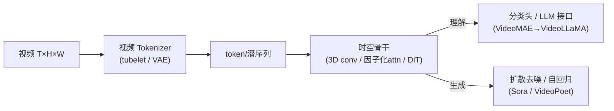

# 00 · 统一视角：四根轴讲透全部视频模型

> **博士级目标**：读完这一篇，你拿到任何一个视频模型（哪怕是明年新发的），都能立刻说出它在"哪几根轴上做了什么选择"，并预测它的优缺点。这不是记忆，是**一个坐标系**。

---

## 一、起点：视频就是一个三维张量

一段视频，剥掉容器格式（mp4/编码），本质是一个张量：

$$
x \in \mathbb{R}^{T \times C \times H \times W}
$$

- $T$：帧数（时间）—— 视频比图像**多出来的维度**
- $C$：通道数（RGB=3）
- $H, W$：空间高宽

**视频模型的全部工作，就是建模这个四维张量里元素之间的依赖关系。** 其中最棘手的是 $T$ 维——它和 $H,W$ 性质不同：

| 维度 | 性质 | 建模难点 |
|---|---|---|
| $H, W$（空间） | **各向同性**：上下左右对称，平移不变 | 已被 CNN/ViT 解决得很透 |
| $T$（时间） | **有方向**：因果（未来不依赖过去）、不可逆 | 需要专门处理；还隐含运动与物理 |

> 🎯 **一句话**：视频的全部难度，都来自"时间维 $T$ 有方向、且和空间维不同构"这件事。

## 二、四根设计轴——视频模型的坐标系

### 轴①：时间耦合方式（最核心）

"怎么让 $t$ 帧的信息影响 $t+1$ 帧？" 有三种回答：

**(a) 显式跨帧耦合** —— 卷积核或注意力**直接跨越时间**。
- 3D 卷积：核是 $(t,k,k)$，一次扫时空。**局部**时间感受野。
- 全时空注意力：每个 token attend 所有时刻。**全局**但贵 $O(N^2)$。

**(b) 因子化耦合** —— 把"空间"和"时间"**拆成两层**分别算。
- 先帧内空间注意力（学外观），再跨帧时间注意力（学运动）。
- 省 $\sim T$ 倍，代价是跨帧耦合要"两跳"。

**(c) 因果耦合** —— 当前帧**只看过去**，不看未来。
- 自回归：$p(x_t \mid x_{<t})$。可流式生成、可 KV-cache。
- 代价：训练时 teacher-forcing 与推理 exposure bias。

> 见 [`experiments/01`](experiments/01_3d_conv_vs_2d_temporal.py)（3D vs 2D 的时间敏感性）与 [`experiments/03`](experiments/03_temporal_attention.py)（因子化省多少）。

### 轴②：建模空间（像素 vs 潜空间）

- **像素空间**：直接在 $T{\times}H{\times}W$ 上算。精确，但 $T$ 一大，计算量和显存爆炸。早期理解模型（C3D、VideoMAE）在这层。
- **潜空间**：先用视频 VAE/tokenizer 把视频压成 $T'{\times}h{\times}w$ 的潜表示（$T'{\ll}T, h{\ll}H$），再建模。**2024 年视频生成爆炸的关键开关**——Sora、HunyuanVideo、Wan 全在这层。

$$
\underbrace{x_{T\times H\times W}}_{\text{像素, 贵}} \xrightarrow{\text{视频 VAE}} \underbrace{z_{T'\times h\times w}}_{\text{潜, 便宜}} \xrightarrow{\text{DiT 扩散}} \text{生成}
$$

潜空间的压缩比是关键设计：压太多丢运动细节，压太少没省钱。

### 轴③：生成范式（扩散 vs 自回归 vs 掩码）

这三者来自 [`讲透生成模型`](../讲透生成模型/) 的三大范式，在视频里具体表现为：

| 范式 | 视频里的样子 | 优点 | 缺点 | 代表 |
|---|---|---|---|---|
| **扩散** | 潜视频 + DiT 去噪 | 质量最高、多样性好 | 慢（迭代 $K$ 步）、不能流式 | Sora, HunyuanVideo, Wan |
| **自回归** | 逐帧/逐 token 生成 | 可流式、KV-cache 加速 | exposure bias、误差累积 | VideoPoet, CausVid(蒸馏后) |
| **掩码生成 (MIM)** | 随机遮 tubelet 再重建 | 训练高效、自监督 | 不直接用于生成(主要用于理解预训练) | VideoMAE |

> 2024–2025 的主线之一：**扩散模型质量碾压，但慢且不能流式 → 用蒸馏把扩散变成自回归**（CausVid 的核心贡献）。

### 轴④：运动表示（显式 vs 隐式 vs 潜预测）

"运动信息从哪来？"

- **显式光流**（Two-Stream, 2014）：预计算每像素位移 $(u,v)$ 喂给网络。**直觉强但需手工预处理、对遮挡敏感。**
- **隐式学习**（现代主流）：不显式算光流，让 3D conv / 时空注意力**自己学**到运动。**省事、端到端。**
- **潜空间预测**（JEPA 路线）：不在像素层预测，而在**抽象潜空间**预测下一状态。LeCun 认为这才是"理解"的正路。

> 见 [`experiments/05`](experiments/05_optical_flow.py)：光流鼻祖 Lucas-Kanade，及其在大位移下的线性化局限。

## 三、设计矩阵——把所有模型定位进去

> 把轴①（时间耦合）做行、轴③（生成范式）做列，把明星模型填进去。**一张表看懂十年演进。**

|  | **理解 (编码)** | **扩散生成** | **自回归生成** | **掩码预训练** |
|---|---|---|---|---|
| **显式跨帧** | C3D, I3D, SlowFast (3D conv) | Sora, HunyuanVideo, Wan (DiT 全注意力) | VideoPoet (全 attn AR) | — |
| **因子化** | TimeSformer, ViViT, MViT | 早期 VideoLDM | — | **VideoMAE** ★ |
| **因果** | — | CausVid ★ (因果蒸馏) | **自回归视频** | V-JEPA(部分) |
| **潜预测** | **V-JEPA 2** ★ | — | — | JEPA 系列 |

读法举例：
- **Sora** = 显式跨帧(全 attn) × 潜空间 × 扩散。**质量天花板，但不能流式、不能交互。**
- **VideoMAE** = 因子化 × 像素 × 掩码。**最成功的视频自监督预训练。**
- **CausVid** = 因果 × 潜 × 扩散蒸馏成自回归。**填补了"扩散质量 + 自回归流式"的空白。**
- **V-JEPA 2** = 潜预测 × 潜 × 掩码+预测。**LeCun 路线，奔着世界模型去。**

## 四、理解与生成的统一

理解（判别）和生成看似两件事，但在视频里**共享同一套算子栈**：

**关键洞察**：
1. **VideoMAE 预训练的时空骨干，可以直接当视频生成的 backbone**（很多图生视频模型这么做）。
2. **视频 LLM（VideoLLaMA、Video-LLaVA）= 视觉编码器 + LLM**，把视频"翻译"成语言能处理的 token——见 [`讲透多模态`](../讲透多模态/)。
3. 生成模型的时空注意力机制（DiT），和理解模型的（TimeSformer）**本质是同一个算子**，只是训练目标不同。

## 五、为什么 2024 年视频生成突然"炸"了

用四根轴解释这个拐点：

| 变化 | 之前（≤2023） | 2024 起 |
|---|---|---|
| 轴② 建模空间 | 像素空间（贵，只能短视频） | **潜视频空间**（VAE 压缩，长视频可行） |
| 轴① 骨干 | U-Net（3D） | **DiT（扩散 Transformer）** —— 可 scaling |
| 数据 | 几十万视频 | **亿级**高质量带字幕视频 |
| 算力 | — | H100 大规模集群 |

> 三个开关同时打开：**潜空间压缩 + DiT 可 scale + 海量数据** → Sora 拐点。**不是新算法，是三根轴同时到位。**

## 六、一句话总结

> 🎯 **视频模型 = "如何把时间耦合进三维张量"的工程艺术。** 四根轴（时间耦合/空间/范式/运动表示）各选一格，就定义了一个模型族。2024 的革命 = 潜空间 + DiT + 扩散；2025 的主线 = 把扩散蒸馏成可流式的因果生成 + 用潜预测冲击世界模型。

---

📌 **下一步**

1. 读 [01-直觉](01-直觉.md) 获得对"时间维度"的物理直觉。
2. 读 [02-数学](02-数学.md) 看 3D 卷积/时空注意力的公式推导。
3. **跑 [`experiments/01`](experiments/01_3d_conv_vs_2d_temporal.py) 与 [`03`](experiments/03_temporal_attention.py)**，亲眼验证四根轴里轴①的代价。
4. 进 [04-算法全景](04-算法全景.md)，看所有算法在坐标系里的位置。

✍️ **练习**：拿一个你没见过的视频模型（比如去 HuggingFace 找一个），用四根轴描述它，预测它的优缺点，再去读论文验证。
