# 04 · 算法全景：所有视频算法一张图

> **本文是"包含所有相关算法"的索引页。** 视频领域十年来发明的算法，按**机制**分成 7 大族、20+ 算子。每个给出：直觉 → 关键形式 → 代表模型 → 代码骨架 → 落在哪根设计轴。
>
> 配合 [00-统一视角](00-统一视角.md) 的四根轴阅读：每个算法都是某根轴上的一格。

---

## 全景分类图

```mermaid
graph TB
    ROOT["视频算法"]
    ROOT --> CONV["① 时空卷积族"]
    ROOT --> ATT["② 时空注意力族"]
    ROOT --> MOT["③ 运动表示族"]
    ROOT --> SSL["④ 自监督预训练族"]
    ROOT --> TOK["⑤ 视频 Tokenizer 族"]
    ROOT --> GEN["⑥ 视频生成族"]
    ROOT --> SEQ["⑦ 时序/长视频族"]

    CONV --> C1["2D卷积(基线) · 3D卷积(C3D)"]
    CONV --> C2["(2+1)D卷积(R2+1D) · I3D膨胀"]
    CONV --> C3["SlowFast双通路 · 可变形3D"]

    ATT --> A1["全时空注意力 · DiT"]
    ATT --> A2["因子化: TimeSformer · ViViT · MViT"]
    ATT --> A3["Tubelet嵌入 · 因果注意力"]

    MOT --> M1["光流: LK/HS · FlowNet · RAFT"]
    MOT --> M2["Two-Stream双腿 · 轨迹卷积TAdaConv"]
    MOT --> M3["隐式运动FIM · 潜预测JEPA"]

    SSL --> S1["VideoMAE(掩码) ★"]
    SSL --> S2["对比: VideoCLIP · LaViLa"]
    SSL --> S3["JEPA潜预测 ★"]

    TOK --> T1["Tubelet(Conv3d连续)"]
    TOK --> T2["离散量化: MAGVIT/v2(LFQ)"]
    TOK --> T3["连续VAE: Sora/HunyuanVideo/Wan"]

    GEN --> G1["视频扩散: LVD/SVD/DiT ★"]
    GEN --> G2["流匹配: Rectified Flow"]
    GEN --> G3["自回归: VideoPoet · VideoGPT"]
    GEN --> G4["蒸馏: CausVid(DMD视频)"]
    GEN --> G5["GAN: MoCoGAN/VideoGAN(早期)"]

    SEQ --> Q1["ConvLSTM/循环预测"]
    SEQ --> Q2["分层/流式长视频"]
```



---

## ① 时空卷积族

视频理解的"古典时代"（2014–2020）主力。核心问题：怎么让卷积看见运动。

### 1.1 2D 卷积（基线，看不见运动）
- **直觉**：每帧独立做图像卷积，根本不看时间。
- **形式**：$Y_{t} = \text{Conv2D}(X_t)$，各帧无关。
- **代表**：ResNet-2D（视频早期 baseline）。
- **代码**：`nn.Conv2d(C_in, C_out, 3, padding=1)` 逐帧调用。
- **轴①**：无时间耦合。**实验 [`01`](experiments/01_3d_conv_vs_2d_temporal.py) 证明它对时间倒放差异精确为 0。**

### 1.2 3D 卷积（C3D）★
- **直觉**：卷积核变成 $(t,k,k)$ 的立方体，**一次扫过时空**，天然捕捉短时运动。
- **形式**：$Y_{t,h,w} = \sum_{\Delta t,\Delta h,\Delta w} W_{\Delta t,\Delta h,\Delta w}\, X_{t+\Delta t,h+\Delta h,w+\Delta w}$。
- **复杂度**：$O(THW \cdot t k^2)$，比 2D 贵 $t$ 倍。
- **代表**：**C3D** (2014, Tran et al., 学习 3D 特征的开山作)；I3D、SlowFast 都基于它。
- **代码**：
  ```python
  nn.Conv3d(C_in, C_out, kernel_size=(3,3,3), padding=(1,1,1))
  ```
- **缺点**：3D 核参数多、局部时间感受野（要看长程得堆很多层）。
- **轴①**：显式跨帧（局部）。

### 1.3 (2+1)D 卷积（R(2+1)D）
- **直觉**：把 3D 卷积 $(t,k,k)$ **分解**成"空间 $(1,k,k)$ + 时间 $(t,1,1)$"两步，参数更少、非线性更多（中间加 ReLU）。
- **形式**：$X \xrightarrow{\text{空间2D}} \xrightarrow{\text{ReLU}} \xrightarrow{\text{时间1D}} Y$。
- **代表**：**R(2+1)D** (2018, Tran et al.)；类似的有 SlowFast 的 fast 通路。
- **优势**：参数量约为 3D 的 $1/t$，精度却持平甚至更高。
- **轴①**：显式跨帧（分解版）—— **正是"因子化"思想在卷积族里的体现**，对应注意力族的因子化。

### 1.4 I3D（Inflate 2D → 3D）
- **直觉**：ImageNet 预训练的 2D 卷积权重 $W_{k \times k}$，**膨胀**成 3D 的 $W_{t \times k \times k} / t$（沿时间复制再归一化），直接继承 2D 预训练。
- **代表**：**I3D** (2017, Carreira & Zisserman, Kinetics 上的经典)。
- **意义**：解决了"3D 数据少难训"的问题——**用 2D 预训练初始化 3D 网络**。

### 1.5 SlowFast 双通路
- **直觉**：视觉系统有两条路——**慢通路**（低帧率、多通道，捕捉空间语义）+ **快通路**（高帧率、少通道，捕捉快速运动），仿生 P/Q 视觉通路。
- **代表**：**SlowFast** (2019, Feichtenhofer et al., Kinetics SOTA)。
- **轴①**：显式跨帧，但用**两种时间分辨率**互补。

### 1.6 可变形 3D 卷积 / TAdaConv
- **直觉**：固定网格的卷积核跟不上运动；让采样位置**可学习偏移**，自适应运动。
- **代表**：Deformable 3D Conv；**TAdaConv**（Alibaba，沿时间自适应）。

---

## ② 时空注意力族

2021 年起 Transformer 接管视频，核心算子从卷积变注意力。

### 2.1 全时空注意力（Joint）
- **直觉**：每个 token attend 所有时刻所有位置。最强的耦合，但最贵。
- **形式**：$\text{Attn}(Q,K,V)$，其中序列长 $N = T \cdot H' \cdot W'$，复杂度 $O(N^2)$。
- **代表**：**Sora / HunyuanVideo / Wan 的 DiT 骨干**（生成侧）；ViViT Model 3。
- **代价**：$N=4096$ 时注意力矩阵 1600 万对 → 必须靠**潜空间压缩**把 $N$ 降下来，这就是 Sora 用潜空间的原因。
- **轴①**：显式跨帧（全局）。

### 2.2 因子化注意力（TimeSformer / ViViT / MViT）★
- **直觉**：全注意力太贵 → **拆成"帧内空间 + 跨帧时间"两层**，省 $\sim T$ 倍。
- **形式**：
  - 空间层：$X \xrightarrow{\text{每帧内 attn}} X'$，复杂度 $O(T(HW)^2)$
  - 时间层：$X' \xrightarrow{\text{每位置跨帧 attn}} X''$，复杂度 $O(HW \cdot T^2)$
- **变体**：
  - **TimeSformer "Divided Space-Time"**（最常用）：先空间后时间，两层串接。
  - **ViViT "Factorised Encoder"**：先用空间 Transformer 编码每帧，再用时间 Transformer 聚合。
  - **ViViT "Factorised Self-Attention"**：每层内部分空间/时间注意力。
  - **MViT**（Multiscale ViT）：随深度做池化，token 数递减，金字塔结构。
- **代码骨架**：见 [`experiments/03`](experiments/03_temporal_attention.py) 的 `factorised_attn`。
- **实测**：16×16×16 时比全注意力省 **15×**（GFLOP），实测 4×（含开销）。
- **轴①**：因子化耦合。

### 2.3 Tubelet 嵌入 ★
- **直觉**：图像 ViT 把图切成 patch；视频切成"小管子"（$t \times h \times w$ 立方块），用一个 **3D 卷积**一步变成 token。
- **形式**：$\text{Conv3D}(\text{kernel}=\text{stride}=(t,h,w))$，输出 $(T' \times H' \times W')$ 个 token。
- **代表**：**ViViT** 首创；VideoMAE、TimeSformer、**Sora 的视频 tokenizer** 都用它。
- **代码**：见 [`experiments/02`](experiments/02_tubelet_embedding.py)。
- **意义**：这是**视频 Transformer 的输入层标准**——决定 token 数 $N$，进而决定后续所有注意力的开销。

### 2.4 因果注意力（Causal）
- **直觉**：当前帧只 attend 过去（下三角掩码），天然支持自回归流式生成 + KV-cache。
- **形式**：$\text{Attn}$ 加 mask $M_{ij} = \mathbb{1}[j \le i]$。
- **代表**：**VideoPoet**（自回归视频）；**CausVid**（把扩散蒸馏成因果）。
- **轴①**：因果耦合。

---

## ③ 运动表示族

回答"运动信息从哪来"。

### 3.1 光流（Optical Flow）—— 显式鼻祖
- **直觉**：对每个像素估计它在下一帧的位移 $(u,v)$，得到稠密运动场。
- **经典方法**：
  - **Lucas-Kanade**（1981）：局部窗口 + 亮度守恒 + 一阶泰勒，最小二乘解。**见 [`experiments/05`](experiments/05_optical_flow.py)。**
  - **Horn-Schunck**（1981）：全局变分，加平滑约束。
  - **FlowNet / RAFT**（深度学习）：端到端回归光流。
- **局限**：大位移（线性化失效，见实验 05 低估）、遮挡、无纹理区域（孔径问题）。

### 3.2 Two-Stream 网络（2014）★
- **直觉**：两条腿走路——**空间流**（单帧 RGB，认"是什么"）+ **时间流**（预计算光流堆叠，认"怎么动"），后期融合。
- **代表**：Simonyan & Zisserman Two-Stream（2014）。
- **历史地位**：深度学习视频理解的奠基作之一。**缺点：要预计算光流，慢、不端到端。**
- **轴④**：显式光流。

### 3.3 隐式运动（现代主流）
- **直觉**：不显式算光流，让 3D conv / 因子化注意力**自己学**到运动。端到端、省预处理。
- **代表**：几乎所有 2020 后的模型（SlowFast、TimeSformer、VideoMAE）。
- **轴④**：隐式学习。

### 3.4 潜空间预测（JEPA 路线）★
- **直觉**：LeCun 主张——别在像素层预测（太嘈杂），在**抽象潜空间**预测下一状态，才接近"理解"。
- **代表**：**I-JEPA / V-JEPA / V-JEPA 2**（Meta，2024–2025）。
- **轴④**：潜预测。详见 [07-视频世界模型](07-视频世界模型.md)。

---

## ④ 自监督预训练族

视频标注贵（动作标签难标），自监督是关键。

### 4.1 VideoMAE（视频掩码自编码）★
- **直觉**：把视频的 tubelet **随机遮掉 90%**（视频冗余极高，能遮更多），只编码可见的 10%，再重建被遮像素。
- **形式**：$\mathcal{L} = \|X_{\text{mask}} - \hat X_{\text{mask}}\|^2$（像素重建 MSE）。
- **关键技巧**：**tubelet 级掩码 + 极高掩码率（90%）**（图像 MAE 才 75%，因为视频时空冗余更大）。
- **代表**：VideoMAE (2022)、VideoMAE V2 (2023，更大更强)。
- **地位**：**当前最成功的视频自监督方法**，是绝大多数视频理解的预训练标配。
- **代码**：HuggingFace `transformers` 有 `VideoMAEModel`。
- **轴③**：掩码生成（MIM）。

### 4.2 对比学习（VideoCLIP / LaViLa）
- **直觉**：拉近"视频-匹配文本"对，推远不匹配的。
- **代表**：VideoCLIP（2021）、LaViLa（用 LLM 生成伪字幕）。
- **用途**：视频-文本检索、零样本动作识别。

### 4.3 JEPA（联合嵌入预测）★
- **直觉**：不是重建像素，而是**在潜空间预测被遮区域的表示**；用 Siameses + EMA target encoder 防坍塌。
- **代表**：I-JEPA（图像）、V-JEPA（视频）、V-JEPA 2（2025，扩展到世界模型）。
- **意义**：LeCun 认为这是通向"理解"与世界模型的正路。详见 [07](07-视频世界模型.md)。

---

## ⑤ 视频 Tokenizer 族（生成的入口）

视频生成模型怎么把视频变成可处理的对象？这是 2024 生成革命的关键基础设施。

### 5.1 Tubelet Tokenizer（连续）
- **直觉**：tubelet 嵌入（2.3），输出**连续**向量。用于**连续潜扩散**（Sora、HunyuanVideo）。
- **代表**：Sora 的 spacetime patch tokenizer。

### 5.2 离散视频 Tokenizer（MAGVIT）★
- **直觉**：把视频压缩成**离散 token**（像文字 token 一样），这样能用 GPT 式自回归生成。
- **关键**：**MAGVIT**（2022）用 3D 因果 VQ；**MAGVIT-v2**（2023）提出 **LFQ（Lookup-Free Quantization）**，大幅提升词表规模，解锁了自回归视频的质量。
- **代表**：VideoPoet（用 MAGVIT 做 tokenizer + LLM 自回归）。
- **轴③**：离散 → 自回归生成。

### 5.3 连续视频 VAE（Sora / HunyuanVideo / Wan）★
- **直觉**：不用离散化，用 3D VAE 把视频压成**连续潜变量** $z$，在潜空间做扩散。保留更多细节。
- **形式**：$x \xrightarrow{\text{3D VAE enc}} z \xrightarrow{\text{DiT 扩散}} \hat z \xrightarrow{\text{VAE dec}} \hat x$。
- **代表**：**Sora**、**HunyuanVideo**（Tencent，开源 SOTA 2024）、**Wan2.1/2.2**（Alibaba，开源）。
- **意义**：连续潜 + DiT 扩散 = **2024 视频生成的标准配方**。

### 5.4 Cosmos Tokenizer（NVIDIA）
- **直觉**：为"世界基础模型"设计的 tokenizer，兼顾连续与离散，强调物理一致性。
- **代表**：NVIDIA Cosmos（2024）。

---

## ⑥ 视频生成族

详见 [06-视频生成路线](06-视频生成路线.md)，这里给算法索引。

### 6.1 视频扩散（Latent Video Diffusion / DiT）★
- **直觉**：把图像扩散（见 [`讲透生成模型/05`](../讲透生成模型/05-Diffusion.md)）搬到视频潜空间——前向给整段潜视频加噪，反向 DiT 去噪。
- **关键挑战**：**时间一致性**（各帧去噪要协调）→ 全时空注意力保证。
- **代表**：Latent Video Diffusion (2022)、Stable Video Diffusion (2023)、**Sora** (2024)、**HunyuanVideo/Wan** (2024-25)。
- **轴③**：扩散。**见 [`experiments/04`](experiments/04_video_diffusion.py)（合成运动上的去噪）。**

### 6.2 流匹配（Rectified Flow）
- **直觉**：扩散的"直线路径"版本——学一个向量场把噪声沿直线移到数据，路径更短、采样更快。
- **代表**：Stable Diffusion 3、**Wan2.1**、部分 2024 视频模型改用 flow matching。

### 6.3 自回归视频生成
- **直觉**：把视频离散化成 token（MAGVIT），用 GPT/LLM 逐 token 预测。
- **代表**：VideoGPT、**VideoPoet**（Google，多模态 LLM 生成视频）。
- **轴③**：自回归。

### 6.4 扩散→自回归蒸馏（CausVid）★
- **直觉**：扩散质量高但不能流式；自回归能流式但质量差。**把训练好的双向扩散 DiT，蒸馏成一个因果（自回归）模型**，兼得两者。
- **技术**：分布匹配蒸馏（DMD）扩展到视频 + 因果学生初始化。
- **代表**：**CausVid** (2024, CVPR 2025, arXiv:2412.07772)——VBench-Long 84.27 分，单 GPU 9.4 FPS 流式生成。
- **意义**：**2024 最优雅的视频生成创新**——打通扩散与自回归。

### 6.5 GAN 视频生成（早期，已退场）
- **代表**：MoCoGAN、VideoGAN（2018）。
- **现状**：被扩散完全取代（GAN 难做长视频一致性）。

---

## ⑦ 时序 / 长视频族

### 7.1 循环预测（ConvLSTM）
- **直觉**：把视频当序列，用 LSTM/ConvLSTM 逐帧预测下一帧（早期视频预测）。
- **代表**：ConvLSTM（2015，视频降水预测）。
- **现状**：被 Transformer + 扩散取代。

### 7.2 分层 / 流式长视频
- **直觉**：长视频（分钟级）不能一次塞进注意力 → 分段生成 + **重叠窗口保连续**，或用**循环记忆**携带上下文。
- **代表**：Sora 的长视频（窗口 + 全局 latent）；CausVid 的流式 KV-cache。
- **核心难点**：长视频的**误差累积**与**全局一致性**——详见 [08-不足](08-不足.md)。

---

## 算法 × 任务 速查（你要做什么，该用谁）

| 你的任务 | 推荐算法栈 | 代表实现 |
|---|---|---|
| 动作识别（给视频分类） | VideoMAE 预训练 + 因子化 ViT 微调 | VideoMAE V2 |
| 视频-文本检索 | 对比学习（VideoCLIP） | LaViLa |
| 视频问答/对话 | 视频编码器 + LLM | VideoLLaMA, Video-LLaVA |
| 文生视频（最高质量） | 视频 VAE + DiT 扩散 | HunyuanVideo, Wan2.1 |
| 文生视频（要流式/交互） | 扩散蒸馏成因果自回归 | CausVid |
| 图生视频 | 视频 VAE + 条件 DiT | Stable Video Diffusion |
| 机器人/物理预测 | 潜空间世界模型 | V-JEPA 2, Cosmos |
| 视频自监督预训练 | 掩码自编码 | VideoMAE |

---

📌 **下一步**

1. 沿**理解路线**走：[05-视频理解路线](05-视频理解路线.md)（卷积→注意力→VideoMAE→V-JEPA）。
2. 沿**生成路线**走：[06-视频生成路线](06-视频生成路线.md)（扩散为何统治）。
3. 想懂"世界模型"争论：[07-视频世界模型](07-视频世界模型.md)。
4. **动手**：跑 [`experiments/`](experiments/) 全部脚本，每个对应一两个算法族。

✍️ **练习**：选两个算法族（如 3D 卷积 与 因子化注意力），用同一组合成视频对比它们的运动捕捉能力与计算开销。
