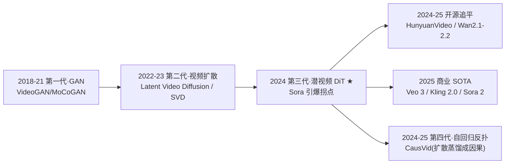

# 06 · 视频生成路线：扩散为什么统治，自回归如何反扑

> **一条线讲透**：机器怎么"无中生有"地造出视频？这是 2018–2026 最戏剧的故事——GAN 先起跑，扩散后来居上彻底碾压，2024 Sora 引爆，2025 自回归借蒸馏杀回来。每一步都落在 [00](00-统一视角.md) 的四根轴上。

---

## 时间线：四代视频生成



| 代 | 范式 | 代表 | 局限 |
|---|---|---|---|
| 一 | GAN | VideoGAN, MoCoGAN | 模式崩溃、难做长视频一致性 |
| 二 | 像素/潜视频扩散 | LVD, Stable Video Diffusion | 短（几秒）、算力有限 |
| 三 | 潜视频 DiT 扩散 | **Sora**, HunyuanVideo, Wan | 慢、不能流式 |
| 四 | 扩散→自回归蒸馏 | **CausVid** | 蒸馏复杂、需好 teacher |

---

## 1. 第一代（2018–2021）：GAN 的失败

### 直觉
图像 GAN（StyleGAN）很成功，自然有人把它搬到视频——生成器造假视频，判别器辨真伪。

### 为什么 GAN 在视频上失败
1. **模式崩溃更严重**：视频维度高，GAN 更容易只学会几种动作。
2. **时间一致性难**：判别器要看整段视频才知真假，训练不稳。
3. **长视频几乎不可能**：GAN 一次前向，难保证分钟级连贯。

> 2020 后，**图像生成已被扩散取代**（见 [`讲透生成模型/05`](../讲透生成模型/05-Diffusion.md)），视频 GAN 也随之退场。**GAN 的失败不是质量不够，是长程一致性 inherently 难。**

## 2. 第二代（2022–2023）：视频扩散登场

### 直觉
把图像扩散（前向加噪 + 反向去噪）直接扩展到视频。难点：**整段视频一起去噪，各帧要协调**（时间一致性）。

### Latent Video Diffusion（2022）
- 在**像素空间**做视频扩散，用 3D U-Net。
- 短视频（几秒）、低分辨率。

### Stable Video Diffusion（2023，Stability AI）
- **图生视频**：给一张图，扩散出后续帧。
- 首个广泛可用的开源视频扩散模型，但仅 4 秒、低分辨率。

### 痛点
还在像素/低压缩空间，**算力限制了时长和分辨率**。破局需要：潜空间压缩 + 可 scaling 的骨干。

## 3. 第三代（2024）：Sora 拐点 ★

### Sora 的三个开关（用四根轴解释）

| 开关 | Sora 的选择 | 为什么是拐点 |
|---|---|---|
| **轴② 建模空间** | **潜视频空间**（spacetime patch + 视频 VAE） | 把 $T{\times}H{\times}W$ 压成 $T'{\times}h{\times}w$，长视频可行 |
| **轴① 骨干** | **DiT（扩散 Transformer）** | 全时空注意力保一致性；Transformer 可 scale（不像 U-Net） |
| **数据** | 亿级高质量带字幕视频 | scaling 的燃料 |

### Sora 的 pipeline
```
文本 → 文本编码器 → 条件
                          ↓
噪声 z_T (潜视频) → DiT 全时空注意力去噪 (K步) → 潜视频 ẑ → 视频 VAE 解码 → 视频
```

关键：**全时空注意力**让所有 token（跨所有帧）互相看到 → **时间一致性的保证**。这也解释了为什么 Sora 贵（$O(N^2)$）。

### Sora 的成就与争议
- **成就**：60 秒连贯视频、3D 一致性、物体持久性——质量飞跃。
- **争议**：OpenAI 称其为 "world simulator"，但视频里大量物理违反（穿墙、变形）。**它是不是世界模型？** 见 [07](07-视频世界模型.md)。

### 技术报告核心思想
Sora 技术报告标题 **"Video Generation Models as World Simulators"**——用"spacetime patches"统一所有视频/图像为 token 序列，DiT 在潜空间扩散。**没有公开模型，但思路被开源界迅速复现。**

## 4. 开源追平（2024–2025）：HunyuanVideo / Wan

Sora 闭源，开源社区在 2024 末–2025 迅速追上：

### HunyuanVideo（腾讯，2024.12）
> 📄 **arXiv:2412.03603**（2024-12-03）——已核实

- **13B 参数**，论文确认是"所有开源模型中最大"的视频生成模型。
- 框架四要素：数据 curation + 架构设计 + 渐进式 scaling 训练 + 大规模训练/推理基础设施。
- 专业评估显示超过 Runway Gen-3、Luma 1.6 及三个顶级中文视频模型。
- 关键：**连续视频 VAE + DiT**，文生视频 SOTA（开源）。

### Wan2.1 / Wan2.2（阿里，2025）
> 📄 **arXiv:2503.20314**（2025-03-26，Team Wan 62 人，60 页）——已核实

- 论文确认基于**扩散 Transformer 范式**（flow matching 路线）。
- 双规格：**14B**（效果）+ **1.3B**（效率——仅需 **8.19 GB 显存**，消费级 GPU 可跑）。
- 覆盖 8+ 下游任务：图生视频、指令视频编辑、个性化视频生成等。
- 全套开源（代码 + 模型）：github.com/Wan-Video/Wan2.1。
- 论文展示了视频生成随**数据与模型规模的 scaling law**。

### 其他开源力量
- **CogVideoX**（智谱）、**Open-Sora / Open-Sora-Plan**（社区复现 Sora）、**LTX-Video**（Lightricks，轻量）。
- **趋势**：开源模型在 2025 已接近闭源商业模型的质量，差距快速缩小。

> 这些模型都共享同一个配方：**连续视频 VAE + DiT 全时空注意力 + 扩散/流匹配**。差异在数据、scale、训练细节。

## 5. 商业 SOTA（2025）：Veo 3 / Kling 2.0 / Sora 2

2025 商业模型把视频生成推到新高度：

- **Veo 3（Google DeepMind）**：**同步音频生成**（视频+配音一体）、更强物理交互、更高分辨率。
- **Kling 2.0（快手）**：长视频、强运镜、人物一致性。
- **Sora 2（OpenAI）**：在 Sora 基础上提升物理一致性与时长。

### 2025 的能力前沿
1. **音视频同步生成**（Veo 3）：不再只生成无声视频。
2. **更长时长**：分钟级，靠分段+全局 latent 保一致。
3. **更强物理**：减少穿墙/变形（但仍不完美）。
4. **可控性**：运镜、角色一致性、风格迁移。

## 6. 第四代（2024–2025）：自回归借蒸馏反扑 ★

### 问题：扩散质量高，但不能流式
扩散是**双向**的（去噪时每帧要看到所有帧）→ 不能"边生成边播"，交互场景（直播、游戏、机器人）用不了。

### CausVid（2024，CVPR 2025）的核心创新
**把一个训练好的双向扩散 DiT，蒸馏成一个因果（自回归）模型**，兼得：
- 扩散的**高质量**（teacher 好）
- 自回归的**可流式**（student 因果 → 可 KV-cache → 边播边生成）

### 技术三件套
1. **分布匹配蒸馏（DMD）扩展到视频**：把 50 步扩散蒸馏成 4 步。
2. **因果学生初始化**：用 teacher 的 ODE 轨迹初始化 student，避免误差累积。
3. **非对称蒸馏**：双向 teacher 监督因果 student。

### 成果
- **VBench-Long 84.27 分**，超越所有视频生成模型。
- 单 GPU **9.4 FPS 流式生成**（靠 KV-cache）。
- 零样本支持流式 video-to-video、image-to-video、dynamic prompting。

> **CausVid 的意义**：2024 最优雅的视频生成创新——它不是又一个更大的扩散模型，而是**打通了扩散与自回归两个范式**。这正是四根轴里轴③（生成范式）的关键进展。

### 其他自回归路线
- **VideoPoet**（Google）：离散视频 token（MAGVIT）+ LLM 自回归。质量不如扩散，但证明了"视频当语言自回归"可行。
- **趋势**：2025 越来越多模型探索"扩散预训练 + 自回归部署"的混合。

---

## 7. 视频生成的三大未解难题（预告 [08](08-不足.md)）

1. **长视频一致性**：分钟级视频的物体一致性、误差累积——见 [08](08-不足.md)。
2. **物理真实性**：穿墙、变形、因果错乱——Sora 至今未解，见 [07](07-视频世界模型.md)。
3. **评估困难**：FID/IS 不适合视频；VBench 是进步但仍不全面——见 [08](08-不足.md)。

---

## 一句话总结

> 🎯 **视频生成的革命 = "GAN 退场 → 扩散上位 → 潜空间+DiT 爆发 → 蒸馏成自回归"四幕剧。** 2024 Sora 拐点不是因为新算法，是**潜空间压缩 + DiT 可 scale + 海量数据**三个开关同时到位。2025 的前沿是**把扩散的quality 和自回归的流式性合并**（CausVid），以及**音视频一体生成**（Veo 3）。

---

📌 **下一步**

1. 读 [07-视频世界模型](07-视频世界模型.md)：Sora 到底懂不懂物理？
2. 读 [08-不足](08-不足.md)：视频生成的失败模式与评估难题。
3. **动手**：在 HuggingFace 上跑 HunyuanVideo 或 Wan2.1 的 demo，亲手生成一段视频。
4. 读 CausVid 论文（arXiv:2412.07772），理解扩散→自回归蒸馏的三件套。

✍️ **练习**：用四根轴分别描述 Sora 和 CausVid，指出它们在哪根轴上不同，这个不同如何导致 CausVid 能流式而 Sora 不能。
