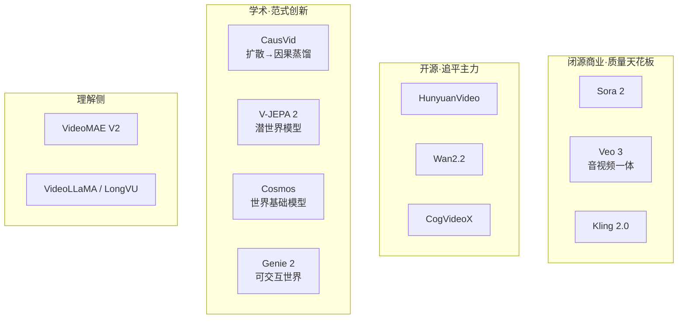

# 09 · 应用：2024–2026 视频浪潮全景

> 把前面所有章节落到**真实产品和论文**上。这是地图，不是教程——按需查阅。

> ⚠️ 信息截至 2025 年中。视频领域迭代极快，具体排名可能变化，但**架构范式**（四根轴）相对稳定。

---

## 一、视频生成产品矩阵

### 闭源商业模型（质量天花板）

| 产品 | 厂商 | 范式 | 亮点 | 时间 |
|---|---|---|---|---|
| **Sora / Sora 2** | OpenAI | 潜视频 DiT 扩散 | 拐点；60s 连贯；物理改进 | 2024-2025 |
| **Veo 3** | Google DeepMind | 扩散 | **音视频同步生成**；强物理 | 2025 |
| **Kling 2.0** | 快手 | 扩散 | 长视频；强运镜；人物一致 | 2025 |
| **Runway Gen-3/4** | Runway | 扩散 | 影视创作工作流 | 2024-2025 |
| **Pika** | Pika | 扩散 | 风格化；易用 | 2024 |

### 开源模型（追赶主力）

| 模型 | 机构 | 亮点 | 链接 |
|---|---|---|---|
| **HunyuanVideo** | 腾讯 | 13B DiT，开源 SOTA（2024末） | huggingface.co/tencent/HunyuanVideo |
| **Wan2.1 / 2.2** | 阿里 | 流匹配，多模态，开源 | huggingface.co/Wan-AI |
| **CogVideoX** | 智谱 | 开源，高效 | THUDM/CogVideo |
| **Open-Sora / Open-Sora-Plan** | 社区 | 复现 Sora 思路 | hpcaitech/Open-Sora |
| **LTX-Video** | Lightricks | 轻量快速 | Lightricks/LTX-Video |
| **Stable Video Diffusion** | Stability | 图生视频，早期开源 | Stability-AI |

> **趋势**：2025 开源已接近闭源质量，差距快速缩小。配方趋同：**连续视频 VAE + DiT + 扩散/流匹配**。

### 学术里程碑

> 📌 **以下 5 篇的 arXiv ID 与关键数字均已在 arXiv 核实**（2026-08 检索）。

| 论文/模型 | 贡献 | 已核实信息 |
|---|---|---|
| **CausVid** (Yin et al., CVPR 2025) | 扩散→因果自回归蒸馏，可流式 | **arXiv:2412.07772**；VBench-Long 84.27；单 GPU 9.4 FPS |
| **HunyuanVideo** (Tencent, 2024.12) | 开源最大视频生成框架 | **arXiv:2412.03603**；13B；超 Runway Gen-3 / Luma 1.6 |
| **Wan** (Alibaba, 2025.03) | 开源视频基础模型套件 | **arXiv:2503.20314**；14B + 1.3B（8.19GB 显存）；8+ 任务；60 页 |
| **V-JEPA 2** (Meta, 2025.06) | 潜预测世界模型 | **arXiv:2506.09985**；>100 万小时视频；SSv2 77.3；零样本 Franka 抓放 |
| **Cosmos** (NVIDIA, 2025.01) | 世界基础模型平台 | **arXiv:2501.03575**；curation + 模型 + tokenizer；开放权重 |
| **VideoMAE / V2** (Tong et al.) | 视频掩码自编码，预训练标配 | NeurIPS 2022 / 2023 |
| **Genie 2** (DeepMind, 2024) | 可交互世界模型 | deepmind.google |

---

## 二、视频理解产品/任务

| 任务 | 代表 | 用什么 |
|---|---|---|
| 动作识别 | Kinetics benchmark | VideoMAE V2 + 因子化 ViT |
| 视频问答/对话 | VideoLLaMA, Video-LLaVA, VideoChat | 视频编码器 + LLM |
| 长视频理解 | LongVU (2024) | DINOv2 显著性剪枝 |
| 视频-文本检索 | LaViLa | 对比学习 |
| 视频监控/动作检测 | 业界 | SlowFast + 检测头 |

---

## 三、视频世界模型应用

| 应用 | 模型 | 说明 |
|---|---|---|
| 机器人规划 | V-JEPA 2 | 潜空间想象动作后果 |
| 自动驾驶仿真 | Cosmos, GAIA-1 | 生成驾驶场景训练 |
| 可玩游戏 | Genie 2 | 用户输入动作生成世界 |
| 物理仿真 | 视频+物理引导 | 减少传统引擎成本 |

---

## 四、按四根轴定位 2025 主流模型

| 模型 | ①时间耦合 | ②空间 | ③范式 | ④运动 | 定位 |
|---|---|---|---|---|---|
| Sora 2 | 全时空 DiT | 潜 | 扩散 | 隐式 | 质量天花板 |
| Veo 3 | 全时空 DiT | 潜 | 扩散+音频 | 隐式 | 音视频一体 |
| HunyuanVideo | 全时空 DiT | 潜 | 流匹配 | 隐式 | 开源 SOTA |
| Wan2.2 | 全时空 DiT | 潜 | 流匹配 | 隐式 | 开源高效 |
| CausVid | **因果** | 潜 | 扩散→AR蒸馏 | 隐式 | **可流式** |
| VideoMAE V2 | 因子化 | 像素 | 掩码 | 隐式 | 理解预训练 |
| V-JEPA 2 | 潜预测 | 潜 | 掩码+预测 | 潜预测 | 世界模型 |
| Cosmos | 全时空 | 潜(tokenizer) | 扩散 | 隐式 | physical AI |

> 读这张表的方法见 [00-统一视角](00-统一视角.md) §3。

---

## 五、学习资源

- **综述**：搜索 "video diffusion models survey 2024/2025"。
- **代码**：HuggingFace `diffusers`（视频扩散）、`transformers`（VideoMAE）。
- **benchmark**：VBench（视频生成评估）。
- **社区**：HuggingFace Daily Papers（cs.CV）、AK (@_akhaliq) Twitter。

---

## 六、一张图：视频 AI 的 2025 版图

---

📌 **下一步**

1. 选一个开源模型（HunyuanVideo / Wan），在 HuggingFace 跑 demo，亲手生成。
2. 读 CausVid 论文（arXiv:2412.07772），它是 2024 最优雅的创新。
3. 关注 VBench 排行榜，跟踪质量进展。
4. 回到 [README](README.md)，用四根轴重新审视你最喜欢的模型。

✍️ **练习**：挑两个产品（如 Sora 2 和 CausVid），用四根轴写一段对比分析，预测它们各自适合的应用场景。
