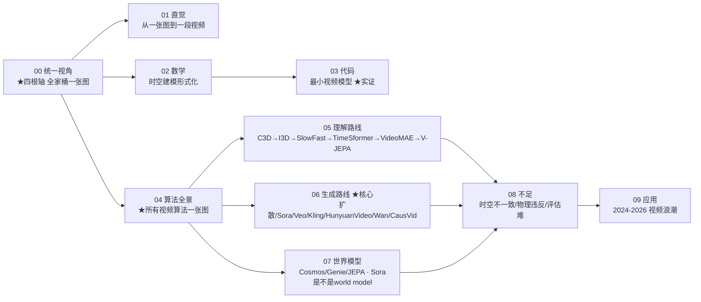

# 讲透视频

> **图像多了一个"时间"维度，于是有了一切。**
>
> 一张图是 $H \times W$ 的二维像素网格。视频是 $T \times H \times W$ 的**三维张量**——多了时间维 $T$。
> 这多出来的一个维度，是所有难度的来源（数据量指数爆炸、时序一致性、长程依赖），也是所有奇迹的来源（运动、因果、连贯、世界规律）。
>
> 本教程的目标：让你看懂**从 C3D 到 Sora**这十年间，人类为了让机器"看懂"和"造出"视频，发明了哪些算法、它们为什么这样设计、以及为什么 2024 年后视频生成突然"炸"了。
>
> 承接「[讲透CV](../讲透CV/)」「[讲透生成模型](../讲透生成模型/)」「[讲透Transformer](../讲透Transformer/)」——CV 回答"单帧怎么看"，生成模型回答"怎么无中生有"，Transformer 回答"注意力怎么算"。视频把三者揉进同一个三维张量，并追问：**时间该怎么耦合进来？**

---

## 这份教程为谁而写

- 知道 Sora / Veo / Kling 很强，但**不知道它们到底是怎么生成的**的人。
- 用过 `Conv3d` / `VideoMAE`，但**讲不清"因子化注意力"为什么省**的人。
- 听过"光流""tubelet""潜视频扩散""因果视频生成"，但**串不起一条主线**的人。
- 想知道**为什么 2024 年扩散模型统治了视频生成**、而 2025 年自回归又杀回来的人。
- 想判断"视频生成模型是不是世界模型"这个 2024–2026 最大争论的人。

## 教学宪法（每章遵守）

每个概念按三层呈现：

1. **直觉层**——一句话比喻 + 为什么需要它（先于公式）。
2. **数学层**——关键公式与推导主线，标注假设与边界。
3. **代码层**——可运行的最小脚本，并用 `bash` 真正跑出结果作为实证。

诚实标注哪些是"已证明"、哪些是"经验现象"、哪些"仍未解决"。结尾固定给出 **📌 下一步** 与（核心章）**✍️ 练习**。

---

## 灵魂：视频模型都在干什么（一句话钉死）

> **所有视频模型都在干同一件事：高效地建模一个三维张量 $x \in \mathbb{R}^{T \times H \times W}$ 上像素/特征之间的依赖关系。** 视频比图像难，全难在"时间"——它带来运动与连贯的要求，也带来计算量的爆炸。各家算法的差别，全部落在"**时间怎么耦合**"这四个字上。

判别 vs 生成，在视频里就是：

| | 学什么 | 输入→输出 | 典型任务 | 代表 |
|---|---|---|---|---|
| **视频理解** | $p(y \mid x_{1:T})$ | 视频→标签/文本/动作 | 动作识别、视频问答、视频检索 | VideoMAE、V-JEPA、VideoLLaMA |
| **视频生成** | $p(x_{1:T})$ 或 $p(x_{1:T}\mid c)$ | 噪声/文本/图→视频 | 文生视频、图生视频、视频续写 | Sora、Veo、Kling、HunyuanVideo |
| **视频世界模型** | $p(s_{t+1}\mid s_{\le t},a)$ | 状态/动作→未来 | 机器人预测、物理仿真 | V-JEPA 2、Cosmos、Genie |

> 三者共用同一套底层算子（3D 卷积、时空注意力、视频 tokenizer），只是"学什么"和"怎么用"不同。**这就是为什么本教程把它们放在一起讲。**

## 四根设计轴——抓住全部脉络的总纲

> **务必先记住这四根轴。** 2025 年你能见到的每一个视频模型，都是在下面四根轴上各选一格拼出来的。本教程的全部章节，都是在解释"每一格为什么这么选"。

| 设计轴 | 选项 A | 选项 B | 选项 C | 决定了什么 |
|---|---|---|---|---|
| **① 时间耦合方式** | **显式跨帧**<br/>(3D conv / cross-frame attn) | **因子化**<br/>(先空间后时间) | **因果/自回归**<br/>(只看过去) | 能不能捕捉运动 & 能否流式生成 |
| **② 建模空间** | **像素空间**<br/>(精确但贵) | **潜空间**<br/>(VAE 压缩后高效) | — | 计算量、细节保真度 |
| **③ 生成范式** | **扩散**<br/>(双向，质量高，慢) | **自回归**<br/>(因果，可流式) | **掩码生成**<br/>(MIM) | 生成质量 vs 速度 vs 可控性 |
| **④ 运动表示** | **显式光流**<br/>(Two-Stream) | **隐式学习**<br/>(让网络自己学) | **潜空间预测**<br/>(JEPA) | 是否需要手工预处理、泛化能力 |

把几个明星模型填进这张表，你就看懂了它们的本质区别：

| 模型 | ① 时间耦合 | ② 空间 | ③ 范式 | ④ 运动 |
|---|---|---|---|---|
| **C3D / I3D** (2014-17) | 显式 3D conv | 像素 | —（理解） | 隐式 |
| **Two-Stream** (2014) | 2D conv + 光流 | 像素 | —（理解） | **显式光流** |
| **TimeSformer / ViViT** (2021) | **因子化** attn | 像素 | —（理解） | 隐式 |
| **VideoMAE** (2022) | 因子化 attn | 像素 | **掩码生成** | 隐式 |
| **V-JEPA 2** (2025) | 潜空间预测 | 潜 | 掩码+预测 | **潜预测** |
| **Sora** (2024) | 全时空 attn (DiT) | **潜** | **扩散** | 隐式 |
| **CausVid** (2024) | **因果** attn | 潜 | 扩散→蒸馏成自回归 | 隐式 |
| **HunyuanVideo** (2024) | 全时空 attn | 潜 | 扩散(流匹配) | 隐式 |

> 看出来了吗？**2024 年的视频生成革命 = 把轴②从"像素"挪到"潜" + 把轴①用 DiT 全注意力 + 轴③用扩散。** 每一步都不是魔法，是这四根轴的组合。

## 目录与学习路径



| 章节 | 文档 | 回答的问题 | 实验 |
|------|------|-----------|------|
| 00 | [00-统一视角.md](00-统一视角.md) | 视频模型都在干什么？四根轴如何统一一切？ | — |
| 01 | [01-直觉.md](01-直觉.md) | 为什么视频比图像难？时间维度带来什么？ | — |
| 02 | [02-数学.md](02-数学.md) | 3D 卷积/时空注意力/光流的数学是什么？ | — |
| 03 | [03-代码.md](03-代码.md) | 最小视频模型长什么样？ | `01-05_*.py` ★ |
| 04 | [04-算法全景.md](04-算法全景.md) | **所有视频算法怎么分类？** | — |
| 05 | [05-视频理解路线.md](05-视频理解路线.md) | 从 C3D 到 V-JEPA，理解怎么演进？ | `01,02,03,05` |
| 06 | [06-视频生成路线.md](06-视频生成路线.md) | Sora/Veo 怎么生成视频？扩散为什么统治？ | `04` |
| 07 | [07-视频世界模型.md](07-视频世界模型.md) | 视频生成是世界模型吗？JEPA 路线对吗？ | — |
| 08 | [08-不足.md](08-不足.md) | 视频模型还解决不了什么？怎么评估？ | — |
| 09 | [09-应用.md](09-应用.md) | 2024–2026 视频产品/论文全景 | — |
| — | [exercises.md](exercises.md) | 输出倒逼输入（🟢直觉/🟡实现/🔴研究 12 题） | E04-E08 |

## 核心算子速查表

| 算子 | 形式 | 复杂度 | 看到运动? | 代表模型 | 本章实验 |
|------|------|--------|:---:|------|------|
| **2D 卷积 (每帧)** | $(C_{out},C_{in},1,k,k)$ | $O(THW \cdot k^2)$ | ❌ | ResNet-2D | `01` |
| **3D 卷积** | $(C_{out},C_{in},t,k,k)$ | $O(THW \cdot tk^2)$ | ✅ | C3D, I3D, SlowFast | `01` ★ |
| **(2+1)D 卷积** | 空间 2D + 时间 1D 分开 | $O(THW(k^2+t))$ | ✅ | R(2+1)D | — |
| **光流** | 像素位移场 $(u,v)$ | $O(THW)$ | ✅(显式) | Two-Stream | `05` |
| **全时空注意力** | $O((THW)^2)$ | $O(N^2)$ | ✅ | Sora(DiT) | `03` |
| **因子化注意力** | 空间⊕时间分两层 | $O(T(HW)^2{+}HWT^2)$ | ✅ | TimeSformer, ViViT | `03` ★ |
| **Tubelet 嵌入** | 3D conv 切管子 | $O(THW)$ | — | ViViT, VideoMAE, Sora | `02` ★ |
| **视频扩散** | 潜空间去噪 | 迭代 $K$ 步 | ✅ | Sora, HunyuanVideo, Wan | `04` |
| **因果注意力** | 只 attend 过去 | $O(N^2)$ 但可 KV-cache | ✅ | CausVid, VideoPoet | — |

## 实证速览（全部 bash 跑通）

> 四个实验是本教程的"定海神针"——用最小代码把视频算法的核心权衡**直接量化给你看**。

| 实验 | 验证的事实 | 关键数字 |
|------|-----------|---------|
| `01_3d_conv_vs_2d` ★ | 3D 卷积看见运动，2D 对时间无感 | 3D 参数 224 vs 2D 80（2.8×）；2D 对时间倒放差异**精确为 0** |
| `02_tubelet` | 视频如何变成一串 token | 16×224×224 → **1568** 个 tubelet token |
| `03_temporal_attention` ★ | 因子化注意力省多少 | 16×16×16 时全时空 12.9 GFLOP vs 因子化 0.86（**15×**）；T=32 时 **28×** |
| `05_optical_flow` | 显式运动表示的鼻祖与局限 | LK 估计大位移会低估（线性化极限） |

```bash
cd 讲透视频/experiments
for f in 01_*.py 02_*.py 03_*.py 05_*.py; do echo "===== $f ====="; python3 "$f"; done
```

## 一张图看懂视频 AI 演进

```mermaid
graph TB
    subgraph 理解["视频理解 · 给视频打标签/问答"]
        C3D["C3D 2014<br/>首个 3D conv 学习"]
        I3D["I3D 2017<br/>Inflate 2D→3D"]
        SF["SlowFast 2019<br/>双通路 快慢"]
        TS["Two-Stream 2014<br/>RGB+光流 双腿"]
        TSF["TimeSformer 2021<br/>因子化时空注意力"]
        VIVIT["ViViT 2021<br/>Tubelet+3种分解"]
        VMAE["VideoMAE 2022<br/>视频掩码自编码 ★"]
        VJEPA["V-JEPA / V-JEPA 2 2024-25<br/>潜空间预测 世界模型"]
        C3D --> I3D --> SF
        TS --> TSF --> VIVIT --> VMAE --> VJEPA
    end
    subgraph 生成["视频生成 · 无中生有"]
        VGAN["VideoGAN 2018<br/>GAN 生成视频"]
        LVD["Latent Video Diffusion 2022<br/>潜视频扩散"]
        SVD["Stable Video Diffusion 2023<br/>图生视频扩散"]
        SORA["Sora 2024 ★<br/>DiT + 潜视频扩散"]
        HY["HunyuanVideo/Wan 2024-25<br/>开源 SOTA 视频扩散"]
        VEOS["Veo 3 / Kling 2 2025<br/>音频+物理交互"]
        CV["CausVid 2024<br/>扩散→因果自回归(可流式)"]
        VGAN --> LVD --> SVD --> SORA
        SORA --> HY
        SORA --> VEOS
        SORA --> CV
    end
    subgraph 世界["世界模型 · 预测未来"]
        DREA["Dreamer 2020<br/>RL 里的环境模型"]
        COS["Cosmos 2024<br/>NVIDIA 世界基础模型"]
        GEN["Genie 2024<br/>可交互世界模型"]
        DREA --> COS
        DREA --> GEN
        VJEPA -.->|潜预测| 世界
    end
```

---

## 多视角桥接（本仓库的讲透哲学）

> 视频不只是算法问题。每个 `讲透` 工件都连接到仓库的元视角。

### 🎭 欺骗动力学视角：视频造假

> 承接 [`欺骗动力学-社会进步的隐秘引擎.md`](../欺骗动力学-社会进步的隐秘引擎.md) §5。

- **讲透视频 防的是什么欺骗？** → Deepfake 视频 / 合成视频冒充真实（换脸、伪造事件、AI 生成新闻画面）。
- **被什么攻破？** → 视频生成质量过高、逐帧检测失效（单帧都真，但时序有破绽）、水印被视频压缩擦除。
- **沉淀进哪条主链？** → AI 安全主链：**时序一致性检测**、视频水印（VideoSeal）、合成内容溯源（C2PA）。
- **一句话**：视频生成越逼真，"逐帧假检测"越失效——**时序维度的不一致是当前最可靠的 Deepfake 破绽**，但随着模型变强，这扇窗也在关闭。

### 🔬 认知/物理视角

- **人类怎么"看"视频？** 人眼并非逐帧处理，而是预测下一帧（predictive coding）。V-JEPA 的"预测下一状态"正是这个直觉的工程化——见 [07-视频世界模型](07-视频世界模型.md)。
- **视频 = 时间维度上的物理过程采样。** 一段视频是连续物理世界在离散时刻的快照序列。视频生成模型是否"理解"物理，是 2024–2026 最核心的争论（详见 [07](07-视频世界模型.md) 与 [`讲透世界模型/advanced/03-视频生成是世界模型吗.md`](../讲透世界模型/advanced/03-视频生成是世界模型吗.md)）。

---

📌 **下一步**

1. **如果你对视频没概念**，从 [00-统一视角](00-统一视角.md) 开始——四根轴讲透全家桶。
2. **如果你只想懂 Sora 怎么生成**，直奔 [06-视频生成路线](06-视频生成路线.md)。
3. **如果你想知道所有视频算法的关系**，看 [04-算法全景](04-算法全景.md)。
4. **想动手**，跑 `experiments/01-03`，三张图胜过千言。

## 🔗 与其他宇宙的连接

